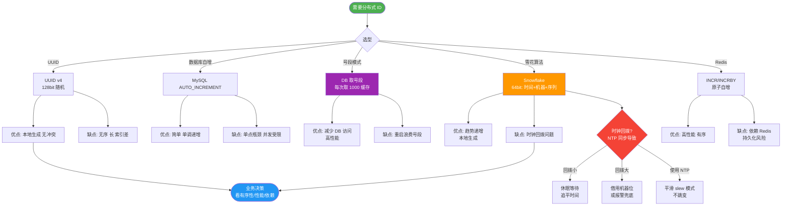

# 雪花算法的时钟回拨问题如何解决？

雪花算法依赖机器时钟生成ID，如果机器时钟回退（NTP同步或手动修改），可能生成重复ID。

**解决方案**：

1. **回拨时间短（<阈值，如5ms）**：线程等待，直到时间追上。
```java
if (currentTime < lastTimestamp) {
    long offset = lastTimestamp - currentTime;
    if (offset <= 5) {
        Thread.sleep(offset << 1); // 稍微多睡一点确保追上
        currentTime = genTime();
    } else {
        throw new ClockBackwardsException("Clock moved backwards");
    }
}
```

2. **百度UidGenerator**：
   - 使用RingBuffer预生成ID缓存。
   - **双Buffer**：CurrentBuffer提供ID，NextBuffer后台预生成。
   - 即使时钟短暂回拨，只要Buffer中有ID，对外服务就不受影响；若检测到大回拨则拒绝服务并告警。

3. **美团Leaf-snowflake**：
   - 使用ZooKeeper持久顺序节点记录各Worker的最后一次上报时间戳。
   - 启动时比对本地时间和ZK记录时间。如果本地时间 < ZK时间，认定发生过回拨，拒绝启动或等待。
   - 运行时定期上报时间更新ZK节点。

4. **预留序列号位（辅助）**：在时间戳相同时用序列号区分。如果回拨时间极短（1ms），可以通过消耗序列号位来继续生成ID，但这只能支撑非常短时间的回拨（序列号耗尽后仍需等待）。

**最佳实践**：
- 配置NTP服务时，禁用`ntpdate`的大步长调整，开启平滑调整（`-x`参数）。
- 结合上述算法（如Leaf方案）作为兜底。

**实战案例**：
在某次双十一大促中，某应用容器因宿主机NTP同步导致时钟回拨，触发Snowflake的时钟回拨异常抛出，导致上游订单创建接口熔断。修复方案是引入ZooKeeper记录Worker注册时间，启动时若检测回拨则拒绝服务并报警，而不是直接 panic，由K8s自动重启新实例替换。

**方案对比**：

| 方案 | 优点 | 缺点 | 适用场景 |
| :--- | :--- | :--- | :--- |
| **直接报错** | 实现简单，防止脏数据 | 系统可用性降低，依赖重启恢复 | 对ID连续性要求极高，且对时钟回拨容忍度低的非核心业务 |
| **线程等待** | 解决微小回拨（<阈值），成本低 | 大幅回拨会导致线程长时间阻塞，拖垮线程池 | 时钟非常稳定，仅偶发毫秒级波动的环境 |
| **ZK/DB持久化 (Leaf)** | 容错性强，能感知历史状态，启动安全 | 强依赖外部组件(ZK/DB)，增加运维复杂度和网络开销 | 生产环境核心业务，追求高可用和强一致性 |
| **RingBuffer (UidGenerator)** | 吞吐量极高，屏蔽时钟微小抖动 | 实现复杂，若长时间回拨仍需降级 | 高并发ID生成场景，允许短暂的不一致 |

```text
雪花算法ID结构 (64bit Long):

0 | 0000000000 0000000000 0000000000 0000000000 0 | 00000 | 0000000000 0000000000 0000000000 0000000000 00
↑ └───────────────────────────┬────────────────────┘ └──┬──┘ └───────────────────────┬───────────────────────┘
│          41位 时间戳             │ 10位 机器ID      │       12位 毫秒内序列号
│
1bit 符号位(始终为0)
```

**## 常见考点**
1. **时钟回拨的原理**：为什么NTP会导致回拨？（NTP同步发现本地时间快了，会主动往回调；或者在虚拟化环境中，宿主机同步时间导致虚拟机时间跳跃）。
2. **WorkerID分配**：在Docker/K8s动态扩缩容场景下，如何解决WorkerID冲突问题？（通常利用ZooKeeper的顺序节点、数据库自增ID或启动时申请并注册）。
3. **序列号溢出**：QPS超过4096（2^12）时如何处理？（通常会直接拒绝当前时间片的请求，或者切换到下一毫秒）。
4. **时间戳位耗尽**：41位时间戳大约能用69年，如何解决架构级的长久性？（可以在位数未耗尽前修改业务逻辑，如增加Epoch位）。


## 核心流程图



## 记忆要点

- 时钟回拨原因：NTP同步或手动修改导致时间倒退，引发ID重复
- 微小回拨（如<5ms）：因为时间极短，所以线程睡眠等待追平即可
- 百度UidGen：预生成双RingBuffer，屏蔽时钟微小抖动
- 美团Leaf：本地时间对比ZK记录时间，若小于则拒绝启动防脏数据
- 最佳实践：NTP开启平滑调整模式（-x），禁用大步长跃变

## 结构化回答


**30 秒电梯演讲：** 时光倒流了，必须等人等到时间恢复正常，或者用备好的号段顶着。

**展开框架：**
1. **短时回拨等待** — 短时间回拨等待
2. **长时回拨报错** — 长时间回拨报错
3. **ZK/RingBuffer兜底** — 可用ZK或RingBuffer兜底

**收尾：** 这是我实战中的理解，您想深入哪一段？


## 视频脚本

> 预计时长：3 分钟 | 由浅入深

| 时间 | 画面/字幕 | 口播台词 | 讲解要点 |
|------|----------|----------|----------|
| 0:00 | 标题卡：雪花算法的时钟回拨问题如何解决 | "雪花算法的时钟回拨问题如何解决，这题我会分三步讲。" | 开场钩子 |
| 0:41 | 概念定义动画 | "一句话：解决时钟回拨导致的ID重复问题。" | 核心定义 |
| 1:22 | 生活类比动画 | "打个比方——时光倒流了，必须等人等到时间恢复正常，或者用备好的号段顶着。" | 核心类比 |
| 2:03 | 短时间回拨等待 图解 | "短时间回拨等待。" | 短时间回拨等待 |
| 2:50 | 长时间回拨报错 图解 | "长时间回拨报错。" | 长时间回拨报错 |
