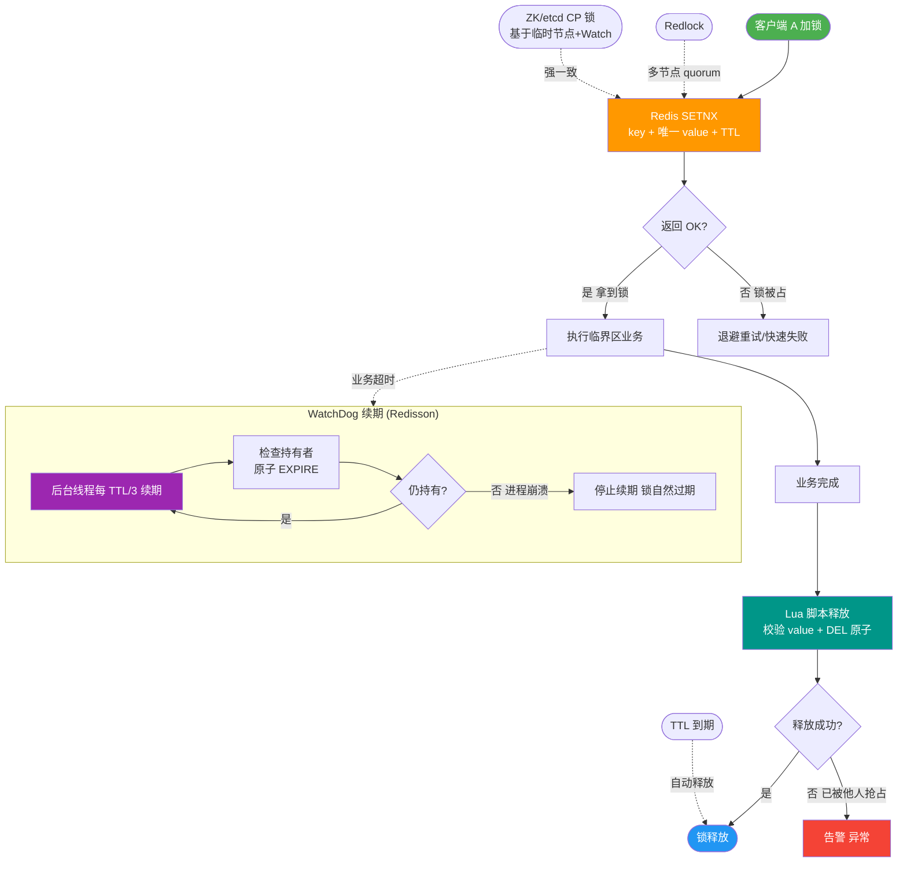

# Redlock 算法为什么有争议？Redis 分布式锁和 ZooKeeper 分布式锁的本质区别？

【Redis 单节点分布式锁】
命令：`SET key value NX PX 30000`
- **NX**：不存在才设置（互斥）。
- **PX 30000**：设置30ms过期（防死锁）。
- **Value**：必须设置唯一标识（如UUID + ThreadId），用于释放时校验。
释放锁用 Lua 脚本（保证原子性）：`if redis.call("get",KEYS[1]) == ARGV[1] then return redis.call("del",KEYS[1]) else return 0 end`
**问题**：单点故障；主从切换时锁可能丢失（主节点加锁后宕机，锁未同步到从节点，从节点晋升为新主，其他客户端可加锁）。

【Redlock（Redis Distributed Lock）】
向 N（通常5）个独立 Redis 实例加锁，获取超过半数（N/2 + 1）个节点的锁，且总耗时 < 锁有效期 → 加锁成功。
**争议**：
1. **时钟漂移**：依赖各节点时钟一致，尽管有过期时间，但在极端 GC 暂停或网络延迟下，锁自动过期时间失效，导致多个客户端同时持有锁（互斥失效）。
2. **Martin Kleppmann 的反驳**：Redlock 假设系统有一个“全局时钟”，这在异步分布式系统中不成立。它既不能保证 CP（因为有时钟依赖），又不如单纯的 AP 高效，被认为是一种“模糊”的保证。
3. **客户端 GC 停顿**：客户端持有锁期间发生长时间 Full GC，导致锁自动过期，但客户端醒来后认为仍持有锁，去操作共享资源，破坏了互斥性。

【ZooKeeper 分布式锁（CP）】
流程：创建临时顺序节点 → 判断自己是否最小节点 → 是则获锁 → 不是则 watch 前一个节点。
优势：
- **强一致**：ZAB 协议保证所有节点看到相同视图。
- **会话失效自动释放**：客户端宕机，Session 断开，临时节点立即删除，避免死锁。
- **公平锁**：顺序节点保证了先来后到。
- **无时钟依赖**：不依赖服务器时间，完全依靠节点的通知机制。
劣势：性能不如 Redis（每次写操作需要经过 Leader 投票确认，吞吐量低）。

【选型建议】
- **高性能、容忍极低概率的互斥失效**：Redis 锁（如秒杀、库存扣减）。为安全起见，建议引入 **Fencing Token**（令牌机制）。
- **强一致性、数据绝对安全**：ZooKeeper / etcd 锁（如金融转账、主备选举）。
- **极高并发但数据可回滚**：也可考虑 DB 乐观锁。

【Fencing Token（栅栏令牌）】
为了解决 Redis 锁过期导致的并发问题，每次加锁成功后，由一个递增的权威服务（如 ZooKeeper 或 DB）分配一个单调递增的 Token。客户端在操作共享资源（如写 DB）时必须携带 Token。
- DB 检查 Token，拒绝处理旧的 Token 请求。
- 即使客户端 A 持有过期锁继续操作，但其 Token 小于客户端 B 的新 Token，DB 会拒绝 A，从而保证数据一致性。

```text
ZooKeeper 锁流程:

/lock
  ├── node-000001 (Watcher) ◄── 客户端1 (最小, 获锁)
  ├── node-000002 (Watcher) ◄── 客户端2 (Watch 前一个)
  └── node-000002 (Watcher) ◄── 客户端3 (Watch 前一个)

1. 客户端1 释放/断开 -> node-000001 消失
2. 触发客户端2 的 Watcher
3. 客户端2 获锁
```

**## 常见考点**
1. **Redisson 的实现原理**：Redisson 通过 Watch Dog（看门狗）机制，如果业务还没跑完且锁快过期，会自动续期（默认锁时间30秒，每10秒续期一次），避免业务执行期间锁过期。
2. **Redisson 的 Redlock 实现**：Redisson 封装了 Redlock 算法，但在高版本中也对其进行了优化，面试时可提及“了解但鉴于争议一般只做普通锁使用”。
3. **ZK 锁羊群效应**：如果不使用顺序节点，所有客户端监听同一个节点，锁释放时所有客户端被唤醒，造成风暴。使用**临时顺序节点**并监听**前一个节点**可以完美解决这个问题。
4. **数据库乐观锁 vs 分布式锁**：扣减库存场景下，利用数据库的 `update stock set num=num-1 where id=1 and num>0` 是一种基于乐观锁的无锁方案，但容易导致行锁竞争激烈，连接池耗尽。


## 核心流程图



## 记忆要点

- 单机Redis锁指令：SET key NX PX，且释放必须用Lua保证原子性
- Redlock争议：因为依赖各节点时钟且怕GC停顿，所以无法保证绝对互斥
- Redis锁是AP高并发但有失效风险，而ZK锁是CP强一致无时钟依赖
- ZK锁原理：创建临时顺序节点，因为监听前一个节点，所以能避免羊群效应
- Fencing Token（递增令牌）：解决锁过期后的并发冲突，旧Token操作被拒

## 结构化回答


**30 秒电梯演讲：** Redis锁像抢凳子快但有误判，ZK锁像排队叫号准但慢。

**展开框架：**
1. **Redis** — Redis依赖时间，主从切换不安全
2. **Redlock** — Redlock解决单点但引入时钟依赖
3. **ZK** — ZK依赖ZAB协议，强一致

**收尾：** Redis 分布式锁的「续期」问题如何解决？Redisson 的看门狗原理？


## 视频脚本

> 预计时长：3 分钟 | 由浅入深

| 时间 | 画面/字幕 | 口播台词 | 讲解要点 |
|------|----------|----------|----------|
| 0:00 | 标题卡：Redlock 算法为什么有争议 | "Redlock 算法为什么有争议，这题我会分三步讲。" | 开场钩子 |
| 0:41 | 概念定义动画 | "一句话：Redis快但可能在极端情况下丢锁，ZK慢但绝对可靠。" | 核心定义 |
| 1:22 | 生活类比动画 | "打个比方——Redis锁像抢凳子快但有误判，ZK锁像排队叫号准但慢。" | 核心类比 |
| 2:03 | Redis依赖时间 图解 | "Redis依赖时间，主从切换不安全。" | Redis依赖时间 |
| 2:50 | Redlock 图解 | "Redlock解决单点但引入时钟依赖。" | Redlock |
