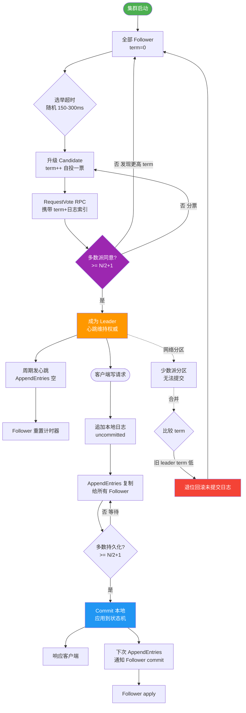
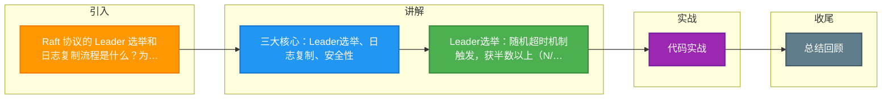

# Raft 协议的 Leader 选举和日志复制流程是什么？为什么比 Paxos 更容易理解？

【Raft 核心思想】
将共识问题分解为：**Leader选举**、**日志复制**、**安全性**。与 Multi-Paxos 不同，Raft 强调强 Leader 性质，所有日志流转必须经过 Leader，简化了系统状态空间。

【1. Leader 选举】
- **角色**：Follower（跟随者）、Candidate（候选人）、Leader（领导者）。
- **Term（任期）**：全局单调递增的整数，类似“届数”，每进行一次选举 Term + 1，用于识别过时 Leader。
- **随机超时（Election Timeout）**：Follower 在 150ms~300ms 随机时间内未收到 Leader 心跳，则认为 Leader 宕机，转为 Candidate。
- **选举流程**：
  1. **转变为 Candidate**：当前 Term + 1，投票给自己。
  2. **RequestVote RPC**：并行向其他节点发送拉票请求。
  3. **投票规则**：每个节点在同一任期内只能投一票，采用“先到先得”策略。Candidate 的日志必须比投票人“新”（即 Log Term 更大，或者 Term 相同但 Index 更长），这保证了当选 Leader 含有所有已提交日志。
  4. **胜出**：获得超过半数（N/2 + 1）选票，成为 Leader，立即发送心跳阻止新选举。
  5. ** split vote（平票）**：如果多个 Candidate 同时竞选导致无人过半，则各自随机超时后重新发起选举，由于随机性，大概率下次能分出胜负。

【2. 日志复制】
1. **接收请求**：客户端发送命令给 Leader。
2. **追加日志**：Leader 将命令追加到本地日志，状态设为 Uncommitted。
3. **并行复制**：Leader 并发发送 `AppendEntries RPC`（含日志索引、任期、前一条日志信息）给所有 Follower。
4. **一致性检查**：Follower 收到请求，检查本地日志是否存在 `prevLogIndex` 和 `prevLogTerm`。若存在且匹配，则追加；若不匹配，拒绝并返回冲突信息，Leader 随后会递减 index 重试（匹配后覆盖后续冲突日志）。
5. **提交**：Leader 收到超过半数 Follower 的成功响应，将该日志标记为 Committed，应用到状态机，并回复客户端成功。
6. **异步通知**：Leader 在后续心跳中携带 `commitIndex`，告知 Follower 应用已提交的日志。

【3. 安全性】
- **选举限制**：Candidate 必须拥有所有“已提交”的日志，才能被选为 Leader。因为已提交日志必然存在于超过半数节点，而 Candidate 赢得选举也需超过半数票，这两个集合必有交集，保证了新 Leader 包含所有已提交日志。
- **Leader 完整性**：一旦日志在某 Term 被提交，该日志条目将在所有后续任期的 Leader 日志中保留（不会被覆盖或删除）。
- **日志匹配特性**：如果两个日志包含相同的 Index 和 Term，那么该 index 之前的所有日志条目必须完全一致。

【为什么比 Paxos 容易理解？】
1. **强 Leader 模型**：日志只能由 Leader 写入，避免了 Paxos 中多个 Proposer 竞争导致的活锁和复杂冲突处理。
2. **问题分解**：将复杂的共识问题拆解为三个相对独立的子问题（选举、复制、安全），逻辑清晰。
3. **状态限制**：限制了日志状态（不允许 hole，Leader 日志是权威基准），减少了 Paxos 中复杂的 Instance 管理和日志合成逻辑。
4. **可视化**：Raft 论文中提供了大量的状态转换图和时序图，便于教学和实现。

```text
Raft 日志复制与一致性检查:

Leader:                          Follower:
Index: 1  2  3  4                Index: 1  2  3
Term:  1  1  2  3                Term:  1  1  2
Data:  x  y  z  w                Data:  x  y  z
       ^
       |
 AppendEntries(Term=3, PrevIndex=3, PrevTerm=2, Entry={...})
       |
       |--- 检查: Index3的Term是2, 匹配成功 --- >|
       |                                         |
       |<----- Success -------------------------|
                                        Follower 追加 Entry w
```

**## 常见考点**
1. **脑裂处理**：Raft 中，如果旧 Leader 因网络分区被隔离，它仍然可以接受写请求，但因为它无法获得大多数节点的认可，日志无法提交。当网络恢复，新 Leader（拥有新 Term）的心跳会使旧 Leader 自动退位为 Follower，旧 Leader 的未提交日志会被新 Leader 的日志覆盖。
2. **日志压缩**：随着日志增长，需要快照来压缩日志。Leader 不需要发送全部快照数据，可以增量发送或让 Follower 自行抓取。快照期间，Leader 仍可处理新请求。
3. **Follower 宕机恢复**：Follower 重启后，如果日志落后太多，Leader 会发送 `InstallSnapshot RPC` 直接发送快照数据，而不是逐条发送日志。
4. **成员变更**：直接修改集群配置可能导致出现两个 Majority（例如从3节点变更为4节点期间），导致脑裂。Raft 采用 **Joint Consensus（两阶段变更）** 或 **Single-server changes（单节点变更）** 来安全地在配置变更期间保持多数派一致性。


## 核心流程图



## 记忆要点

- 三大核心：Leader选举、日志复制、安全性
- Leader选举：随机超时机制触发，获半数以上(N/2+1)选票即当选
- 日志复制：Leader强制同步，获半数成功响应才提交(Committed)状态机
- 安全性保障：因为Candidate日志必须比投票者新，所以保证含所有提交记录
- 易理解原因：强Leader模型简化了冲突，且复杂问题被拆解三大独立子问题

## 结构化回答


**30 秒电梯演讲：** 班级选班长，大家只听班长的指挥记笔记，班长挂了重选。

**展开框架：**
1. **Leader** — 强Leader模型简化逻辑
2. **少数服从多数** — 少数服从多数原则
3. **选举安全性保** — 选举安全性保证日志不丢

**收尾：** Raft 的网络分区恢复后如何处理日志冲突？


## 视频脚本

> 预计时长：4 分钟 | 由浅入深

| 时间 | 画面/字幕 | 口播台词 | 讲解要点 |
|------|----------|----------|----------|
| 0:00 | 标题卡：Raft 协议的 Leader 选举和日 | "Raft 协议的 Leader 选举和日，30 秒讲清楚核心。" | 开场钩子 |
| 0:45 | 概念定义动画 | "一句话：通过选主和日志复制实现分布式强一致性。" | 核心定义 |
| 1:30 | 生活类比动画 | "打个比方——班级选班长，大家只听班长的指挥记笔记，班长挂了重选。" | 核心类比 |
| 2:15 | 强Leader模型简 图解 | "强Leader模型简化逻辑。" | 强Leader模型简 |
| 3:00 | 少数服从多数原则 图解 | "少数服从多数原则。" | 少数服从多数原则 |
| 3:50 | 选举安全性 图解 | "选举安全性保证日志不丢。" | 选举安全性 |

### 视频流程图



