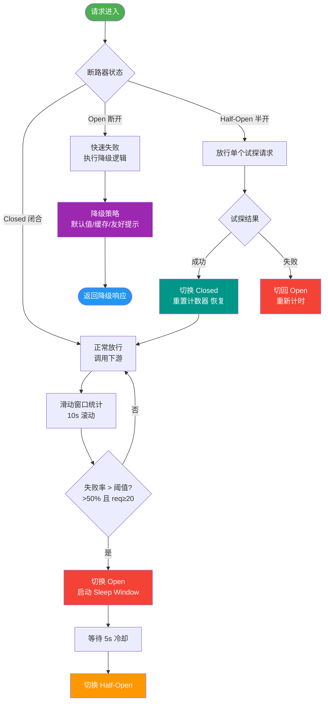

# Sentinel 和 Hystrix 的区别？熔断降级的核心策略是什么？

【Sentinel vs Hystrix】
- **Hystrix**：Netflix 开源，已停止维护。基于**线程池隔离**（默认，开销大但隔离彻底）/信号量隔离（无阻塞，仅限入门）。熔断器模式。不支持热点限流，监控面板较简陋。
- **Sentinel**：阿里开源，活跃维护。基于**滑动窗口**统计。支持限流/熔断/系统自适应保护/热点参数限流/授权规则。提供控制台实时监控，且支持动态规则推送（Nacos/ZK/Apollo）。

【熔断器状态转换图】
```text
      失败率/慢调用比例超阈值
      +---------------------+
      |                     |
      v                     |  探测失败
   +-------+     成功     +----------+
   | Closed | ----------> | Half-Open|
   +-------+   (探测)     +----------+
      ^                     |
      | 探测成功            |  熔断时长结束
      +---------------------+
            Open (熔断开启)
``` 

【熔断器三种状态】
1. **Closed（关闭）**：初始状态，请求正常通过，收集指标（RT、错误率）。
2. **Open（打开）**：错误率或慢调用比例超过阈值，熔断器打开，后续请求直接被拒绝（抛出 DegradeException），经过一段时间进入 Half-Open。
3. **Half-Open（半开）**：熔断尝试恢复，放行一个/少量请求。若请求成功（或符合规则），则闭合熔断器（Closed）；若失败，继续熔断（Open）。

【熔断策略细节】
- **慢调用比例**：请求响应时间 > 设定的最大 RT（Max RT）被视为慢调用。当慢调用比例 > 阈值且请求数 > 最小请求数（Min Request Amount）时触发。
- **异常比例**：异常数 / 总请求数 > 比例阈值，且请求数 > 最小请求数时触发。
- **异常数**：统计窗口内异常绝对值 > 阈值时触发。

【降级策略】
熔断后的兜底方案：返回默认值、返回缓存旧数据、友好提示（如“服务繁忙”）、或调用本地降级逻辑（如 Hystrix 的 fallback）。

【限流算法与 Sentinel 实现】
- **漏桶**：匀速处理，平滑流量，无法应对突发。
- **令牌桶**：固定速率放入令牌，允许突发流量（只要桶内有令牌），Guava RateLimiter 采用此算法。
- **滑动窗口**：Sentinel 默认实现。将时间窗口拆分为多个小样本来精确统计，支持高性能的 QPS 计算和限流判断。

【Sentinel 的核心优势】
1. **热点参数限流**：精确到请求中的参数（如 user_id=100），支持参数黑/白名单，适用于秒杀场景。
2. **系统自适应保护**：使用 Load Adaptive 算法（BBRT），根据系统 Load1 或 CPU 使用率自动调整限流阈值，防止系统被打挂。
3. **实时监控控制台**：Push 模式（需配置 DataSource）或 Pull 模式，秒级监控数据。
4. **规则动态配置**：无缝集成 Nacos、ZooKeeper、Apollo，实现规则的热更新。

## 常见考点
1. **线程池隔离 vs 信号量隔离**：Hystrix 默认线程池隔离的优缺点（资源开销大、超时控制好 vs 开销小、依赖异步逻辑）。
2. **Sentinel 的限流是拦截还是拒绝**：Sentinel 默认抛出 BlockException，通常配合 AOP 或全局异常处理进行兜底，并非像某些网关那样直接阻塞线程挂起。
3. **Sentinel 滑动窗口实现原理**：如何通过 LeapArray（时间轮）和 WindowWrap（时间窗口包装）实现无锁高并发统计。
4. **服务熔断和服务降级的区别**：熔断是自我保护（断开后停止调用），降级是兜底方案（服务不可用时返回默认值）。


## 核心流程图



## 记忆要点

- 隔离对比：Hystrix靠线程池隔离开销大，Sentinel靠滑动窗口轻量
- 三态流转：Closed正常统计 -> Open直接拒绝 -> Half_Open放行探测恢复
- Sentinel三大熔断策略：慢调用比例、异常比例、异常数
- 限流算法：漏桶匀速平滑，令牌桶允许突发，Sentinel默认滑动窗口
- 核心区别：熔断是遇故障断开保护，降级是兜底返回默认值或缓存

## 结构化回答

**30 秒电梯演讲：** 基于滑动窗口的流量卫士，相比Hystrix支持更丰富的限流与实时监控。打比方——电路保险丝与水坝的综合体，既防电流过载(熔断)，又控水流洪峰(限流)。落到工程上，Sentinel活跃维护，支持热点限流和系统自适应保护；Hystrix已停更。

**展开框架：**
1. **Sentinel活跃维护** — Sentinel活跃维护，支持热点限流和系统自适应保护；Hystrix已停更。
2. **状态流转** — 关闭(Closed)→熔断(Open)→半开探测(Half-Open)
3. **熔断策略** — 慢调用比例、异常比例、异常数

**收尾：** 这几个点都能配合实战展开。您想继续聊哪个追问——比如 「Sentinel 的滑动窗口是如何实现的」 或者 「Hystrix 的线程池隔离和信号量隔离有什么区别？各自适合什么场景」？

## 视频脚本

> 预计时长：3 分钟 | 由浅入深

| 时间 | 画面/字幕 | 口播台词 | 讲解要点 |
|------|----------|----------|----------|
| 0:00 | 标题卡：Sentinel 和 Hystrix 的 | "Sentinel 和 Hystrix 的，这题我会分三步讲。" | 开场钩子 |
| 0:41 | 概念定义动画 | "一句话：基于滑动窗口的流量卫士，相比Hystrix支持更丰富的限流与实时监控。" | 核心定义 |
| 1:22 | 生活类比动画 | "打个比方——电路保险丝与水坝的综合体，既防电流过载(熔断)，又控水流洪峰(限流)。" | 核心类比 |
| 2:03 | Sentinel 图解 | "Sentinel活跃维护，支持热点限流和系统自适应保护；Hystrix已停更。" | Sentinel |
| 2:50 | 状态流转 图解 | "关闭(Closed)→熔断(Open)→半开探测(Half-Open)。" | 状态流转 |
