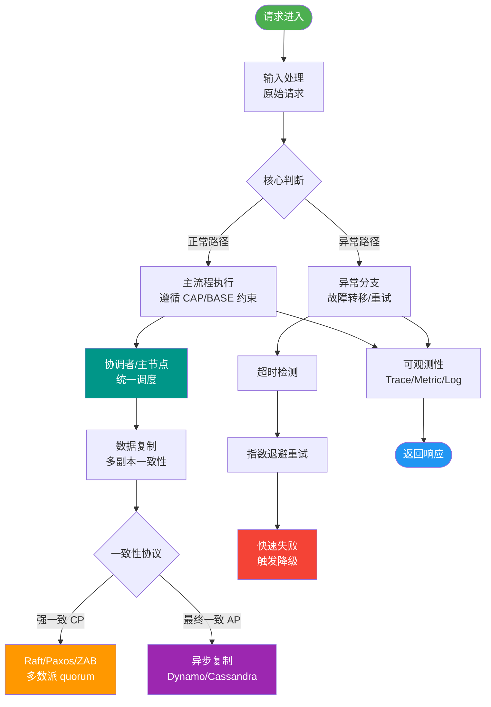

# 分布式存储

【注：题目标题为「分布式存储」，但内容主要涵盖 RPC 协议与缓存，以下根据内容进行深度扩展】

【RPC 协议对比】
- **WebService**：基于 HTTP/XML (SOAP)，使用 CXF/Axis 实现。支持跨语言，协议繁琐（XML 头重），适合传统异构系统集成。
- **HTTP (Restful/RPC)**：Spring Cloud 生态常用。基于 HTTP 协议（JSON 序列化），通用性强，但头部长度大，性能略低于二进制协议。
- **Hessian**：基于 HTTP 传输的二进制 RPC 协议，序列化效率高，Dubbo 早期默认协议之一。适合传输大对象，不支持传输文件流。
- **Redis/Memcache (作为协议载体)**：利用缓存协议进行高速数据交换，通常用于缓存集群间的数据同步或特定的存储协议（如 Redis Cluster Bus）。

【RPC 调用流程图】
```text
  Consumer                     Provider
    |                            |
    |-- 1. 动态代理调用 -------->|
    |                            |
    |-- 2. 序列化 --------------->|
    |                            |
    |---- 3. 网络传输 --------> |
    |                            |
    |                        |-- 4. 反序列化
    |                        |-- 5. 业务逻辑处理
    |                        |-- 6. 序列化结果
    |                            |
    |<-- 7. 响应数据 ------------ |
    |                            |
    |-- 8. 反序列化/结果返回 --- |
```

【RPC 关键技术】
1. **动态代理**：在客户端生成远程服务的本地代理，使得调用远程方法像调用本地一样透明。常见实现：JDK 动态代理（基于接口）、CGLib（基于继承）、Javassist（字节码生成）。
2. **序列化**：将对象转换为二进制流以便网络传输。
   - *Text*：JSON（易读、慢）、XML。
   - *Binary*：Protobuf（Google，极快且兼容性强）、Hessian2、Kryo、FST。
3. **NIO 通信**：非阻塞 IO，利用操作系统提供的多路复用机制（Linux 下 epoll），单线程处理大量连接。框架：Netty（Mina 后继者，Dubbo 默认）、GRPC。
4. **服务注册中心**：治理服务的注册与发现。
   - *CP 模型*：Zookeeper、Consul（强一致性，适合 leader 选举）。
   - *AP 模型*：Nacos（Eureka 替代，支持 AP/CP 切换，云原生友好）。

【Redis 单线程与高并发原理】
- **核心机制**：Redis 6.0 以前，命令处理是单线程的；6.0 引入多线程处理网络 IO，但命令执行依然单线程。基于**内存操作**（纳秒级）和 **IO 多路复用**（epoll），实现了 Reactor 模式。单线程避免了 CPU 上下文切换和锁竞争的开销。
- **瓶颈**：通常不在 CPU，而在内存带宽、网络带宽或大 key 操作造成的阻塞。

【缓存异常问题详解】
1. **缓存雪崩**：
   - *现象*：大量的 Key 在同一时间集中过期，或 Redis 实例宕机，请求全部击穿到 DB。
   - *解决*：
     1. 设置过期时间时增加随机值（如 1-5 分钟随机偏移）。
     2. 热点数据设置“逻辑过期”（不设置 TTL，后台异步刷新）。
     3. 构建高可用 Redis 集群（哨兵或 Cluster）。
2. **缓存穿透**：
   - *现象*：查询不存在的 Key（如恶意攻击 id=-1），缓存未命中，DB 也没有，导致每次请求都打到 DB。
   - *解决*：
     1. **布隆过滤器**：在访问前先通过布隆过滤器判断 Key 是否可能存在。
     2. **缓存空对象**：当 DB 查询为空时，将 Key-Null 缓存起来，并设置较短的过期时间（如 30 秒）。
3. **缓存击穿**（考点补充）：
   - *现象*：某个极度热点的 Key 突然过期，海量并发瞬间打死 DB。
   - *解决*：
     1. 互斥锁：只允许一个线程去查 DB，其他线程等待。
     2. 逻辑过期：不设置 TTL，后台更新，保证数据永远不过期（旧数据 vs 一致性权衡）。

## 常见考点
1. **RPC 和 HTTP 的区别**：RPC 强调方法调用语义（像调本地函数），通常基于 TCP 长连接 + 二进制协议，性能更高；HTTP 强调资源语义，通用性好但开销大。
2. **为什么 Redis 单线程这么快**：内存操作、IO 多路复用、单线程无锁开销、高效的数据结构（如 SDS、跳跃表）。
3. **布隆过滤器原理**：利用多个 Hash 函数将元素映射到位数组中，存在极低的误判率（说存在不一定真的存在，说不存在则一定不存在），不能删除元素。
4. **CAP 定理在注册中心的选择**：为什么 Nacos 支持 AP 和 CP 切换，Zookeeper 是 CP（挂掉 leader 选主期间不可用）。


## 核心流程图



## 记忆要点

- RPC流程：动态代理 -> 序列化 -> 网络传输(NIO) -> 反序列化处理
- 因为纯内存且IO多路复用无锁竞争，所以Redis单线程速度极快
- 缓存雪崩：大批key同时失效，靠过期时间加随机值解决
- 缓存穿透：查不存在数据，靠布隆过滤器或缓存空对象解决
- 缓存击穿：热点key突然失效，靠互斥锁或逻辑过期(异步更新)解决

## 结构化回答

**30 秒电梯演讲：** RPC解决远程调用透明化，Redis通过内存加多路复用实现极速存取。打比方——RPC像寄信(打包成包裹发快递)，Redis像记在脑子里的备忘录(回想极快)。落到工程上，动态代理、序列化、NIO、注册中心。

**展开框架：**
1. **RPC核心** — 动态代理、序列化、NIO、注册中心
2. **Redis命令执行单线程** — Redis命令执行单线程，利用内存和IO多路复用实现高并发。
3. **缓存雪崩** — 大量Key同时过期；解决：随机过期时间

**收尾：** 以上三点都能配合实战聊。我可以展开任一要点，您想先深入哪一块？

## 视频脚本

> 预计时长：4 分钟 | 由浅入深

| 时间 | 画面/字幕 | 口播台词 | 讲解要点 |
|------|----------|----------|----------|
| 0:00 | 标题卡：分布式存储 | "分布式存储，30 秒讲清楚核心。" | 开场钩子 |
| 0:45 | 概念定义动画 | "一句话：RPC解决远程调用透明化，Redis通过内存加多路复用实现极速存取。" | 核心定义 |
| 1:30 | 生活类比动画 | "打个比方——RPC像寄信(打包成包裹发快递)，Redis像记在脑子里的备忘录(回想极快)。" | 核心类比 |
| 2:15 | RPC核心 图解 | "动态代理、序列化、NIO、注册中心。" | RPC核心 |
| 3:00 | Redis命令执 图解 | "Redis命令执行单线程，利用内存和IO多路复用实现高并发。" | Redis命令执 |
| 3:50 | 缓存雪崩 图解 | "大量Key同时过期；解决：随机过期时间。" | 缓存雪崩 |

### 视频流程图


