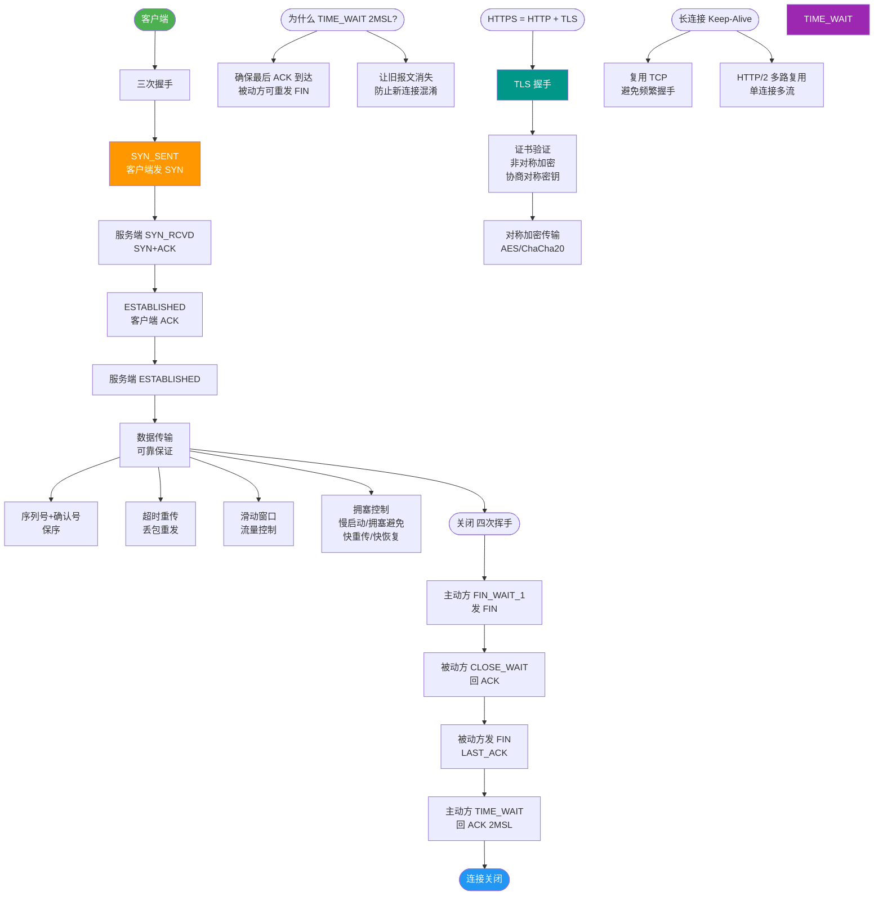

# HTTPS与HTTP的区别

【HTTPS 与 HTTP 的区别】

1. **安全性（核心区别）**：
   - **HTTP**：明文传输，数据在网络上以文本形式裸奔，容易被窃听（嗅探）、篡改（劫持）和冒充（钓鱼）。
   - **HTTPS**：在 TCP 和 HTTP 之间加入了 SSL/TLS 协议层。通过**加密**防止窃听，通过**摘要/签名**防止篡改，通过**数字证书**防止冒充。

2. **端口**：
   - **HTTP**：默认使用 80 端口。
   - **HTTPS**：默认使用 443 端口。

3. **证书（CA 机制）**：
   - **HTTP**：不需要证书，任何服务都可以搭建，用户无法验证服务器真实身份。
   - **HTTPS**：需要向 CA（证书授权中心）申请数字证书。客户端（浏览器）会验证证书的合法性，确保访问的是目标服务器。

4. **资源消耗与性能**：
   - **HTTPS**：握手阶段涉及非对称加密（RSA/ECDHE），消耗更多 CPU 资源。建立连接的首包延迟（RTT）比 HTTP 高。
   - **优化**：连接复用、Session Resumption（会话复用）、硬件加速卡可缓解性能损耗。

5. **协议结构**：
   - **HTTP**：直接将 HTTP 报文交给 TCP。
   - **HTTPS**：将 HTTP 报文交给 SSL/TLS 加密，加密后的数据再交给 TCP 传输。

### 对比表格
| 维度 | HTTP | HTTPS |
| :--- | :--- | :--- |
| **数据形态** | 明文 | 密文 (SSL/TLS 加密) |
| **默认端口** | 80 | 443 |
| **安全性** | 低 (易被窃听/篡改) | 高 (身份验证+加密) |
| **CPU/内存开销** | 低 | 较高 (握手计算) |
| **连接耗时** | RTT + 处理时间 | RTT + TLS 握手 (通常 2-RTT) |
| **证书要求** | 无 | 需要 CA 颁发的数字证书 |

【协议层级对比图】
```text
+-------------------+
|     应用层 (HTTP) |
+-------------------+         +-------------------+
|                   |         |     应用层 (HTTP) |
|                   |         +-------------------+
|     传输层 (TCP)  |         |   安全层 (SSL/TLS)|
+-------------------+         +-------------------+
|     网络层 (IP)   |         |     传输层 (TCP)  |
+-------------------+         +-------------------+
                              |     网络层 (IP)   |
                              +-------------------+
           HTTP 模型                 HTTPS 模型
```

### 实战案例
- **中间人攻击**：在某次对接第三方支付接口时，遭遇运营商 HTTP 劫持，在返回的 HTML 中注入了赌博广告。强制全站 HTTPS 后问题解决，且需开启 HSTS 防止用户被降级攻击。

### 关键配置 (Nginx 示例)
```nginx
server {
    listen 443 ssl;
    server_name example.com;
    
    ssl_certificate /etc/nginx/ssl/cert.pem;
    ssl_certificate_key /etc/nginx/ssl/key.pem;
    
    # 优化：仅启用安全的加密套件，禁用 SSLv3
    ssl_protocols TLSv1.2 TLSv1.3;
    ssl_ciphers HIGH:!aNULL:!MD5;
}
```

## 常见考点
1. **HTTPS 一定安全吗**？不一定。取决于客户端（如浏览器）是否信任根证书，以及服务器实现的 SSL/TLS 版本是否过时（如禁用 SSLv2/SSLv3）。如果使用了弱加密套件或证书过期，依然存在风险。
2. **全站 HTTPS 的成本**：证书费用（Let's Encrypt 免费）、CPU 资源消耗（SSL 握手）、CDN 支持。
3. **混合内容**：HTTPS 页面中包含 HTTP 资源，浏览器会阻止或报错（Mixed Content Error），导致页面显示异常。


## 核心流程图



## 记忆要点

- 核心区别：HTTP明文易被劫持裸奔，HTTPS因为加入SSL/TLS层所以支持加密、防篡改、防冒充
- 端口与证书：HTTP默认80端口无需证书，而HTTPS默认443端口且必须向CA申请数字证书
- 性能损耗：因为HTTPS涉及非对称加密握手和验证，所以CPU消耗和连接延迟均高于HTTP

## 结构化回答

**30 秒电梯演讲：** HTTP披上了SSL/TLS的加密外衣，确保数据传输安全。打比方——HTTP是寄明信片(谁都能看)，HTTPS是寄挂号信(密封且带身份证明)。落到工程上，HTTPS = HTTP + SSL/TLS 加密层。

**展开框架：**
1. **HTTPS =** — HTTPS = HTTP + SSL/TLS 加密层。
2. **HTTPS** — HTTPS 使用 443 端口，需 CA 数字证书。
3. **HTTPS 数据加密** — HTTPS 数据加密，HTTP 明文传输。

**收尾：** 以上三点都能配合实战聊。我可以展开任一要点，您想先深入哪一块？

## 视频脚本

> 预计时长：1 分 30 秒 | 由浅入深

| 时间 | 画面/字幕 | 口播台词 | 讲解要点 |
|------|----------|----------|----------|
| 0:00 | 标题卡：HTTPS与HTTP的区别 | "HTTPS与HTTP的区别，一分钟讲透。" | 开场钩子 |
| 0:25 | 生活类比动画 | "打个比方——HTTP是寄明信片(谁都能看)，HTTPS是寄挂号信(密封且带身份证明)。" | 核心类比 |
| 0:50 | 概念定义动画 | "一句话：HTTP披上了SSL/TLS的加密外衣，确保数据传输安全。" | 核心定义 |
| 1:20 | HTTPS = 图解 | "HTTPS = HTTP + SSL/TLS 加密层。" | HTTPS = |
