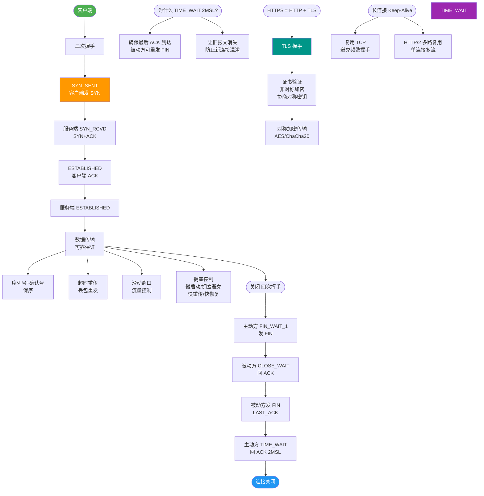
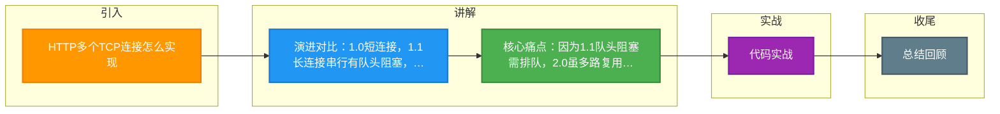

# HTTP多个TCP连接怎么实现

【HTTP 多个 TCP 连接与复用机制】

【核心机制：连接复用】
- **Keep-Alive**：通过 HTTP 头部 `Connection: keep-alive`（HTTP/1.1 默认开启）实现。一个 TCP 连接建立后（完成三次握手），保持不关闭状态，允许连续发送和接收多个 HTTP 请求/响应（串行），从而减少 TCP 握手/挥手的 RTT（往返时延）开销。

【HTTP 版本演进与并发模型】

1. **HTTP/1.0**：
   - 默认为短连接（非 Keep-Alive），每个请求都需要建立一个新的 TCP 连接。

2. **HTTP/1.1**：
   - **默认开启 Keep-Alive**，支持连接复用。
   - **缺陷**：**串行发送**（Pipeline 虽存在但支持不佳）。必须等前一个请求的响应回来后，下一个请求才能发出。容易导致**队头阻塞（Head-of-Line Blocking）**。

3. **HTTP/2**：
   - **多路复用**：基于二进制分帧层。在一个 TCP 连接上，可以并发发送多个请求/响应流。
   - **解决队头阻塞**：将数据拆分为帧，不同请求的帧可以交错发送，接收端根据 Stream ID 重组。
   - **缺陷**：TCP 层的队头阻塞依然存在（若丢包，整个 TCP 连接的所有流都需等待重传）。

4. **HTTP/3 (QUIC)**：
   - 基于 UDP 协议，彻底解决了 TCP 层的队头阻塞。

### 版本对比表格
| 特性 | HTTP/1.0 | HTTP/1.1 | HTTP/2 | HTTP/3 (QUIC) |
| :--- | :--- | :--- | :--- | :--- |
| **连接方式** | 短连接 | 长连接 | 长连接 | 基于 UDP (长连接) |
| **传输模型** | 串行 (无并发) | 串行 (有 Keep-Alive) | 二进制分帧 (多路复用) | 多路复用 (无 TCP 阻塞) |
| **并发能力** | 极差 (每请求一连接) | 一般 (受限于浏览器并发数，如6个) | 高 (单连接多流并发) | 极高 | 
| **头部压缩** | 无 | 无 | HPACK 算法 | QPACK |
| **队头阻塞** | HTTP 层阻塞 | HTTP 层阻塞 | TCP 层阻塞 (丢包全停) | 无 (包独立传输) |

【传输模式对比图】
```text
HTTP/1.1 (串行/Pipeline):         HTTP/2 (多路复用):
Request 1 --> |==========|          Req 1 --> | -- -- -- -- |
Response 1<-  |==========|          Req 2 --> | -- -- -- -- |
                                       (交错传输)
Request 2 --> |==========|          Resp 1<- | -- -- -- -- |
Response 2<-  |==========|          Resp 2<- | -- -- -- -- |
必须排队，前一个完才能发下一个    同一连接内并发互不影响
```

【关键点补充】
- **TCP 连接数限制**：浏览器对同一域名的最大并发连接数有限制（通常为 6 个），HTTP/2 将其减少到 1 个即可实现高并发。
- **服务器配置**：服务端需配置 `KeepAliveTimeout`，超时后才会关闭连接以释放资源。

### 实战案例
- **域名分片**：在 HTTP/1.1 时代，为了加载 30 个小图标，我们会将静态资源分散到 `cdn1.domain.com` 和 `cdn2.domain.com` 以突破浏览器 6 个连接的限制。升级 HTTP/2 后，反而合并域名才更优，因为多了连接建立的开销。

### 代码示例 (Go HTTP 客户端配置)
```go
transport := &http.Transport{
    MaxIdleConns:        100,              // 最大空闲连接数
    MaxIdleConnsPerHost: 10,               // 每个Host的最大空闲连接
    IdleConnTimeout:     90 * time.Second, // 空闲超时
    // 启用 HTTP/2
    ForceAttemptHTTP2:   true,
}
client := &http.Client{Transport: transport}
```

## 常见考点
1. **什么是队头阻塞 (HOL Blocking)**？在 HTTP/1.1 中，前一个请求处理慢会阻塞后续请求；在 HTTP/2 中，TCP 丢包会阻塞该连接上所有 HTTP 请求。
2. **为什么 HTTP/2 性能更好**？二进制协议（解析效率高）、头部压缩（HPACK 解决重复发送头部的浪费）、多路复用（合并请求，减少 TCP 连接数）。
3. **为什么还要搞 HTTP/3 (QUIC)**？为了解决 HTTP/2 在 TCP 层的队头阻塞问题，以及 TCP 连接建立慢（1-RTT）的问题，QUIC 实现了 0-RTT 或 1-RTT 建连。


## 核心流程图



## 记忆要点

- 演进对比：1.0短连接，1.1长连接串行有队头阻塞，2.0多路复用，3.0基于UDP
- 核心痛点：因为1.1队头阻塞需排队，2.0虽多路复用但TCP丢包会阻塞所有流
- 并发限制：HTTP/1.1受限于浏览器单域名6个TCP连接，HTTP/2只需1个TCP连接即可高并发

## 结构化回答

**30 秒电梯演讲：** TCP长连接复用，减少频繁握手带来的性能损耗。打比方——打电话(TCP连接)时不挂断，说完一句(请求)紧接着说下一句。落到工程上，keep-alive 头部保持 TCP 连接不断开。

**展开框架：**
1. **通过** — keep-alive 头部保持 TCP 连接不断开
2. **了重复建立 TCP ** — 避免了重复建立 TCP 连接的三次握手开销。
3. **HTTP/1.1 中** — HTTP/1.1 中请求需串行，HTTP/2 支持多路复用并发。

**收尾：** 以上三点都能配合实战聊。我可以展开任一要点，您想先深入哪一块？

## 视频脚本

> 预计时长：1 分 30 秒 | 由浅入深

| 时间 | 画面/字幕 | 口播台词 | 讲解要点 |
|------|----------|----------|----------|
| 0:00 | 标题卡：HTTP多个TCP连接怎么实现 | "HTTP多个TCP连接怎么实现，一分钟讲透。" | 开场钩子 |
| 0:25 | 生活类比动画 | "打个比方——打电话(TCP连接)时不挂断，说完一句(请求)紧接着说下一句。" | 核心类比 |
| 0:50 | 概念定义动画 | "一句话：TCP长连接复用，减少频繁握手带来的性能损耗。" | 核心定义 |
| 1:20 | 通过 图解 | "keep-alive 头部保持 TCP 连接不断开。" | 通过 |

### 视频流程图



