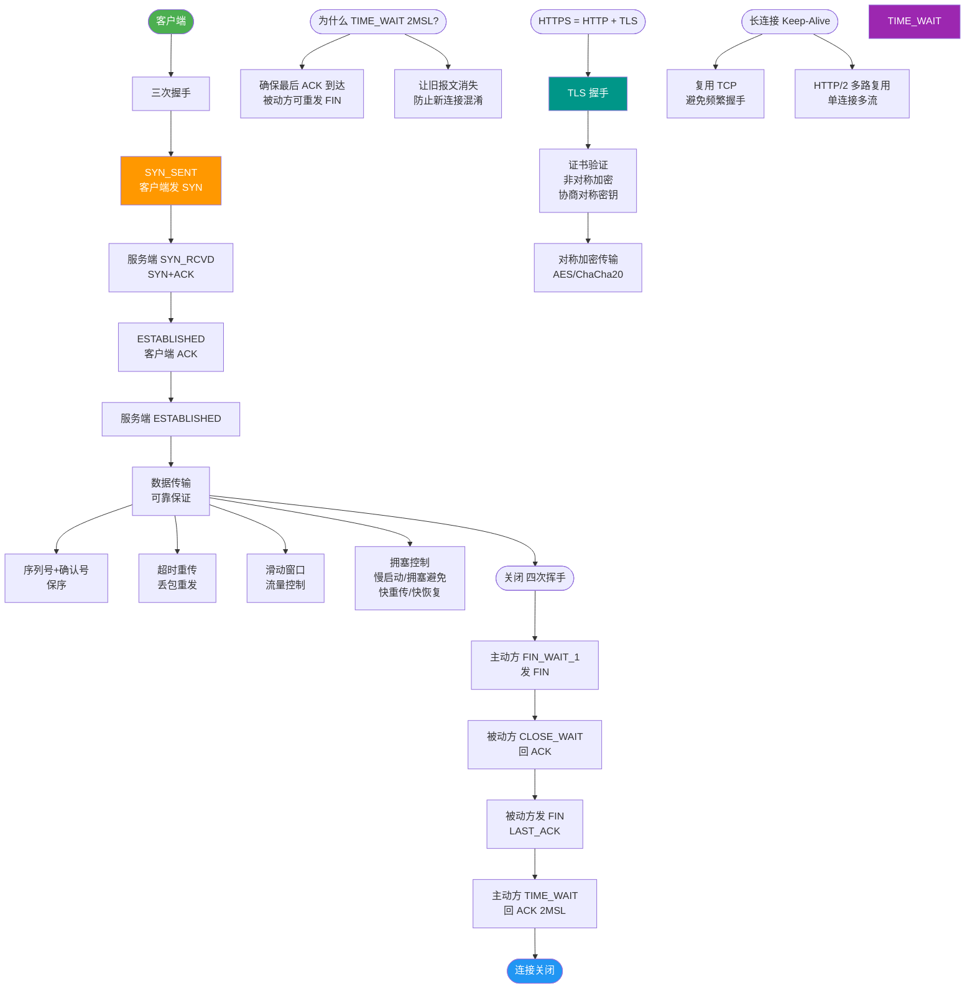
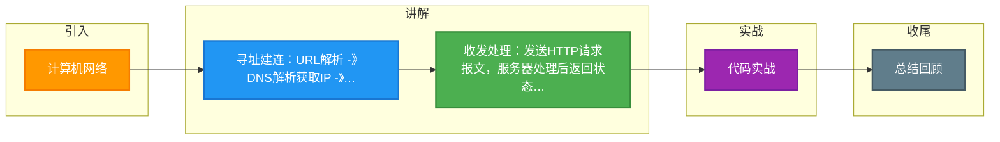

# 计算机网络

### 1. URL 解析
浏览器首先解析输入的 URL，提取出协议、主机名、端口、路径等信息。如果输入的不是合法 URL（如关键词），浏览器会默认使用搜索引擎搜索。

**实战案例**：在某电商项目中，曾遇到因用户输入带空格的 URL 导致请求失败，需在请求前对 URL 进行 `encodeURIComponent` 处理；另外，搜索引擎劫持（如流氓软件修改 `omnibox`）也是常见的排查点。

### 2. DNS 域名解析
将主机名转换为 IP 地址。查询顺序如下：
1. **浏览器缓存**：检查浏览器内存中的 DNS 缓存。
2. **系统缓存**：检查操作系统的 hosts 文件及 DNS 缓存。
3. **路由器缓存**：检查局域网网关的缓存。
4. **ISP DNS 服务器**：向运营商发起递归查询。
5. **根域名服务器**：递归查询未命中时，进行迭代查询（根 -> 顶级域 -> 权威域）。

**实战案例**：在高并发抢购活动中，为了绕过运营商 LocalDNS 的解析延迟和域名劫持，我们接入了 **HTTPDNS** 服务，通过加密 HTTP 接口直接获取 IP，将首屏时间降低了 200ms。

### 3. TCP 连接建立
获得服务器 IP 后，浏览器通过 TCP 三次握手与服务器建立连接（默认端口 443/80）。
```text
Client                         Server
  |                               |
  | ---------- SYN=1, Seq=x ----> |  (1. 客户端请求连接)
  | <--- SYN=1, ACK=1, Seq=y ---- |  (2. 服务端确认并请求连接)
  | ---------- ACK=1, Seq=z ----> |  (3. 客户端确认，连接建立)
  |                               |
```
如果协议是 HTTPS，在 TCP 连接建立后，还需要进行 **TLS/SSL 握手**，协商加密密钥，验证服务器证书。

**实战案例**：在弱网环境下（如移动端电梯里），TLS 握手的 RTT 耗时占比很高。开启 **TCP Fast Open (TFO)** 和 **TLS 1.3**（将握手次数从 2-RTT 降至 1-RTT）能显著提升连接速度。

### 4. 发送 HTTP 请求
浏览器构建 HTTP 请求报文，包含请求行、请求头和请求体。常见的请求头包括：
- `User-Agent`：浏览器类型
- `Cookie`：身份认证信息
- `Connection: keep-alive`：保持长连接

### 5. 服务器处理
- **监听端口**：服务器内核监听对应端口，将请求交给 Web 服务器（如 Nginx, Apache）。
- **反向代理/负载均衡**：Nginx 可能根据规则将请求转发给后端应用服务器（如 Tomcat, Node.js）。
- **应用逻辑处理**：后端代码处理业务逻辑，读写数据库，生成响应数据。

### 6. 返回 HTTP 响应
服务器返回响应报文，包含状态码（如 200, 301, 404, 500）、响应头和响应体（HTML, JSON 等）。

### 7. 浏览器渲染页面
- **构建 DOM 树**：解析 HTML，生成 DOM 节点树。
- **构建 CSSOM 树**：解析 CSS，生成样式规则树。
- **执行 JavaScript**：遇到 `<script>` 标签时暂停 HTML 解析（除非 defer/async），执行 JS 代码（可能会修改 DOM/CSS）。
- **构建渲染树**：将 DOM 和 CSSOM 合并，剔除不可见元素（如 head, display:none）。
- **布局**：计算每个节点在屏幕上的具体位置和大小。
- **绘制**：将渲染树的节点绘制成像素图层。
- **合成**：将图层按正确的顺序和层级叠加，显示在屏幕上。

**实战案例**：首屏加载缓慢，通过 Chrome Performance 面板分析发现，由于 JS 脚本在 `<head>` 中且未加 `defer`，阻塞了 DOM 树构建长达 800ms。将脚本移至 `</body>` 前或添加 `defer` 后，FCP（首次内容绘制）提升了 40%。

**代码示例 (JavaScript - defer/async 区别)**：
```html
<!-- defer: 脚本在 HTML 解析完成后、DOMContentLoaded 事件前按顺序执行 -->
<script src="analytics.js" defer></script> 

<!-- async: 脚本加载完成后立即执行，不保证顺序，可能阻塞 DOM 解析 -->
<script src="ads.js" async></script>
```

```text
   [URL] --> [DNS解析] --> [TCP/TLS握手] --> [HTTP请求]
                                                         |
   [用户] <--- [页面渲染] <-- [浏览器解析] <-- [HTTP响应] <---+
                                     ^
                                     | (构建DOM/CSSOM/Layout/Paint)
```

## 常见考点
1. **DNS 污染与劫持**：如何通过 HTTPDNS（使用 HTTP 协议查询 DNS）解决 DNS 劫持问题。
2. **TCP 与 UDP 的选择**：为什么 HTTP 使用 TCP 而不是 UDP（可靠传输需求），以及 QUIC（HTTP/3）为何改回 UDP。
3. **HTTPS 握手过程**：简述非对称加密交换密钥，对称加密传输数据的过程。
4. **渲染性能优化**：解释重排和重绘，以及如何通过 `transform` 和 `opacity` 避免重排。


## 核心流程图



## 记忆要点

- 寻址建连：URL解析 -> DNS解析获取IP -> TCP三次握手(HTTPS加TLS握手)
- 收发处理：发送HTTP请求报文，服务器处理后返回状态码及响应数据
- 渲染核心：构建DOM树与CSSOM树，经Layout布局和Paint绘制后合成显示

## 结构化回答


**30 秒电梯演讲：** 查地图（DNS）→走路线（TCP）→点菜（HTTP）→做菜上菜（渲染）。

**展开框架：**
1. **DNS 解析域名** — DNS 解析域名获取 IP。
2. **TCP 三次握手** — TCP 三次握手建立连接。
3. **发送 HTTP ** — 发送 HTTP 请求获取资源。

**收尾：** 这是我实战中的理解，您想深入哪一段？


## 视频脚本

> 预计时长：2 分钟 | 由浅入深

| 时间 | 画面/字幕 | 口播台词 | 讲解要点 |
|------|----------|----------|----------|
| 0:00 | 标题卡：计算机网络 | "计算机网络，一分钟讲透。" | 开场钩子 |
| 0:35 | 生活类比动画 | "打个比方——查地图(DNS)→走路线(TCP)→点菜(HTTP)→做菜上菜(渲染)。" | 核心类比 |
| 1:10 | 概念定义动画 | "一句话：从域名到页面渲染的全链路网络交互过程。" | 核心定义 |
| 1:50 | DNS 解析域名获取 图解 | "DNS 解析域名获取 IP。" | DNS 解析域名获取 |

### 视频流程图



