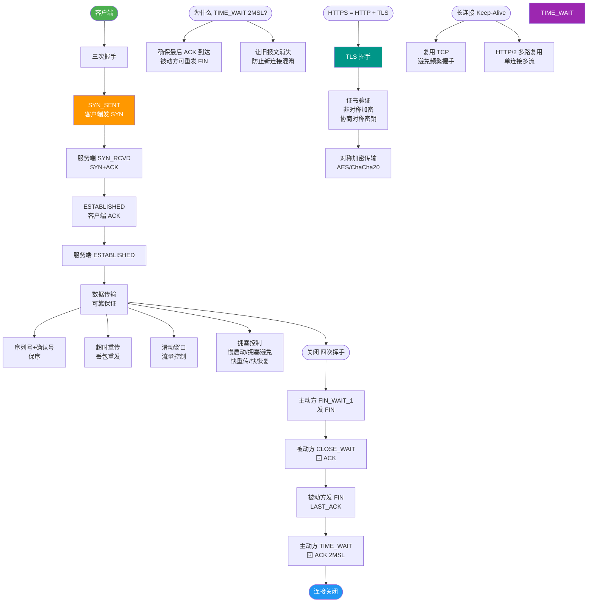

# 浏览器和网络

【浏览器架构 - 多进程】

现代浏览器（Chrome/Edge 架构）采用**多进程架构**，主要包含以下进程：

1. **Browser Process (浏览器主进程)**
   - **职责**：负责浏览器界面的展示（地址栏、书签、前进后退按钮）、管理其他进程（创建/销毁）、存储 Cookie/LocalStorage 等底层数据、网络资源管理。

2. **Renderer Process (渲染进程)**
   - **职责**：核心功能。负责将 HTML/CSS/JS 转换为用户可见的网页。包含 **GUI 线程**、**JS 引擎线程**（如 V8）、**事件触发线程**、**定时器线程**等。
   - **沙箱机制**：运行在受限环境中，无法直接读写文件系统或访问敏感数据，必须通过 IPC（进程间通信）请求主进程。

3. **Network Process (网络进程)**
   - **职责**：负责发起和处理所有的网络请求（HTTP/Socket）、下载资源、处理 CORS、解析 DNS 等。

4. **GPU Process (GPU 进程)**
   - **职责**：专门处理 GPU 相关任务，如 CSS 3D 变换、Canvas WebGL 绘制、合成页面图层，减轻 CPU 负担。

5. **Plugin Process (插件进程)**
   - **职责**：负责运行浏览器插件（如 PDF 阅读器、Flash）。每个插件通常运行在独立的进程中，防止插件崩溃影响浏览器。

6. **Utility Process (实用进程)**
   - **职责**：处理某些特定、敏感或繁琐的任务，如音频解码、视频编解码、密码管理等，进一步隔离风险。

```text
+-------------------------------------------------------+
|                   Browser Process (主进程)            |
|  (UI显示、进程管理、存储、IPC 通信枢纽)                |
+-----------+----------------------+---------------------+
            |                      |
+-----------v----------+  +--------v---------+  +-------v-------+
| Renderer Process A   |  | Renderer Process B|  | Network Proc. |
| (Tab 1 - 沙箱隔离)   |  | (Tab 2 - 沙箱隔离)|  | (网络请求)     |
+----------------------+  +-------------------+  +---------------+
            |                      |
+-----------v----------+  +--------v---------+  +-------v-------+
| GPU Process          |  | Plugin Process   |  | Utility Proc. |
| (硬件加速/合成)      |  | (Flash/PDF)      |  | (解码/密码)    |
+----------------------+  +-------------------+  +---------------+
```

**实战案例**：曾遇到某页面频繁崩溃，排查发现是第三方视频解码插件内存泄漏导致的。得益于插件隔离机制，浏览器并未崩溃，仅该插件失效。修复后，我们将该插件升级为通过 Utility Process 承载的 WebAssembly 方案，彻底解决了稳定性问题。

### 为何多进程

1. **稳定性**
   - **故障隔离**：某一页面的渲染进程崩溃（例如 JS 死循环或内存溢出），只会关闭当前标签页，不会导致整个浏览器崩溃或丢失其他标签页的数据。

2. **安全性**
   - **沙箱隔离**：网页代码运行在渲染进程中，沙箱限制了其对系统文件、内存的访问权限，有效防止恶意网页通过漏洞植入病毒或窃取隐私。

3. **流畅性**
   - **并行处理**：虽然 JS 是单线程的，但多进程允许不同页面占用不同的 CPU 核心。同时，复杂的插件或网络请求在独立进程中运行，不会阻塞主界面的 UI 线程响应。

4. **扩展性**
   - 方便对特定功能（如网络、渲染、插件）进行独立的模块化升级和资源分配。

**对比表格：单进程 vs 多进程架构**

| 特性 | 单进程架构 (早期 IE/Chrome) | 多进程架构 (现代 Chrome) |
| :--- | :--- | :--- |
| **稳定性** | 一个页面崩溃导致整个浏览器挂掉 | 页面崩溃仅影响当前 Tab，浏览器存活 |
| **安全性** | 恶意代码可直接读写本地文件 | 沙箱机制限制权限，无法直接访问 OS |
| **内存占用** | 较低 (共享内存) | 较高 (每个 Tab 独立内存，约 20-50MB) |
| **性能/流畅度** | JS 阻塞导致 UI 无响应 | 多核并行，网络/UI 不互阻塞 |

## 常见考点
1. **单页与多页模式**：Chrome 曾尝试过“单进程多线程”，但因为不稳定且难以利用多核 CPU 而放弃。
2. **进程间通信 (IPC)**：浏览器进程如何控制渲染进程（例如：右键菜单点击“刷新”，Browser 进程发送 IPC 消息通知 Renderer 进程重新加载）。
3. **面向服务的架构**：最新 Chrome 正在将 Browser Process 中的模块（如 Cookie 管理、缓存）进一步拆分为独立的服务，以提高模块化和安全性。


## 核心流程图



## 记忆要点

- 架构特性：现代浏览器采用多进程架构，主要分为主进程、渲染进程、网络进程、GPU进程
- 核心优势：因为多进程实现了资源隔离，所以单页面崩溃不会导致整个浏览器挂掉
- 安全沙箱：渲染进程运行在沙箱中无法直接读写系统文件，必须通过IPC与主进程通信

## 结构化回答


**30 秒电梯演讲：** 工厂里有独立的包装车间（渲染）和运输车间（网络），一个车间着火不影响其他车间。

**展开框架：**
1. **包含主进程、渲染** — 进程、网络进程、插件进程
2. **渲染进程负责页面解析和绘制** — 渲染进程负责页面解析和绘制，处于沙箱中。
3. **进程隔离防止单点** — 故障影响全局（防崩溃、防恶意代码）

**收尾：** 这是我实战中的理解，您想深入哪一段？


## 视频脚本

> 预计时长：2 分钟 | 由浅入深

| 时间 | 画面/字幕 | 口播台词 | 讲解要点 |
|------|----------|----------|----------|
| 0:00 | 标题卡：浏览器和网络 | "浏览器和网络，一分钟讲透。" | 开场钩子 |
| 0:35 | 生活类比动画 | "打个比方——工厂里有独立的包装车间(渲染)和运输车间(网络)，一个车间着火不影响其他车间。" | 核心类比 |
| 1:10 | 概念定义动画 | "一句话：多进程架构通过隔离提升浏览器的稳定性和安全性。" | 核心定义 |
| 1:50 | 主进程、渲染进程、网 图解 | "包含主进程、渲染进程、网络进程、插件进程。" | 主进程、渲染进程、网 |
