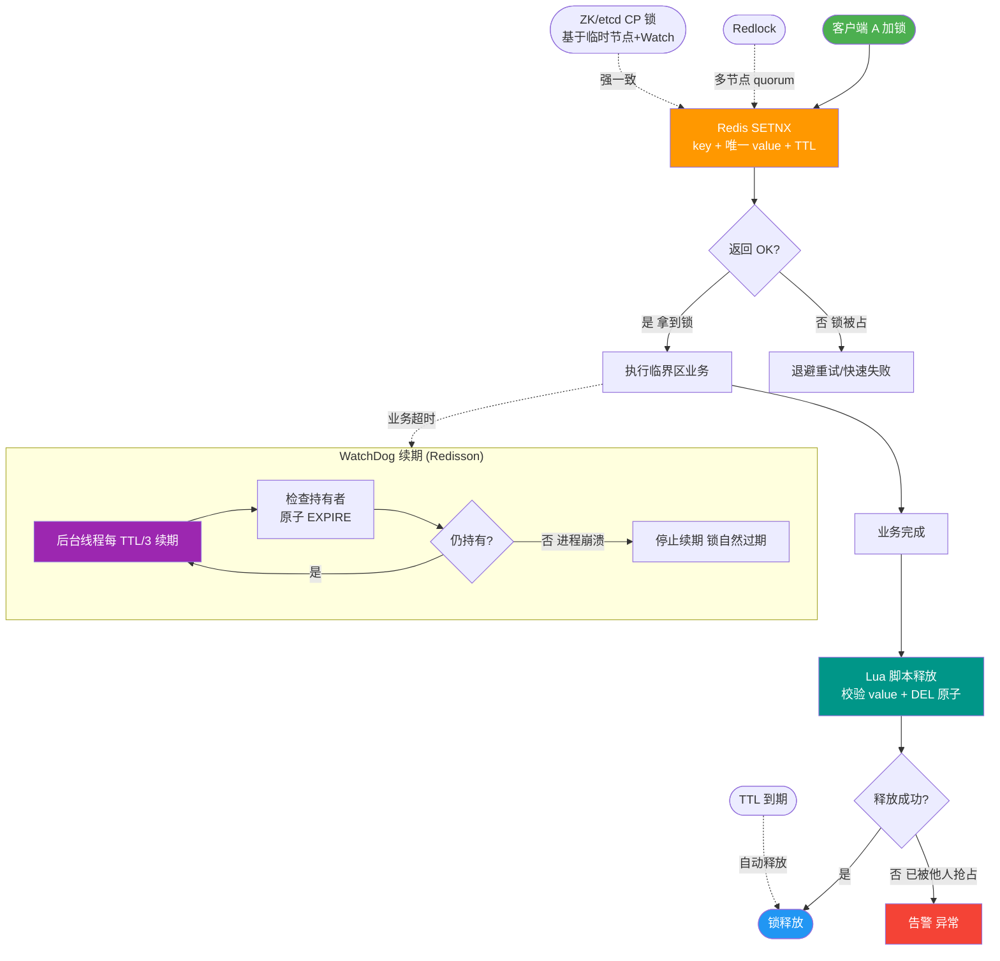
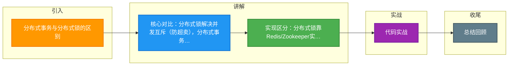

# 分布式事务与分布式锁的区别

【分布式事务与分布式锁的区别】

### 核心区别

1. **分布式锁**
   - **目标**：解决**并发竞态**问题，确保互斥性。
   - **场景**：防止多个节点在同一时刻操作同一个资源（如：秒杀场景下防止超卖、定时任务重复执行）。
   - **核心点**：在同一时刻，**只有一个客户端**能持有锁并执行代码，执行完成后释放锁。
   - **实现工具**：Redis (SETNX + Lua)、Zookeeper (临时顺序节点)、数据库 (唯一索引)。

2. **分布式事务**
   - **目标**：解决**数据一致性**问题，确保原子性。
   - **场景**：涉及多个微服务或数据库的操作，必须**同时成功或同时失败**（如：下单服务扣库存 -> 订单服务创建记录 -> 积分服务增加积分）。
   - **核心点**：跨多个网络节点的数据操作，即便中间发生故障或网络分区，最终状态也要一致。
   - **实现方案**：2PC/3PC、TCC (Try-Confirm-Cancel)、Saga 模式、本地消息表、MQ 事务消息。

**实战案例**：在库存扣减中，我们使用 **分布式锁** 来保证同一时刻只有一个请求能修改库存数值（防止超卖）；而在下单后，我们需要使用 **Seata (AT模式)** 分布式事务来保证库存扣减、订单生成和积分增加三者要么全成功，要么全回滚（防止数据不一致）。

```text
+---------------------+       +-----------------------+
|     分布式锁        |       |      分布式事务        |
+---------------------+       +-----------------------+
| 关注点：互斥        |       | 关注点：一致          |
| 目的：一人干，其他人|       | 目的：要么全干，       |
|       看着/等着     |       |       要么全不干      |
|                     |       |                       |
| [节点A] 拿到锁      |       | [服务A] 成功           |
| [节点B] 等待/拒绝   |       | [服务B] 成功           |
|                     |       | [服务C] 成功           |
| 结果：串行执行      |       | 结果：整体提交/回滚    |
+---------------------+       +-----------------------+
```

**代码示例 (Redis 分布式锁 - 使用 Redisson 框架)**：
```java
RLock lock = redisson.getLock("myLock");
try {
    // 尝试加锁，等待100秒，锁自动释放时间30秒
    boolean locked = lock.tryLock(100, 30, TimeUnit.SECONDS); 
    if (locked) {
        // 执行业务逻辑
        doBusiness();
    }
} finally {
    // 确保锁释放
    if (lock.isHeldByCurrentThread()) {
        lock.unlock();
    }
}
```

### CAP 定理与 BASE 理论

**CAP 定理**：
- **Consistency (一致性)**：在分布式系统中的所有数据备份，在同一时刻是否同样的值（等同于所有节点访问同一份最新的数据副本）。
- **Availability (可用性)**：保证每个请求不管成功或者失败都有响应。
- **Partition Tolerance (分区容错性)**：系统中任意信息的丢失或失败不会影响系统的继续运作。
- **结论**：在分布式系统中，P（分区）是客观存在的，因此只能在 CP 和 AP 之间做权衡。
  - **CP**：强一致性，牺牲部分可用性（如 Zookeeper，挂了 Leader 期间服务不可用）。
  - **AP**：高可用性，牺牲强一致性（如 Redis，允许主从同步期间数据不一致）。

**BASE 理论**（对 CAP 中 AP 的延伸）：
- **Basically Available (基本可用)**：允许损失部分可用性（如响应时间变长、服务降级）。
- **Soft state (软状态)**：允许数据存在中间状态，该中间状态不影响系统可用性。
- **Eventually consistent (最终一致性)**：经过一段时间后，所有节点的数据最终会达到一致。

## 常见考点
1. **TCC vs Saga**：TCC 需要每个接口实现 Try/Confirm/Cancel 三个阶段，代码侵入性强但性能好；Saga 通过正向操作+补偿操作，适合长流程业务。
2. **Redis 分布式锁的安全问题**：如何解决锁过期时间不确定、主从切换导致锁丢失问题？需要看门狗机制或 Redlock 算法。
3. **事务消息流程**：RocketMQ 如何解决“半消息”状态下的消息回查机制，确保消息发送与本地事务的原子性。
4. **2PC 的缺点**：同步阻塞问题（所有参与者锁定资源直到提交）、单点故障问题（Coordinator 挂了所有参与者都卡住）。


## 核心流程图



## 记忆要点

- 核心对比：分布式锁解决并发互斥(防超卖)，分布式事务解决跨服务数据一致性(全成功或全回滚)
- 实现区分：分布式锁靠Redis/Zookeeper实现串行化，分布式事务靠2PC/TCC/Saga保证原子性
- 实战场景：秒杀用分布式锁控制并发，下单扣库存加积分用分布式事务保证整体一致

## 结构化回答

**30 秒电梯演讲：** 锁解决资源抢占(排队)，事务解决操作原子性(同生共死)。打比方——锁是公厕的门(一次进一人)，事务是转账(要么都成要么都滚)。落到工程上，分布式锁解决并发下的互斥访问，强调唯一性。

**展开框架：**
1. **分布式锁** — 分布式锁解决并发下的互斥访问，强调唯一性。
2. **分布式事务** — 分布式事务解决跨服务的数据一致性，强调原子性。
3. **CAP 理论** — 分布式系统无法同时满足一致性、可用性和分区容错性

**收尾：** 以上三点都能配合实战聊。我可以展开任一要点，您想先深入哪一块？

## 视频脚本

> 预计时长：2 分钟 | 由浅入深

| 时间 | 画面/字幕 | 口播台词 | 讲解要点 |
|------|----------|----------|----------|
| 0:00 | 标题卡：分布式事务与分布式锁的区别 | "分布式事务与分布式锁的区别，一分钟讲透。" | 开场钩子 |
| 0:35 | 生活类比动画 | "打个比方——锁是公厕的门(一次进一人)，事务是转账(要么都成要么都滚)。" | 核心类比 |
| 1:10 | 概念定义动画 | "一句话：锁解决资源抢占(排队)，事务解决操作原子性(同生共死)。" | 核心定义 |
| 1:50 | 分布式锁 图解 | "分布式锁解决并发下的互斥访问，强调唯一性。" | 分布式锁 |

### 视频流程图



