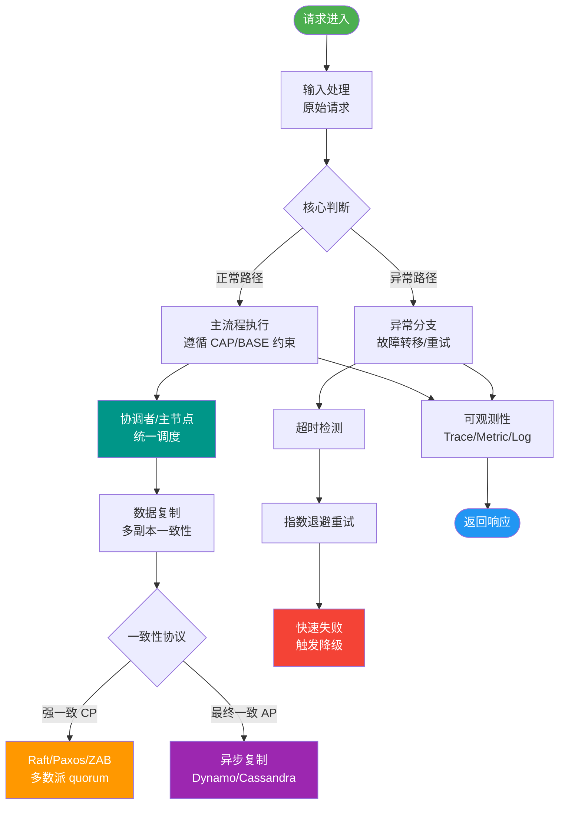

# 事务的四个特征

【事务的四个特征 (ACID)】

1. **Atomicity (原子性)**
   - **定义**：事务是一个不可分割的整体，事务中的操作要么全部成功，要么全部失败。
   - **实现原理**：依赖 **Undo Log (回滚日志)**。当事务执行失败或调用 rollback 时，数据库利用 Undo Log 将数据回滚到修改前的状态。
   - **边界**：指事务层面的原子性，并不涉及多个数据库之间的原子性（那是分布式事务的问题）。

2. **Consistency (一致性)**
   - **定义**：事务执行前后，数据库的完整性约束没有被破坏。例如：转账前后 A 和 B 的总金额不变；字段类型符合定义；索引依然有效。
   - **实现原理**：是事务的最终目标。依赖于原子性、隔离性和持久性，以及数据库层面的约束（如外键约束、唯一索引、触发器）。
   - **注意**：一致性也包含业务层面的一致性（如库存不能为负）。

3. **Isolation (隔离性)**
   - **定义**：并发执行的事务之间互不干扰，一个事务的中间状态对其他事务不可见。
   - **实现原理**：依赖 **MVCC (多版本并发控制)** 和 **锁机制**。
   - **隔离级别与问题**：
     - **读未提交**：可能脏读。
     - **读已提交 (RC)**：可能不可重复读。
     - **可重复读 (RR)**：MySQL 默认级别，可能幻读（但 MVCC 很大程度上解决了幻读）。
     - **串行化**：最高级别，强制事务串行执行。

4. **Durability (持久性)**
   - **定义**：事务一旦提交，对数据的修改是永久性的，即使数据库宕机，数据也不会丢失。
   - **实现原理**：依赖 **Redo Log (重做日志)**。事务提交时，先将修改写入 Redo Log（WAL Write-Ahead Logging），即使数据页还没刷入磁盘，系统崩溃后重启也可以通过 Redo Log 恢复数据。

**实战案例**：在生产环境遇到数据库异常重启，部分数据未落盘。通过检查 `InnoDB` 的状态，发现 Redo Log 写入成功，数据库启动时自动执行了崩溃恢复，保证了数据未丢失。这验证了 WAL 机制的重要性：牺牲一定的写入延迟换取数据的极致安全。

```text
事务执行流程与日志关系：

Start Transaction
      |
      v
[执行 SQL] --> 修改内存页 --> 写入 Undo Log (用于回滚)
      |
      v
Write to Redo Log (顺序写磁盘，标记为 Prepare)
      |
      v
Commit (事务提交成功)
      |
      +--> Dirty Page (脏页) 依策略异步刷入磁盘 (数据持久化)
```

**代码示例 (事务回滚)**：
```java
@Transactional(rollbackFor = Exception.class) 
public void transferMoney(Long fromId, Long toId, BigDecimal amount) {
    // 1. 扣款
    accountDao.decrease(fromId, amount);
    // 2. 模拟异常，原子性保证扣款会回滚
    if (amount.compareTo(new BigDecimal("10000")) > 0) {
        throw new RuntimeException("单笔限额");
    }
    // 3. 加款
    accountDao.increase(toId, amount);
}
```

## 常见考点
1. **Undo Log 和 Redo Log 的区别**：Undo Log 是逻辑日志（记录修改前的值），用于回滚；Redo Log 是物理日志（记录修改后的物理位置和值），用于崩溃恢复和持久性。
2. **并发事务带来的问题**：详细解释脏读（读了未提交的）、不可重复读（同一条记录读出了不同值）、幻读（读出了未提交的新增记录）。
3. **MVCC 解决了什么**：实现了读写互不阻塞，解决了读已提交和可重复读级别下的读写并发问题，通过 Read View（快照）判断数据可见性。
4. **ACID 的关系**：原子性是基础，隔离性是手段，持久性是保证，一致性是最终目的。


## 核心流程图



## 记忆要点

- 四大特性：原子性、一致性、隔离性、持久性，其中一致性是最终目的
- 日志支撑：原子性依赖Undo Log(回滚)，持久性依赖Redo Log(崩溃恢复，WAL机制)
- 隔离与并发：隔离性依赖锁和MVCC，保证并发事务互不干扰，避免脏读幻读

## 结构化回答


**30 秒电梯演讲：** 银行转账：要么全成要么全撤（原子），钱数守恒（一致），互看不透（隔离），记账入册（持久）。

**展开框架：**
1. **原子性** — 不可分割，失败回滚。
2. **一致性** — 数据状态符合约束。
3. **隔离性** — 并发事务间互不干扰。

**收尾：** 这是我实战中的理解，您想深入哪一段？


## 视频脚本

> 预计时长：3 分钟 | 由浅入深

| 时间 | 画面/字幕 | 口播台词 | 讲解要点 |
|------|----------|----------|----------|
| 0:00 | 标题卡：事务的四个特征 | "事务的四个特征，这题我会分三步讲。" | 开场钩子 |
| 0:41 | 概念定义动画 | "一句话：事务保障数据库操作的原子、一致、隔离和持久。" | 核心定义 |
| 1:22 | 生活类比动画 | "打个比方——银行转账：要么全成要么全撤(原子)，钱数守恒(一致)，互看不透(隔离)，记账入册(持久)。" | 核心类比 |
| 2:03 | 原子性 图解 | "不可分割，失败回滚。" | 原子性 |
| 2:50 | 一致性 图解 | "数据状态符合约束。" | 一致性 |
