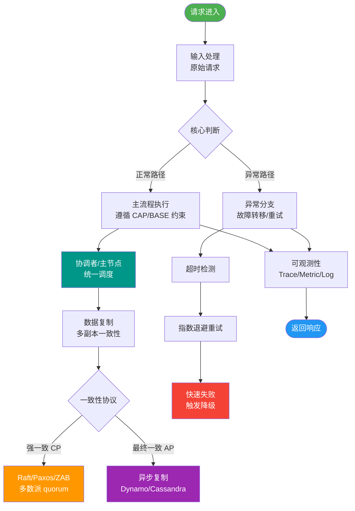
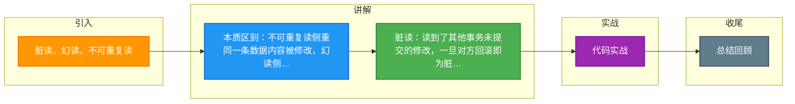

# 脏读、幻读、不可重复读

### 脏读
事务A读到了事务B还未提交的数据。如果事务B随后回滚，那么事务A读到的数据就是无效的“脏数据”。

### 幻读
事务A在进行范围查询时，事务B在该范围内插入或删除了记录并提交。当事务A再次执行同样的范围查询时，发现结果集中多出或少了一些行（即“幻行”）。

### 不可重复读
事务A在读取某些数据后，事务B修改并提交了该数据。当事务A再次读取该数据时，发现读出的内容已经发生变化。

### 现象对比与场景复现

| 现象 | 描述 | 对应操作 | 隔离级别解决方案（最低）
| :--- | :--- | :--- | :---
| **脏读** | 读到未提交的数据 | 读未提交 | Read Committed (RC)
| **不可重复读** | 前后读取内容不一致 | 修改 | Repeatable Read (RR)
| **幻读** | 前后读取数量不一致 | 插入/删除 | Serializable (标准) / RR (MySQL特有)

### MySQL 中的特殊处理

需要注意的是，在 MySQL InnoDB 的 **REPEATABLE READ (RR)** 隔离级别下：
-   **不可重复读**：通过 **MVCC** 解决。读取快照，保证每次读取到的是事务开始时的版本。
-   **幻读**：通过 **Next-Key Lock (临键锁)** 解决。它不仅锁住记录本身，还会锁住记录之间的间隙，阻止其他事务插入新记录。

### 实战案例
在电商订单状态流转中，如果隔离级别设置不当，事务A查询到“待支付”订单并准备扣款，期间事务B将订单状态回滚或修改，事务A若再次读取发现状态变了（不可重复读）或凭空消失了（脏读回滚），会导致资金流对不上账。

### 代码示例 (Java - Spring Boot 隔离级别配置)
```java
@Transactional(isolation = Isolation.READ_COMMITTED)
public void updateInventory(Long productId, int count) {
    // 在RC级别下，这里能读到其他已提交事务的库存变化
    // 如果是RR，则在整个事务期间读到的库存是一致的
    Integer stock = productMapper.getStock(productId);
    if (stock >= count) {
        productMapper.decreaseStock(productId, count);
    }
}
```

### 常见考点

1.  **RC 和 RR 区别本质是什么？**
    -   在 RC 级别下，每次 SELECT 都会生成一个新的 Read View，因此能看到其他事务提交后的修改。
    -   在 RR 级别下，只在事务第一次 SELECT 时生成 Read View，后续读取都复用这个视图，因此看不到其他事务的修改，实现了可重复读。

2.  **为什么说 MySQL InnoDB 在 RR 级别解决了幻读？**
    -   快照读（普通 `SELECT`）：利用 MVCC 解决。
    -   当前读（`SELECT ... FOR UPDATE`, `UPDATE`, `DELETE`）：利用 Next-Key Lock 解决。

3.  **幻读和不可重复读的区别，仅仅是“新增”吗？**
    -   核心区别在于：不可重复读侧重于**数据值的修改**，是针对同一行数据；幻读侧重于**数据条数的变化**（插入或删除），通常涉及范围查询。


## 核心流程图



## 记忆要点

- 本质区别：不可重复读侧重同一条数据内容被修改，幻读侧重查询结果集数量被增删
- 脏读：读到了其他事务未提交的修改，一旦对方回滚即为脏数据
- MySQL破解：RR级别下通过MVCC解决不可重复读，通过Next-Key Lock解决幻读

## 结构化回答


**30 秒电梯演讲：** 像看文章，别人边写边改，你可能看到草稿（脏）、段落变了（不可重复）、页数变了（幻读）。

**展开框架：**
1. **脏读** — 读到未提交的数据。
2. **不可重复读** — 同一事务内前后读取数据内容不一致。
3. **幻读** — 同一事务内前后读取数据条数不一致。

**收尾：** 这是我实战中的理解，您想深入哪一段？


## 视频脚本

> 预计时长：1 分 30 秒 | 由浅入深

| 时间 | 画面/字幕 | 口播台词 | 讲解要点 |
|------|----------|----------|----------|
| 0:00 | 标题卡：脏读、幻读、不可重复读 | "脏读、幻读、不可重复读，一分钟讲透。" | 开场钩子 |
| 0:25 | 生活类比动画 | "打个比方——像看文章，别人边写边改，你可能看到草稿(脏)、段落变了(不可重复)、页数变了(幻读)。" | 核心类比 |
| 0:50 | 概念定义动画 | "一句话：并发事务未加隔离导致的三种数据不一致现象。" | 核心定义 |
| 1:20 | 脏读 图解 | "读到未提交的数据。" | 脏读 |

### 视频流程图



