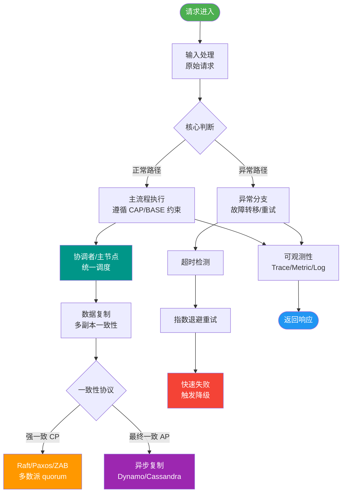

# 事务的隔离级别

### 幻读 vs 不可重复读

-   **幻读**：侧重于**数量**（或记录数）的变化，通常由插入或删除操作引起。
-   **不可重复读**：侧重于**内容**的变化，通常由修改操作引起。

### 四种事务隔离级别

为了解决并发问题，SQL 标准定义了四种隔离级别（从低到高）：

1.  **读未提交（READ UNCOMMITTED）**
    -   允许读取其他事务未提交的数据。
    -   **问题**：可能导致脏读、不可重复读、幻读。
    -   **应用**：极少使用。

2.  **读已提交（READ COMMITTED，RC）**
    -   只能读取其他事务已经提交的数据。
    -   **问题**：解决了脏读，但可能发生不可重复读、幻读。
    -   **应用**：Oracle、SQL Server、PostgreSQL 默认级别。

3.  **可重复读（REPEATABLE READ，RR）**
    -   保证同一事务内多次读取同一数据的结果是一致的。
    -   **问题**：解决了脏读和不可重复读。在 SQL 标准中可能发生幻读，但 **MySQL InnoDB 通过 MVCC（快照读）和 Next-Key Lock（当前读）解决了幻读**。
    -   **应用**：MySQL 默认级别。

4.  **串行化（SERIALIZABLE）**
    -   最高隔离级别，强制事务串行执行。
    -   **机制**：对读取的每一行数据都加共享锁，不允许并发。
    -   **问题**：导致大量的超时和锁争用，性能极低。
    -   **应用**：极少使用，用于对一致性要求极高且并发量极低的场景。

### MySQL 隔离级别操作

```sql
-- 查看全局隔离级别（MySQL 8.0）
SELECT @@GLOBAL.transaction_isolation;

-- 查看当前会话隔离级别
SELECT @@SESSION.transaction_isolation;

-- 设置当前会话隔离级别
SET SESSION TRANSACTION ISOLATION LEVEL READ COMMITTED;

-- 设置全局隔离级别
SET GLOBAL TRANSACTION ISOLATION LEVEL READ COMMITTED;
```

### 隔离级别与锁策略演进图

```text
锁范围与隔离级别关系

Read Uncommitted:  不加锁 (或极短锁)
                         │
                         ▼ 加行锁 (写锁)
Read Committed:  ────────┼───────────────
                         │ 读不加锁 (MVCC)
                         ▼
Repeatable Read: ────────┼───────────────
                         │ MVCC (快照读) + Next-Key Lock (当前读)
                         ▼ 加全表/范围锁 (隐式)
Serializable:    ────────┴───────────────
```

### 实战案例
阿里Java开发手册明确规定，在涉及金钱计算等高敏感业务时，如果使用了MySQL，需显式评估RR级别的间隙锁可能带来的死锁风险；而在高并发简单的增删改查场景，大厂普遍建议将MySQL默认隔离级别由RR调整为RC，以减少间隙锁导致的性能损耗和死锁概率。

### 代码示例 (Go GORM 设置隔离级别)
```go
// 在事务中设置隔离级别为 Read Committed
db.Transaction(func(tx *gorm.DB) error {
    tx.Exec("SET TRANSACTION ISOLATION LEVEL READ COMMITTED")
    if err := tx.Where("status = ?", 1).Find(&users).Error; err != nil {
        return err
    }
    // 业务逻辑...
    return nil
})
```

### 隔离级别选型对比

| 特性 | Read Uncommitted | Read Committed (RC) | Repeatable Read (RR) | Serializable |
| :--- | :--- | :--- | :--- | :--- |
| **脏读** | 可能 | 避免 | 避免 | 避免 |
| **不可重复读** | 可能 | 可能 | 避免 | 避免 |
| **幻读** | 可能 | 可能 | 可能 (MySQL避免) | 避免 |
| **锁竞争** | 最低 | 低 | 中 (含间隙锁) | 极高 |
| **适用场景** | 极少 | 大多数互联网业务 | 需要复杂统计/报表 | 金融强一致性 |

## 常见考点

1.  **MySQL 为什么默认选择 RR 而不是 RC？**
    -   历史/兼容性原因：MySQL 复制在早期版本依赖于 RC/RR 的行为差异（基于语句的复制）。
    -   解决幻读：InnoDB 通过 Next-Key Lock 很好地解决了 RR 级别的幻读问题，使得 RR 具备了媲美 Serializable 的一致性，同时保留了并发能力。

2.  **生产环境一般推荐用什么隔离级别？**
    -   一般推荐 **RC (Read Committed)**。虽然 MySQL 默认是 RR，但 RC 在处理死锁、行锁升级等方面表现更好，且能避免一些间隙锁带来的不必要阻塞。互联网大厂如阿里、字节通常建议将 MySQL 改为 RC。

3.  **MVCC 能解决什么问题？**
    -   MVCC 使得读写操作互不阻塞，极大提高了并发性能。它主要解决了 RR 级别下的不可重复读，配合 Next-Key Lock 解决了幻读。


## 核心流程图



## 记忆要点

- 四大级别：读未提交、读已提交(RC)、可重复读(RR)、串行化，隔离级别越高并发越低
- MySQL默认：默认使用RR级别，通过MVCC和临键锁在RC基础上额外解决了幻读问题
- 大厂实践：互联网业务为减少死锁提高并发，常将隔离级别从RR降为RC

## 结构化回答

**30 秒电梯演讲：** 通过牺牲并发性能来换取不同程度的数据隔离安全。打比方——像做私密谈话，从随便听(读未提交)到只有结束公布才让知道(读已提交)。落到工程上，级别越高，数据一致性越好，并发性能越差。

**展开框架：**
1. **级别越高** — 级别越高，数据一致性越好，并发性能越差。
2. **RC** — RC解决脏读，RR解决不可重复读。
3. **MySQL默认RR** — MySQL默认RR，通过Next-Key Lock解决幻读。

**收尾：** 以上三点都能配合实战聊。我可以展开任一要点，您想先深入哪一块？

## 视频脚本

> 预计时长：2 分钟 | 由浅入深

| 时间 | 画面/字幕 | 口播台词 | 讲解要点 |
|------|----------|----------|----------|
| 0:00 | 标题卡：事务的隔离级别 | "事务的隔离级别，一分钟讲透。" | 开场钩子 |
| 0:35 | 生活类比动画 | "打个比方——像做私密谈话，从随便听(读未提交)到只有结束公布才让知道(读已提交)。" | 核心类比 |
| 1:10 | 概念定义动画 | "一句话：通过牺牲并发性能来换取不同程度的数据隔离安全。" | 核心定义 |
| 1:50 | 级别越高 图解 | "级别越高，数据一致性越好，并发性能越差。" | 级别越高 |
