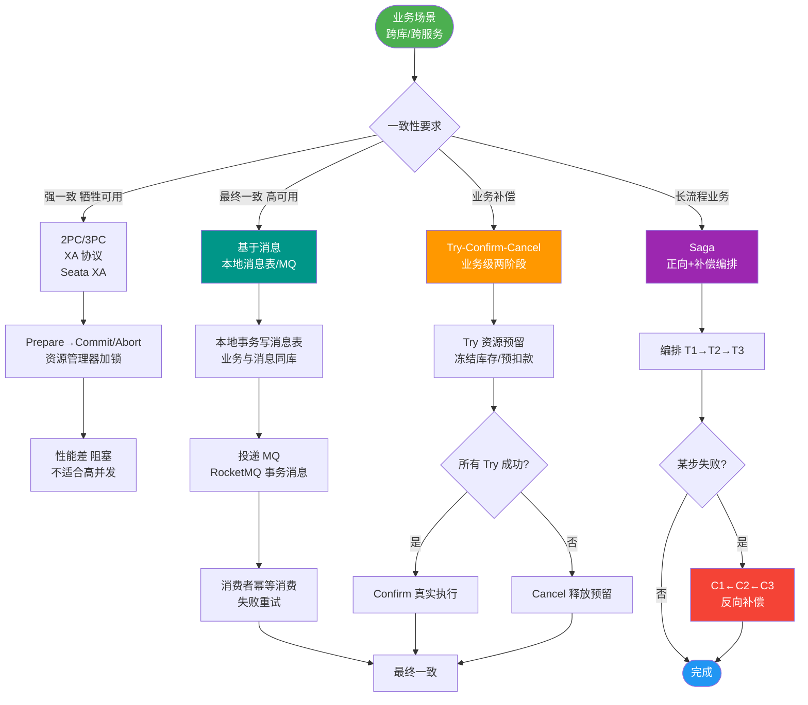

# 分布式事务的基本概念

### 隔离级别补充

-   **读已提交（READ COMMITTED）**：Oracle 默认级别，只能看到其他事务已提交的修改。
-   **可重复读（REPEATABLE READ）**：MySQL 默认级别，同一事务中多次查询看到相同数据行，解决了不可重复读。
-   **可串行化（SERIALIZABLE）**：最高隔离级别，事务串行执行，读取每条数据都加锁，性能差。

**Q：如何保证 REPEATABLE READ 级别绝对不产生幻读？**
A：在 SQL 中加入 `for update`（排他锁）或 `lock in share mode`（共享锁，MySQL 8.0 替换为 `FOR SHARE`），通过锁住可能造成幻读的数据范围，阻止其他事务的插入操作。

### 分布式事务的基本概念

分布式事务是指事务的参与者、支持事务的服务器、资源服务器以及事务管理器分别位于分布式系统的不同节点上。

### 分布式环境的复杂性

当本地事务扩展到分布式时，复杂性显著增加：

1.  **存储端的多样性**
    -   **本地事务**：通常涉及单一数据库，由 DB 内部机制（如 Undo/Redo Log）强一致保证。
    -   **分布式事务**：可能涉及多个不同类型的数据库（如 MySQL、Oracle）、缓存或消息队列（MQ）。不同系统对事务的支持能力不同（例如 Redis 不支持严格的 ACID 回滚，仅支持事务块内的原子执行），增加了协调难度。

2.  **事务链路的延展性**
    -   **本地事务**：通常封装在一个服务方法中，由单一应用维护 ACID，进程内内存调用，网络开销小。
    -   **分布式事务**：业务操作被拆分为多个微服务，服务间通过网络通信协作。网络的不稳定性（超时、丢包）、服务的独立性（部分宕机）导致跨服务的事务协调变得非常困难。

### 实战案例
在电商“下单扣库存”场景中，订单服务和库存服务分属不同数据库。如果订单创建成功但网络抖动导致库存扣减失败，若无分布式事务保障，会出现超卖现象。若使用2PC（两阶段提交），一旦库存服务宕机未响应Prepare，订单服务会一直阻塞锁资源，导致整个下单链路挂死。

### 代码示例 (Seata AT 模式伪代码)
```java
@GlobalTransactional(name = "create-order", rollbackFor = Exception.class)
public void createOrder(OrderDTO order) {
    // 1. 扣除库存 (远程调用)
    storageService.deduct(order.getProductId(), order.getCount());
    // 2. 创建订单 (本地数据库)
    orderMapper.insert(order);
    // 3. 增加账户积分 (远程调用)
    accountService.addPoints(order.getUserId(), order.getPoints());
    // Seata 自动拦截并协调各分支事务的提交或回滚
}
```

### 本地事务 vs 分布式事务 对比

| 维度 | 本地事务 | 分布式事务 |
| :--- | :--- | :--- |
| **参与资源** | 单一数据库实例 | 多个数据库/服务/MQ |
| **协议支持** | ACID (由DB内核保证) | 需要额外协议 (2PC, TCC, Saga) |
| **性能损耗** | 低 (仅锁行/表) | 高 (网络RPC + 额外协调开销) |
| **一致性** | 强一致性 | 最终一致性 或 CP架构下的强一致 |
| **故障处理** | 简单 (Rollback) | 复杂 (需处理补偿、悬挂、空回滚) |

### 分布式事务理论模型：CAP

在分布式系统中，无法同时满足 Consistency（一致性）、Availability（可用性）、Partition Tolerance（分区容错性），只能满足其中两项。
-   **CP**：放弃高可用，保证强一致（如传统 RDBMS 集群模式）。
-   **AP**：放弃强一致，保证高可用（如 Dynamo, Cassandra）。
-   **BASE 理论**：基于 AP，建议 Basically Available（基本可用）、Soft state（软状态）、Eventually consistent（最终一致性）。

```text
本地事务 vs 分布式事务 调用链路对比

【本地事务】
┌───────────────────────────────────────┐
│  应用服务  │
│  ┌─────────────────────────────────┐  │
│  │  Begin Tx                       │  │
│  │  DBOp1 (Insert)                 │  │
│  │  DBOp2 (Update)                 │  │
│  │  Commit Tx                      │  │
│  └─────────────────────────────────┘  │
│            │ 内存调用                  │
│            ▼                          │
│       ┌────────┐                      │
│       │   DB   │                      │
│       └────────┘                      │
└───────────────────────────────────────┘

【分布式事务】
┌────────────────────────────────────────────────────────────┐
│  网络层                            │
├───────────────────────┬────────────────────────────────────┤
│  服务 A                │  服务 B              │
│  ┌─────────────────┐  │  ┌─────────────────┐            │
│  │ Global Tx Start │  │  │                 │            │
│  │ Local Tx (A)    │──┼──>│ Local Tx (B)    │            │
│  │ Commit/Rollback │  │  │ Commit/Rollback │            │
│  └─────────────────┘  │  └─────────────────┘            │
└───────────────────────┴────────────────────────────────────┘
```


## 核心流程图



## 记忆要点

- 本地事务重内部机制，分布式事务重网络协调。跨库/RPC使得ACID难以保证。
- CAP定理限制：P（分区）必选，CP保强一致（如转账），AP保高可用（如网页）。
- BASE理论是AP的延伸：基本可用、软状态、最终一致，容忍短期数据不一致。
- 防幻读：MySQL RR级别下配合 `for update`（排他锁）锁住数据范围。

## 结构化回答


**30 秒电梯演讲：** 像跨行转账，不仅要操作自己的账本，还要协调别的银行，过程更复杂。

**展开框架：**
1. **涉及多个网络** — 涉及多个网络节点或服务。
2. **DB** — 存储介质多样（DB、缓存、MQ）。
3. **网络** — 网络通信增加了不确定性和延迟。

**收尾：** 这是我实战中的理解，您想深入哪一段？


## 视频脚本

> 预计时长：1 分 30 秒 | 由浅入深

| 时间 | 画面/字幕 | 口播台词 | 讲解要点 |
|------|----------|----------|----------|
| 0:00 | 标题卡：分布式事务的基本概念 | "分布式事务的基本概念，一分钟讲透。" | 开场钩子 |
| 0:25 | 生活类比动画 | "打个比方——像跨行转账，不仅要操作自己的账本，还要协调别的银行，过程更复杂。" | 核心类比 |
| 0:50 | 概念定义动画 | "一句话：跨多个节点或服务保持数据一致性的事务机制。" | 核心定义 |
| 1:20 | 涉及多个网络节点 图解 | "涉及多个网络节点或服务。" | 涉及多个网络节点 |
