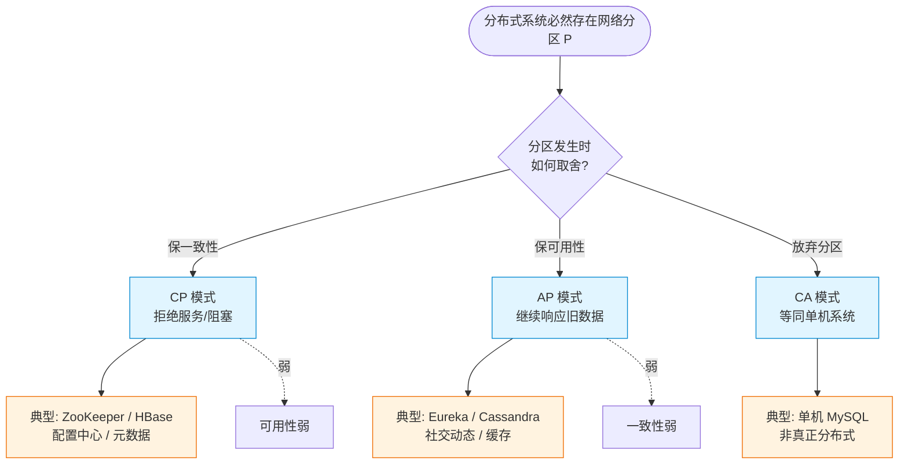

# CAP定理

### CAP 定理

CAP 定理是分布式系统设计中的重要理论基础，由 Eric Brewer 教授提出。它指出一个分布式系统最多只能同时满足以下三个特性中的两个：

1.  **一致性**
    -   在分布式系统中的所有数据备份，在同一时刻是否同样的值。（等同于所有节点访问同一份最新的数据副本）。
    -   强调数据的线性一致性。
    -   *补充细节*：这里特指**强一致性**。即对于客户端来说，访问分布式集群中的任意节点，读到的都是刚刚写入的数据或同一时间戳的数据。

2.  **可用性**
    -   保证每个请求不管成功或者失败都有响应，但不保证获取的数据是正确的（最新的）。
    -   强调服务在合理时间内必须响应。
    -   *补充细节*：强调**“非故障”节点**必须响应。只要节点没有宕机，它就不能一直处于超时或阻塞状态。

3.  **分区容错性**
    -   系统中任意信息的丢失或失败不会影响系统的继续运作。
    -   在分布式系统中，P 是客观存在的，网络分区必然会发生。
    -   *补充细节*：P 意味着系统在**网络丢包或延迟**过高（不仅仅是断网）的情况下，依然能够对外提供服务。在分布式系统中，网络是不可靠的，P 是必须具备的特性。

### CAP 的权衡

在分布式系统中，网络分区（P）是不可避免的常态，因此架构师通常只能在 **一致性（C）** 和 **可用性（A）** 之间进行权衡：

-   **CP**：放弃可用性。当出现分区时，为了保证数据一致性，系统会拒绝服务或阻塞请求，直到数据一致（如传统关系型数据库的强一致模式、Zookeeper、HBase）。
-   **AP**：放弃强一致性。当出现分区时，系统继续提供服务，但允许数据在一段时间内不一致，最终达到一致（如 DNS、Cassandra、Eureka）。
-   **CA**：放弃分区容错性。这在分布式系统中通常意味着不再是真正的分布式系统（如单机数据库），因为无法容忍网络分区。

```text
      分布式系统三角

         一致性 (C)
            / \
           /   \
          /     \
         /       \
        /_________\
   分区容错 (P)   可用性 (A)

   实际上：
   (必须保留 P)  
      |
      +-- 选择 CP (如 Zookeeper): 保证数据强一致，网络故障时可能暂停服务
      +-- 选择 AP (如 Eureka):  保证服务高可用，网络故障时可能出现数据不一致
```

**注**：在互联网大规模分布式中，通常选择 AP 或 CP（主要为了 P）。

### 实战案例
在设计注册中心时，ZooKeeper 选择了 CP 架构。当 Master 节点因网络分区与集群失联时，ZooKeeper 会重新选举，但在选举完成前，服务处于不可用状态，这会导致此时微服务无法获取最新的服务列表，但保证了配置数据的绝对一致。而 Eureka 选择了 AP 架构，当节点网络分区时，各个节点依然提供旧的服务列表供客户端调用，优先保证系统可用，容忍短暂的数据不一致。

### 代码示例 (理解一致性与可用性的代码模拟)
```pythonn# 模拟 AP 系统：网络分区时仍返回旧数据
def get_ap_data():
    if is_network_partitioned():
        # 即使网络不通，也返回本地缓存（可能过期），保证可用性
        return local_cache.get() 
    else:
        return fetch_from_remote()

# 模拟 CP 系统：网络分区时抛出异常或阻塞
def get_cp_data():
    if is_network_partitioned():
        # 网络不通无法保证强一致，直接报错，保证一致性
        raise Exception("Service Unavailable due to partition")
    else:
        return fetch_from_remote_with_quorum()
```

### CAP 组合选型对比

| 组合 | 描述 | 典型场景 | 代表技术/组件 |
| :--- | :--- | :--- | :--- |
| **CP** | 一致性 + 分区容错 | 支付、配置、元数据 | ZooKeeper, HBase, Redis Sentinel (部分) |
| **AP** | 可用性 + 分区容错 | 社交动态、商品浏览、网页缓存 | Eureka, Cassandra, DynamoDB, DNS |
| **CA** | 一致性 + 可用性 (放弃P) | 单体应用/传统RDBMS | 单机 MySQL, Oracle (非集群模式) |

## 常见考点
1.  **CAP 中的 C 是强一致性吗？** 是的，CAP 中的 C 特指线性一致性，虽然也有弱一致性，但在 CAP 定理讨论中 C 指强一致。
2.  **为什么说 CA 在分布式系统中不存在？** 因为只要是分布式系统，节点间就需要通信，网络就有分区的风险（P），如果不允许分区（放弃 P），那就意味着节点必须在同一个局域网且网络绝对可靠，这实际上等同于单机系统。
3.  **BASE 理论与 CAP 的关系？** BASE 理论（Basically Available, Soft state, Eventual consistency）是对 CAP 中 AP 方案的延伸，主张通过最终一致性来换取高可用性。

### CAP 权衡架构图




## 核心知识点图


## 记忆要点

- 核心定义：分布式系统无法同时满足C、A、P。因为网络必然分区（P必选），实质是CP与AP的权衡。
- CP（保一致弃可用）：分区时拒绝服务或阻塞，保证数据绝对正确（如ZooKeeper）。
- AP（保可用弃一致）：分区时继续响应，但可能返回旧数据，追求最终一致（如Eureka）。
- CAP的C特指多节点间数据副本的强一致（线性一致），区别于ACID的单机约束。

## 结构化回答


**30 秒电梯演讲：** 三人通话，信号不好（分区）时，要么大家都不说话保一致（CP），要么各说各的保通畅（AP）。

**展开框架：**
1. **C、A、P 三者不可兼得** — C、A、P 三者不可兼得，只能选二。
2. **P 是分布式系统的固有属性** — P 是分布式系统的固有属性，必须考虑。
3. **CP 保证数据正** — CP 保证数据正确但可能不可用。

**收尾：** 这是我实战中的理解，您想深入哪一段？


## 视频脚本

> 预计时长：2 分钟 | 由浅入深

| 时间 | 画面/字幕 | 口播台词 | 讲解要点 |
|------|----------|----------|----------|
| 0:00 | 标题卡：CAP定理 | "CAP定理，一分钟讲透。" | 开场钩子 |
| 0:35 | 生活类比动画 | "打个比方——三人通话，信号不好(分区)时，要么大家都不说话保一致(CP)，要么各说各的保通畅(AP)。" | 核心类比 |
| 1:10 | 概念定义动画 | "一句话：分布式系统无法同时满足一致性、可用性和分区容错性。" | 核心定义 |
| 1:50 | C、A、P 三者不 图解 | "C、A、P 三者不可兼得，只能选二。" | C、A、P 三者不 |
