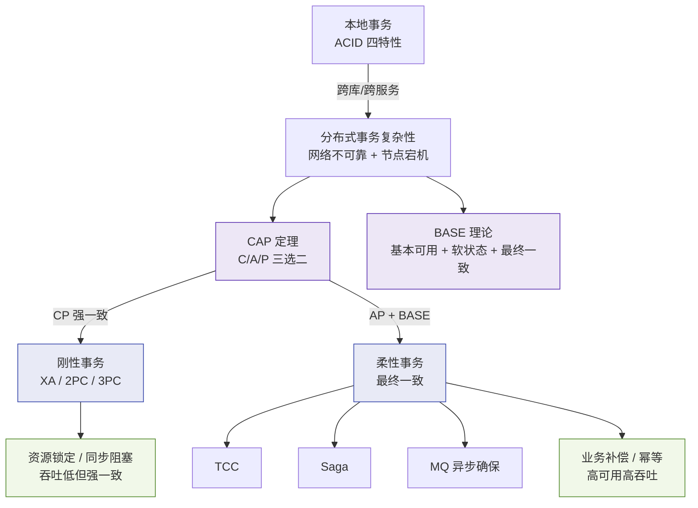
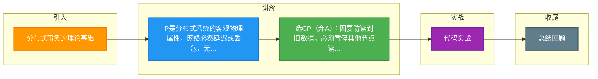

# 分布式事务的理论基础

### 为什么无法同时保证 C 和 A？

前提：对于分布式系统，**分区容错性（P）** 是客观存在的基本要求，因此我们只能在 **一致性（C）** 和 **可用性（A）** 之间取舍。

1. **如果保证一致性（C）**：
   - 当节点 N1 写入数据时，为了防止读到旧数据，必须暂停节点 N2 的读写操作，直到 N1 将数据同步到 N2。
   - 在同步期间，对 N2 的请求会收到失败或超时。
   - **后果**：违反了可用性（A）。

2. **如果保证可用性（A）**：
   - 即使 N1 正在写入且尚未同步，N2 依然允许对外提供读写服务。
   - 此时客户端读取 N2 可能读到旧数据。
   - **后果**：违反了一致性（C）。

### CAP 权衡策略

根据业务场景的不同，架构设计通常有以下选择：

1. **保证 CP（舍弃 A）**
   - **场景**：涉及金钱、交易等对数据准确性要求极高的系统（如银行核心账务）。
   - **策略**：网络故障时宁可停止服务，也要保证数据一致。

2. **保证 AP（舍弃 C）**
   - **场景**：互联网高并发、对用户体验要求高但允许短暂延迟的系统（如社交媒体动态、电商商品详情）。
   - **策略**：保证服务高可用，允许数据在“时间窗口”内不一致，通过最终一致性算法来修正数据。

3. **保证 CA（舍弃 P）**
   - **场景**：单机系统或传统关系型数据库的主备模式下（严格来说不属于分布式系统）。
   - **策略**：假设网络永远可靠，不处理分区故障。

### 深化内容

#### 实战案例
在早期使用 Zookeeper 做配置中心时，曾遇到因为网络抖动导致 Leader 选举，期间集群无法提供读写服务（CP 特性），导致下游应用全部启动失败。后来切换为 Nacos（支持 AP 模式），虽然配置更新可能有毫秒级延迟，但保证了服务注册发现功能的高可用。

#### 代码示例
以下是使用 Hystrix（或 Resilience4j）在 CP 系统不可用时进行降级处理的逻辑示例：

```java
@HystrixCommand(fallbackMethod = "getInventoryFallback")
public int getInventory(String productId) {
    // 调用 CP 架构的库存服务，若网络分区触发超时，Hystrix 会拦截
    return inventoryServiceClient.getStock(productId);
}

// 降级逻辑：当 CP 系统不可用时（舍弃 A），返回默认值或走兜底流程
public int getInventoryFallback(String productId) {
    log.warn("Inventory service unavailable, fallback to default cache");
    return localCacheService.getStock(productId); // 允许短期读取旧数据
}
```

#### 对比表格

| 特性 | CP 系统 (如 HBase, Zookeeper) | AP 系统 (如 Cassandra, DynamoDB) |
| :--- | :--- | :--- |
| **核心追求** | 数据强一致性 | 高可用性、低延迟 |
| **故障表现** | 节点故障时可能拒绝服务或超时 | 节点故障时自动路由，正常响应 |
| **数据读取** | 总是读取最新数据（或报错） | 可能读到旧数据（最终一致性） |
| **适用场景** | 金融转账、库存扣减 | 社交动态、商品详情、日志收集 |
| **写入性能** | 通常较低（需同步确认） | 通常较高（异步写入） |

### 分布式事务理论基础演进图




## 记忆要点

- P是分布式系统的客观物理属性，网络必然延迟或丢包，无法舍弃。
- 选CP（弃A）：因要防读到旧数据，必须暂停其他节点读写，导致服务不可用。
- 选AP（弃C）：因要随时响应请求，未同步数据时允许返回旧数据，导致短暂不一致。
- 核心金融选CP宁可服务停机，互联网高并发选AP采用最终一致性。

## 结构化回答

**30 秒电梯演讲：** 网络分区发生时，若等同步则不可用，若响应则不一致。打比方——联网打游戏，断网时要么暂停等重连保进度(CP)，要么单机玩保流畅(AP)。落到工程上，P 是分布式系统的必然选择。

**展开框架：**
1. **分布式系统的必然选择** — P 是分布式系统的必然选择。
2. **CP 模式下** — CP 模式下，故障会导致服务不可用。
3. **AP 模式下** — AP 模式下，故障会导致数据短暂不一致。

**收尾：** 以上三点都能配合实战聊。我可以展开任一要点，您想先深入哪一块？

## 视频脚本

> 预计时长：2 分钟 | 由浅入深

| 时间 | 画面/字幕 | 口播台词 | 讲解要点 |
|------|----------|----------|----------|
| 0:00 | 标题卡：分布式事务的理论基础 | "分布式事务的理论基础，一分钟讲透。" | 开场钩子 |
| 0:35 | 生活类比动画 | "打个比方——联网打游戏，断网时要么暂停等重连保进度(CP)，要么单机玩保流畅(AP)。" | 核心类比 |
| 1:10 | 概念定义动画 | "一句话：网络分区发生时，若等同步则不可用，若响应则不一致。" | 核心定义 |
| 1:50 | 分布式系统的必然选择 图解 | "P 是分布式系统的必然选择。" | 分布式系统的必然选择 |

### 视频流程图



