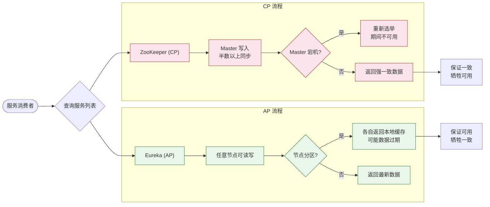

# CAP的应用

### CAP 的应用

1.  **放弃 P（分区容错性）**
    -   **含义**：放弃分布式，退化为单机系统。
    -   **后果**：系统失去了扩展性和容错能力。

2.  **放弃 A（可用性）**
    -   **含义**：当发生网络分区或其他故障时，受影响的服务暂停，直到网络恢复或数据同步完成。
    -   **后果**：系统在故障期间不可用，但保证了数据的一致性（如 CP 系统）。

3.  **放弃 C（强一致性）**
    -   **含义**：不再保证数据的实时强一致，允许数据在一段时间窗口内不一致。
    -   **后果**：系统始终保持可用，最终数据会达到一致（如 AP 系统，采用最终一致性）。

### 分布式系统的选择

在分布式系统中，P（分区容错性）是必须保留的特性，因此架构师主要在 **CP** 和 **AP** 之间权衡：

-   **互联网场景**：通常牺牲强一致性（C），换取高可用性（A），保证最终一致性。
-   **核心金融场景**：通常牺牲可用性（A），保证强一致性（C），防止资金差错。

### ## 常见考点
1.  **Zookeeper/Eureka 的区别是什么？** 这是一个经典的 CAP 应用题。Zookeeper 保证 CP（Leader 挂了选举期间不可用），Eureka 保证 AP（任意节点挂了仍可注册，但数据可能不一致）。
2.  **分布式锁该选 CP 还是 AP？** 分布式锁通常要求强一致性（互斥性），因此必须选择 CP（如 Zookeeper 或 Redis 的 Redlock 算法），不能选 AP，否则会导致锁失效（多个客户端同时拿到锁）。

### 深化内容

#### 实战案例
在一个微服务系统中，服务发现组件从 Eureka（AP）迁移到了 Consul（CP 默认模式）。结果在发布大规模更新导致网络拥塞时，部分服务因为无法注册到 Consul（超时拒绝）而被剔除，导致流量下跌。这证明了在非核心元数据服务中，CP 的严格性可能带来运维风险。

#### 代码示例
模拟 AP 系统的“写冲突”解决逻辑（Last-Write-Wins 策略）：

```java
public void updateProductPrice(String productId, double newPrice, long version) {
    Product product = repository.findById(productId);
    
    // AP 场景下，允许并发写入，通常通过版本号或时间戳合并
    if (newPrice > product.getPrice() * 1.5) {
        // 业务逻辑：防止恶意涨价，如果数据不一致（旧版本覆盖新版本），
        // 后台异步任务会通过最终一致性算法修正
        product.setPrice(newPrice);
        product.setUpdateTime(System.currentTimeMillis()); // 利用时间戳解决冲突
        repository.save(product);
    }
}
```

#### 对比表格

| 组件/架构 | CAP 倾向 | 典型代表 | 选举机制/数据同步 | 故障应对策略 |
| :--- | :--- | :--- | :--- | :--- |
| **Zookeeper** | CP | Kafka, Hadoop | ZAB 协议，Leader 选举 | Leader 挂了，集群停止服务直到新 Leader 选出 |
| **Eureka** | AP | Spring Cloud | 异步复制，Peer-to-Peer | 节点挂了，客户端读取剩余节点，数据可能过期 |
| **Nacos** | AP/CP | 阿里生态 | 支持 Raft(CP) 和 Distro(AP) | 根据配置切换，AP 模式下即使只剩一个节点也能注册 |
| **Redis (Cluster)** | AP | 缓存/Session | Gossip 协议 | 节点故障时，主从切换，可能丢数据（若未确认） |

### CAP 在注册中心场景的应用对比




## 核心知识点图


## 记忆要点

- 放弃P即退化为单机系统，在分布式架构中不成立。
- 放弃A（选CP）：金融转账场景，网络故障时宁可报错，也要保证数据绝对准确。
- 放弃C（选AP）：社交电商场景，允许数据短暂延迟不一致，但必须保证核心高可用。
- 注册中心对比：ZooKeeper选CP（选举期间不可用），Eureka选AP（保留旧节点可读写）。

## 结构化回答


**30 秒电梯演讲：** 出门遇大雾（分区），要么原地不动等雾散（CP），要么摸黑继续走（AP）。

**展开框架：**
1. **放弃P等于放** — 放弃P等于放弃分布式。
2. **放弃A意味着** — 放弃A意味着故障时服务暂停。
3. **放弃C意味着数据会** — 放弃C意味着数据会有延迟。

**收尾：** 这是我实战中的理解，您想深入哪一段？


## 视频脚本

> 预计时长：3 分钟 | 由浅入深

| 时间 | 画面/字幕 | 口播台词 | 讲解要点 |
|------|----------|----------|----------|
| 0:00 | 标题卡：CAP的应用 | "CAP的应用，这题我会分三步讲。" | 开场钩子 |
| 0:41 | 概念定义动画 | "一句话：分布式必须保留P，架构师只能在CP和AP中二选一。" | 核心定义 |
| 1:22 | 生活类比动画 | "打个比方——出门遇大雾(分区)，要么原地不动等雾散(CP)，要么摸黑继续走(AP)。" | 核心类比 |
| 2:03 | 放弃P等于放弃分布式 图解 | "放弃P等于放弃分布式。" | 放弃P等于放弃分布式 |
| 2:50 | 放弃A意味着故障时服 图解 | "放弃A意味着故障时服务暂停。" | 放弃A意味着故障时服 |
