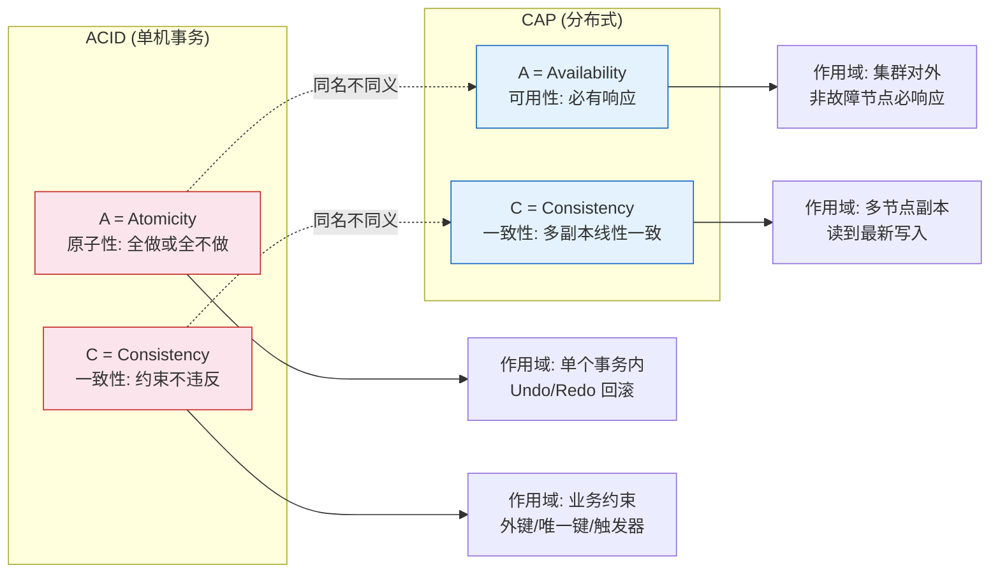

# CAP和ACID中的A和C是完全不一样的

### ACID 与 CAP 中 A 和 C 的区别

#### 1. A 的区别

-   **ACID 中的 A（Atomicity，原子性）**：
    -   **定义**：事务被视为一个不可分割的最小工作单元，事务中的所有操作要么全部提交成功，要么全部失败回滚。
    -   **关注点**：操作的“完整性”，不会出现做了一半的情况。

-   **CAP 中的 A（Availability，可用性）**：
    -   **定义**：集群中一部分节点故障后，集群整体是否还能响应客户端的读写请求。
    -   **关注点**：服务的“连续性”和“健康度”，每次请求都能得到响应。

#### 2. C 的区别

-   **ACID 中的 C（Consistency，一致性）**：
    -   **定义**：指事务执行前后，数据库从一个一致性状态变换到另一个一致性状态，完整性约束（如外键、唯一索引）没有被破坏。
    -   **关注点**：数据库内部的“数据正确性”和“完整性”。
    -   *补充细节*：是指数据库本身约束符合业务预期（如转账前后总金额不变）。

-   **CAP 中的 C（Consistency，一致性）**：
    -   **定义**：指分布式系统中所有节点在同一时刻看到的数据是一样的（强一致性）。
    -   **关注点**：分布式多节点之间的“数据副本同步”。
    -   *补充细节*：是指并发访问时，不同客户端看到的数据视图一致（如读写一致性）。

### 总结

ACID 和 CAP 中的 C 和 A 背景完全不同，无从直接比较：
-   ACID 是数据库事务的理论，强调单机数据库的数据完整。
-   CAP 是分布式系统的理论，强调多节点间的数据同步和服务可用。

### BASE 理论

BASE 理论是 CAP 理论中 AP 方案的延伸：
-   **基本可用**：允许系统出现局部不可用或功能降级。
-   **软状态**：允许系统中的数据存在中间状态，并认为该状态不影响系统的可用性。
-   **最终一致性**：系统保证在没有新的更新操作后，经过一段时间，数据最终能够达到一致的状态。

### ## 常见考点
1.  **ACID 中的 A 和 CAP 中的 A 经常被混淆，请举例说明区别？** ACID 的 A 是原子性，例如转账操作中，扣款和加款必须同时成功或失败；CAP 的 A 是可用性，例如双十一大促时，哪怕部分服务器挂了，系统依然要能让你下单（哪怕下单稍微慢一点），不能直接报错 500。
2.  **数据库事务能完全满足 CAP 吗？** 单机数据库（MySQL 单机）通常满足 CA（不考虑分布式网络分区），因为它是单节点，不存在分区问题（P），且满足原子性和内部一致性。一旦变成 MySQL 主从集群，就进入了分布式领域，必须面对 CAP 的权衡。

### 深化内容

#### 实战案例
在订单支付系统中，数据库事务（ACID）保证了“扣款”和“生成订单”要么都做要么都不做（原子性 A）。但在微服务架构下，由于支付服务在 DB A，订单服务在 DB B（分布式场景），我们必须依据 CAP 理论，采用 TCC 或 Seata 等方案处理跨库一致性。这里如果不理解 ACID 的 C 是单机约束，就会误以为数据库事务能解决分布式下的数据一致问题。

#### 代码示例
演示 ACID 中 Atomicity（通过 Spring `@Transactional`）：

```java
@Transactional(rollbackFor = Exception.class) // ACID 中的 Atomicity
public void transferMoney(Long fromId, Long toId, BigDecimal amount) {
    // 1. 扣减余额 (数据库约束检查 C - 非负数)
    accountDao.decrease(fromId, amount);
    
    // 模拟异常：如果这里报错，上面的操作会自动回滚，保证 Atomicity
    if (amount.compareTo(new BigDecimal("10000")) > 0) {
        throw new RuntimeException("单笔转账限额");
    }
    
    // 2. 增加余额
    accountDao.increase(toId, amount);
    // 事务结束，数据库保证数据完整性 C 约束满足
}
```

#### 对比表格

| 特性 | ACID (数据库事务) | CAP (分布式系统) |
| :--- | :--- | :--- |
| **A (Atomicity vs Availability)** | **原子性**：操作序列不可分割，同进退 | **可用性**：无故障时服务必须可响应
| **C (Consistency vs Consistency)** | **一致性**：数据状态符合预定义规则（如余额>=0） | **一致性**：多节点数据副本在同一时刻完全相同 |
| **Scope (作用域)** | 单个数据库节点内部 | 多个节点/服务组成的分布式集群 |
| **Goal (目标)** | 数据正确性、完整性 | 系统容错性、服务连续性 |
| **Failure Handling** | 失败回滚 | 故障转移（CP：暂停；AP：降级） |

### CAP 的 C/A 与 ACID 的 C/A 对比图




## 记忆要点

- A的对比：ACID指原子性（单机操作同进退），CAP指可用性（多节点服务连续不断）。
- C的对比：ACID指数据约束正确（如单机余额非负），CAP指多节点副本数据强一致。
- 总结口诀：ACID关注单机数据完整，CAP关注多节点同步与服务健康。
- BASE是CAP的延伸：牺牲强一致（C）换取高可用（A），允许软状态和最终一致。

## 结构化回答

**30 秒电梯演讲：** ACID关注单机事务完整性，CAP关注分布式节点一致与可用。打比方——ACID是个人记账不能错，CAP是广播电台所有频道同步不能卡。落到工程上，ACID的A是原子性，CAP的A是可用性。

**展开框架：**
1. **ACID** — ACID的A是原子性，CAP的A是可用性。
2. **BASE理论** — BASE理论是对CAP中AP方案的补充。
3. **A的对比** — ACID指原子性（单机操作同进退），CAP指可用性（多节点服务连续不断）。

**收尾：** 以上三点都能配合实战聊。我可以展开任一要点，您想先深入哪一块？

## 视频脚本

> 预计时长：2 分钟 | 由浅入深

| 时间 | 画面/字幕 | 口播台词 | 讲解要点 |
|------|----------|----------|----------|
| 0:00 | 标题卡：CAP和ACID中的A和C是完全不一样的 | "CAP和ACID中的A和C是完全不一样的，一分钟讲透。" | 开场钩子 |
| 0:35 | 生活类比动画 | "打个比方——ACID是个人记账不能错，CAP是广播电台所有频道同步不能卡。" | 核心类比 |
| 1:10 | 概念定义动画 | "一句话：ACID关注单机事务完整性，CAP关注分布式节点一致与可用。" | 核心定义 |
| 1:50 | ACID 图解 | "ACID的A是原子性，CAP的A是可用性。" | ACID |
