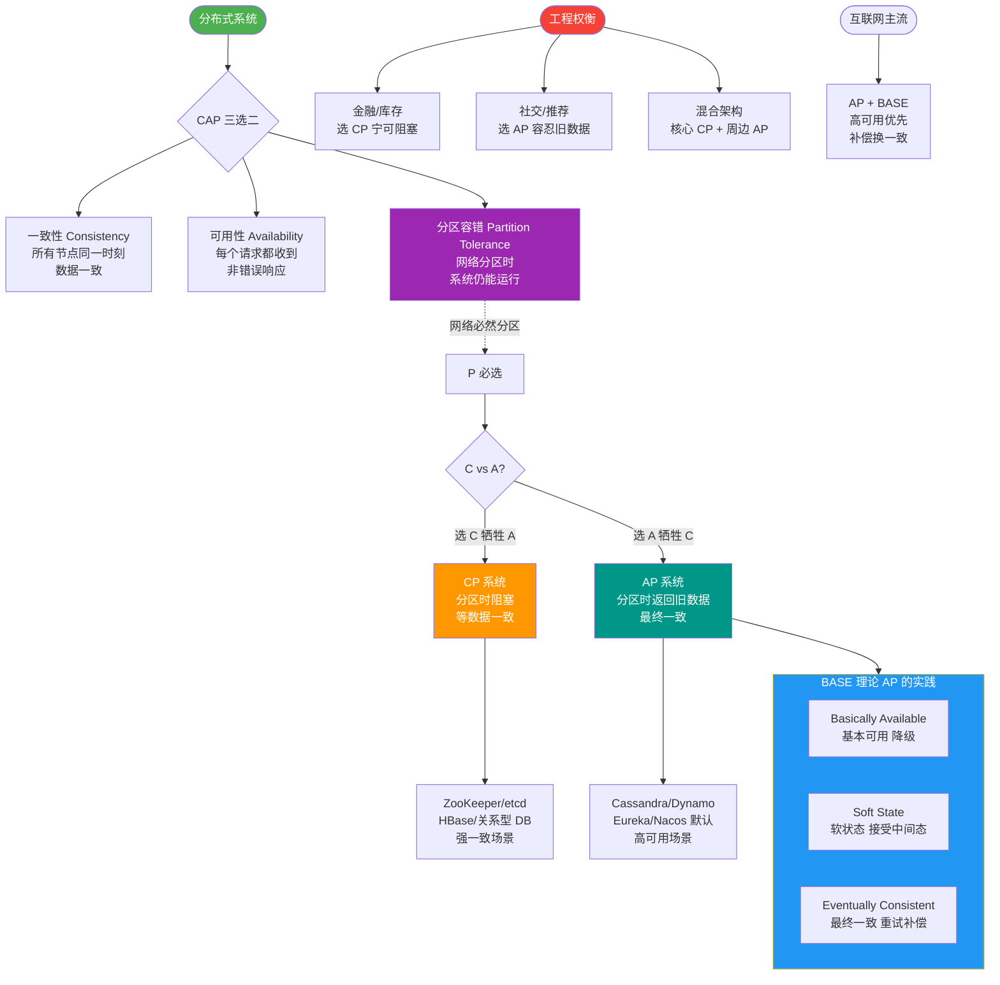

# ACID 和 BASE 的区别与联系

### BASE理论与CAP的关系

BASE理论是对CAP中一致性和可用性权衡的结果，其来源于对大规模互联网系统分布式实践的总结， 是基于CAP定理逐步演化而来的。BASE理论的核心思想是：即使无法做到强一致性，但每个应用都可以根据自身业务特点，采用适当的方式来使系统达到最终一致性。
BASE理论其实就是对CAP理论的延伸和补充，主要是对AP的补充。牺牲数据的强一致性，来保证数据的可用性，虽然存在中间状态，但数据最终一致。

### ACID 和 BASE 的区别与联系

ACID 是传统数据库常用的设计理念，追求强一致性模型。BASE 支持的是大型分布式系统，提出通过牺牲强一致性获得高可用性。
ACID 和 BASE 代表了两种截然相反的设计哲学，在分布式系统设计的场景中，系统组件对一致性要求是不同的，因此 ACID 和 BASE 又会结合使用。

**架构对比图**：

```text
      单机数据库 (ACID)             分布式系统 (BASE)
+-----------------------+       +-----------------------+
|      Atomicity        |       |   Basically Available |
|      Consistency      | <---> |   Soft State          |
|      Isolation        |       |   Eventually Consistent|
|      Durability       |       +-----------------------+
+-----------------------+             \
          |                              \
   (强一致性，低并发)               (高可用，高并发，最终一致性)
```

### 分布式事务分类：柔性事务和刚性事务

分布式场景下，多个服务同时对服务一个流程，比如电商下单场景，需要支付服务进行支付、库存服务扣减库存、订单服务生成订单、物流服务更新物流信息等。如果某一个服务执行失败，或者网络不通引起的请求丢失，那么整个系统可能出现数据不一致的原因。
上述场景就是分布式一致性问题，追根到底，分布式一致性的根本原因在于数据的分布式操作，引起的本地事务无法保障数据的原子性引起。

#### 实战案例：金融系统的混合架构
在某银行资金划转系统中，对于**单机账户记账**操作，我们严格遵守 ACID 以保证资金绝对准确；但在**跨行转账**通知场景下，由于涉及外部银行系统，网络延迟不可控，我们采用 BASE 理论，通过每日对账文件来保证数据的“最终一致性”，既保证了核心账务安全，又实现了跨行系统的高可用。

#### 对比表格：ACID vs BASE 设计理念

| 维度 | ACID (刚性) | BASE (柔性) |
| :--- | :--- | :--- |
| **核心目标** | 数据强一致性 | 高可用性、可扩展性 |
| **数据状态** | 只有“成功”或“失败”两种状态 | 允许中间状态（软状态） |
| **一致性级别** | 强一致性 | 最终一致性 |
| **实现方式** | 数据库事务、锁机制 | 异步通信、补偿机制、重试 |
| **典型应用** | 传统 ERP、银行核心账务 | 社交网络、电商订单、库存 |

## 常见考点
1. **追问**：在实际架构中，ACID 和 BASE 如何结合使用？
   *   **提示**：通常在核心业务流程（如支付）的本地数据库层面使用 ACID 保证单点数据准确性，而在微服务之间的调用层面使用 BASE（如最终一致性方案）来解决分布式数据一致问题。
2. **追问**：为什么分布式系统很难完全满足 ACID？
   *   **提示**：根据 CAP 定理，分布式系统必须满足分区容错性（P），因此只能在 C（一致性）和 A（可用性）之间权衡。ACID 要求的是严格的 C，这在网络不稳定的情况下（发生分区 P）会牺牲 A，导致服务不可用，这对互联网系统通常是不可接受的。


## 核心流程图



## 记忆要点

- 理念对比：ACID追求单机强一致性，BASE追求分布式高可用与最终一致性
- BASE三要素：基本可用、软状态（允许中间态）、最终一致性
- 联系与实战：核心链路本地用ACID保数据，微服务间用BASE保高可用
- 追本溯源：BASE是对CAP中AP的延伸，牺牲强一致换取系统可用性

## 结构化回答

**30 秒电梯演讲：** ACID是单机强一致标准，BASE是分布式最终一致方案，两者理念相反。打比方——ACID像银行转账(必须即时对账)，BASE像点赞数(允许显示错误，几秒后修正)。落到工程上，ACID用于传统数据库，追求强一致性、原子性。

**展开框架：**
1. **ACID** — ACID用于传统数据库，追求强一致性、原子性。
2. **BASE** — BASE用于大型分布式系统，追求基本可用和最终一致。
3. **理念对比** — ACID追求单机强一致性，BASE追求分布式高可用与最终一致性

**收尾：** 以上三点都能配合实战聊。我可以展开任一要点，您想先深入哪一块？

## 视频脚本

> 预计时长：2 分钟 | 由浅入深

| 时间 | 画面/字幕 | 口播台词 | 讲解要点 |
|------|----------|----------|----------|
| 0:00 | 标题卡：ACID 和 BASE 的区别与联系 | "ACID 和 BASE 的区别与联系，一分钟讲透。" | 开场钩子 |
| 0:35 | 生活类比动画 | "打个比方——ACID像银行转账(必须即时对账)，BASE像点赞数(允许显示错误，几秒后修正)。" | 核心类比 |
| 1:10 | 概念定义动画 | "一句话：ACID是单机强一致标准，BASE是分布式最终一致方案，两者理念相反。" | 核心定义 |
| 1:50 | ACID 图解 | "ACID用于传统数据库，追求强一致性、原子性。" | ACID |
