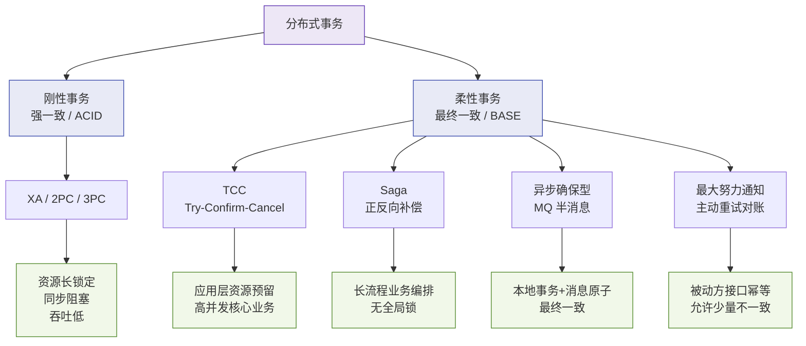
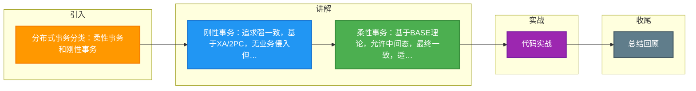

# 分布式事务分类：柔性事务和刚性事务

### 分布式事务分类：柔性事务和刚性事务

分布式场景下，多个服务同时对服务一个流程，比如电商下单场景，需要支付服务进行支付、库存服务扣减库存、订单服务生成订单、物流服务更新物流信息等。如果某一个服务执行失败，或者网络不通引起的请求丢失，那么整个系统可能出现数据不一致的原因。
上述场景就是分布式一致性问题，追根到底，分布式一致性的根本原因在于数据的分布式操作，引起的本地事务无法保障数据的原子性引起。

为了解决这一问题，我们将分布式事务解决方案分为两类：**刚性事务**和**柔性事务**。

#### 1. 刚性事务
刚性事务追求强一致性，通常基于 XA 协议的 2PC（两阶段提交）实现。它要求所有参与事务的节点要么全部提交，要么全部回滚。

**执行流程图**：

```text
    协调者                 参与者 A                参与者 B
      |                      |                       |
      |------- 1. Prepare --->|                       |
      |                      | (锁定资源)             |
      |                      |------- 1. Prepare --->|
      |                      |                       | (锁定资源)
      |                      |<------ 2. Ready ------|
      |<------ 2. Ready ------|                       |
      | (所有节点都准备好了)  |                       |
      |------- 3. Commit --->|                       |
      |                      | (提交/释放锁)          |
      |                      |------- 3. Commit --->|
      |                      |                       | (提交/释放锁)
```

*   **优点**：强一致性，数据可靠。
*   **缺点**：同步阻塞，性能差，单点故障风险（协调者挂了，参与者一直锁定资源）。

#### 2. 柔性事务
柔性事务基于 BASE 理论，允许存在中间状态，最终达到一致。常见的有 TCC、Saga、本地消息表等。

**执行流程图 (以TCC为例)**：

```text
    主业务逻辑             阶段一: Try               阶段二: Confirm/Cancel
      |                      |                       |
      |-- 发起事务 --------->| (资源预留)             |
      |                      |                       |
      |<--- 所有Try成功 -----|                       |
      |                      |                       |
      |-- 发起提交 --------->|                       |
      |                      |------ Confirm ------>| (确认执行，真正扣减库存)
      |                      |                       |
      | (如果Try阶段失败)    |                       |
      |-- 发起取消 --------->|                       |
      |                      |------ Cancel ------->| (取消预留，回滚)
```

*   **优点**：高可用，性能好，支持高并发。
*   **缺点**：代码侵入性强（需要写三个接口），逻辑复杂，存在空回滚、悬挂等边界问题。

#### 实战案例：库存服务的 TCC 空回滚问题
在高并发抢购场景下，Try 阶段因网络拥塞超时，事务管理器触发了 Cancel 操作（空回滚）。随后滞后的 Try 请求到达，此时若不做幂等控制，会导致库存被错误扣减。我们在 Redis 中使用事务 ID 作为 Key 记录阶段状态，若检测到已 Cancel，则直接拒绝后续的 Try 请求，解决悬挂问题。

#### 代码示例：TCC 事务幂等与防悬挂
```java
@LocalTCC
public class StockTCCService {
    
    // Try 阶段：预留库存
    @TwoPhaseBusinessAction(name = "prepareDeduct", commitMethod = "commit", rollbackMethod = "rollback")
    public boolean prepareDeduct(BusinessActionContext context, Long productId, Integer count) {
        String txnId = context.getXid();
        // 防悬挂：如果该事务已经回滚，不再执行 Try
        if (redisTemplate.hasKey("TCC_Cancel_" + txnId)) {
            return false; 
        }
        // 预留库存操作（如冻结库存）
        return stockRepository.freeze(productId, count);
    }

    // Confirm 阶段：确认扣减（幂等校验）
    public boolean commit(BusinessActionContext context) {
        // ... 真正扣减库存，并去重
    }

    // Cancel 阶段：取消预留（防空回滚校验）
    public boolean rollback(BusinessActionContext context) {
        // ... 释放冻结库存，并记录已回滚状态
    }
}
```

#### 对比表格：刚性事务 vs 柔性事务

| 特性 | 刚性事务 (2PC) | 柔性事务 (TCC/Saga) |
| :--- | :--- | :--- |
| **数据一致性** | 强一致性 | 最终一致性 |
| **并发性能** | 低 (锁资源全程) | 高 (Try 阶段短锁或无锁) |
| **代码侵入性** | 低 (仅配置) | 高 (需编写三个阶段逻辑) |
| **适用场景** | 内部管理系统，并发低 | 电商秒杀，金融高并发 |
| **容错机制** | 失败即全部回滚 | 失败通过补偿逆向回滚 |

## 常见考点
1. **追问**：刚性事务中协调者宕机怎么处理？
    *   **提示**：可以通过引入日志和恢复机制。如果参与者收到 Prepare 但未收到 Commit/Cancel，它们会阻塞等待。改进方案是 3PC 引入超时机制，或者使用 Paxos/Raft 协议选举新的协调者（如 Seata 的 RAFT 模式）。
2. **追问**：TCC 的空回滚与悬挂如何解决？
    *   **提示**：**空回滚**：Cancel 接口需判断 Try 是否已执行，若未执行则直接返回成功；**悬挂**：Try 接口执行前需检查是否已 Cancel，若已 Cancel 则拒绝执行。通常通过在 DB 或 Redis 中记录事务状态日志来实现。

### 分布式事务分类架构图




## 记忆要点

- 刚性事务：追求强一致，基于XA/2PC，无业务侵入但同步阻塞性能差
- 柔性事务：基于BASE理论，允许中间态，最终一致，适合高并发长事务
- 核心对比：刚性锁资源低并发 vs 柔性需改造（补偿/幂等）高并发
- 典型柔性方案：TCC、Saga、本地消息表、MQ事务消息

## 结构化回答

**30 秒电梯演讲：** 刚性事务追求强一致性(CP)，柔性事务追求最终一致性(BASE/AP)。打比方——刚性事务像同步视频通话(必须实时同步)，柔性事务像发邮件(允许延迟送达)。落到工程上，刚性事务满足CP，强一致，支持回滚，适合短事务。

**展开框架：**
1. **刚性事务满足CP** — 刚性事务满足CP，强一致，支持回滚，适合短事务。
2. **柔性事务满足BASE** — 柔性事务满足BASE，最终一致，允许中间状态，适合长事务。
3. **分布式事务由本地事务** — 分布式事务由本地事务无法保障原子性引起。

**收尾：** 以上三点都能配合实战聊。我可以展开任一要点，您想先深入哪一块？

## 视频脚本

> 预计时长：2 分钟 | 由浅入深

| 时间 | 画面/字幕 | 口播台词 | 讲解要点 |
|------|----------|----------|----------|
| 0:00 | 标题卡：分布式事务分类：柔性事务和刚性事务 | "分布式事务分类：柔性事务和刚性事务，一分钟讲透。" | 开场钩子 |
| 0:35 | 生活类比动画 | "打个比方——刚性事务像同步视频通话(必须实时同步)，柔性事务像发邮件(允许延迟送达)。" | 核心类比 |
| 1:10 | 概念定义动画 | "一句话：刚性事务追求强一致性(CP)，柔性事务追求最终一致性(BASE/AP)。" | 核心定义 |
| 1:50 | 刚性事务满足CP 图解 | "刚性事务满足CP，强一致，支持回滚，适合短事务。" | 刚性事务满足CP |

---

### 视频流程图




## 延伸：分布式事务分类

> 合并自 `dst-018`（相似度 76%）

### 分布式事务分类

分布式一致性问题的解决思路主要有两种：
1. **使用分布式事务**：直接从技术层面解决问题。
2. **业务流程规避**：通过优化业务逻辑尽量避免分布式事务（如“解决提问题的人”）。如果业务规避成本不高，这往往是最优雅的方案。

#### 1. 刚性事务
刚性事务追求**强一致性**，满足CAP中的CP理论。

- **特点**：通常无业务改造，原生支持回滚和隔离性，低并发，适合短事务。
- **原则**：追求像本地事务一样的强一致性。
- **常见实现**：XA协议（2PC、JTA、JTS）、3PC。
- **缺点**：由于同步阻塞机制，处理效率低，不适合大型高并发互联网分布式场景。

#### 2. 柔性事务
柔性事务追求**最终一致性**，满足BASE理论（基本可用，最终一致）。

- **特点**：通常需要业务改造（如实现实现补偿接口、幂等校验），允许数据存在中间状态，高并发，适合长事务。
- **常见实现**：
  - TCC (Try-Confirm-Cancel)：应用层补偿，分为预留、确认、取消三个阶段。
  - Saga（状态机模式、AOP模式）：长事务拆分为多个本地短事务，每个短事务都有对应的补偿事务。
  - 本地事务消息（基于DB的可靠消息）：使用本地事务保证业务操作和消息发送的原子性。
  - 消息事务（半消息/事务消息）：如RocketMQ的事务消息机制。
  - 最大努力通知型：不保证数据强一致，只尽最大努力通知，适合对一致性要求不高的场景（如支付结果回调）。

#### 实战案例：基于 RocketMQ 的事务消息解耦下单与积分
在用户下单支付成功后，需要给用户增加积分。如果直接调用积分服务，一旦积分服务挂了，支付流程会受影响。实战中我们使用 RocketMQ 事务消息：
1. 支付服务发送“半消息”给 MQ。
2. 执行本地支付事务（更新订单状态）。
3. 提交本地事务后，通知 MQ 发送消息给积分服务。
4. 若本地事务失败，则回滚发送，保证最终一致性。积分服务通过幂等消费来处理积分增加。

#### 代码示例：RocketMQ 事务消息发送
```javan// 构建半消息
Message msg = new Message("Topic积分", body);
// 发送半消息，指定本地事务执行器
TransactionSendResult sendResult = producer.sendMessageInTransaction(msg, null);

// 本地事务执行器接口实现
public class TransactionListenerImpl implements TransactionListener {
    @Override
    public LocalTransactionState executeLocalTransaction(Message msg, Object arg) {
        try {
            // 执行本地业务逻辑（如扣款）
            paymentService.pay();
            return LocalTransactionState.COMMIT_MESSAGE; // 成功则提交消息
        } catch (Exception e) {
            return LocalTransactionState.ROLLBACK_MESSAGE; // 失败则回滚消息
        }
    }
    
    @Override
    public LocalTransactionState checkLocalTransaction(MessageExt msg) {
        // 反查机制：若 MQ 未收到确认，主动查询业务方状态
        return paymentService.checkStatus(msg.getKeys()) ? LocalTransactionState.COMMIT_MESSAGE : LocalTransactionState.ROLLBACK_MESSAGE;
    }
}
```

#### 对比表格：常见柔性事务方案对比

| 方案 | 一致性保证 | 复杂度 | 性能 | 适用场景 |
| :--- | :--- | :--- | :--- | :--- |
| **TCC** | 最终一致性 (高) | 高 (3个接口) | 高 | 核心高并发业务，对性能要求严苛 |
| **Saga** | 最终一致性 (中) | 中 (正向+逆向) | 中 | 长流程业务 (如订机票+酒店) |
| **可靠消息 (本地消息表)** | 最终一致性 (高) | 中 (需定时任务) | 中 | 异步解耦，如电商发货通知 |
| **事务消息 (RocketMQ)** | 最终一致性 (高) | 低 | 高 | 需要异步执行且无外部依赖 |
| **最大努力通知** | 最终一致性 (低) | 低 | 高 | 银行支付回调、第三方通知 |

## 常见考点
1. **CAP理论与BASE理论的选择**：如何根据业务场景（如金融支付vs订单下单）在刚性事务和柔性事务中做取舍？
2. **TCC的空回滚与悬挂**：TCC模式下，Try阶段未执行但Cancel执行了（空回滚），或者Cancel执行了Try才执行（悬挂）如何处理？
3. **Saga的回滚策略**：Saga正向执行失败后，如何通过反向补偿操作保证数据回滚？
4. **可靠消息的一致性保障**：本地消息表如何解决消息发送与本地事务的原子性问题？如何保证消息至少被消费一次（幂等性）？

## 记忆要点

- 解法分两类：刚性事务（CP强一致）与柔性事务（AP最终一致）
- 刚性方案：XA协议（2PC/3PC），无业务改造但性能低
- 柔性方案：TCC（资源预留）、Saga（长事务补偿）、可靠消息表、MQ事务消息
- 最高境界：通过业务合理拆分与设计，尽量规避分布式事务

## 结构化回答

**30 秒电梯演讲：** 刚性事务强一致但性能差，柔性事务最终一致但性能高。打比方——刚性事务是“要么都成功要么都失败”的死命令；柔性事务是“这次不行下次再试”的协商机制。落到工程上，刚性事务对应CP，如XA/2PC，同步阻塞性能差。

**展开框架：**
1. **刚性事务** — 刚性事务对应CP，如XA/2PC，同步阻塞性能差。
2. **柔性事务** — 柔性事务对应AP，如TCC/Saga，允许最终一致。
3. **柔性事务通常需要业务** — 柔性事务通常需要业务编写补偿逻辑。

**收尾：** 以上三点都能配合实战聊。我可以展开任一要点，您想先深入哪一块？

## 视频脚本

> 预计时长：1 分 30 秒 | 由浅入深

| 时间 | 画面/字幕 | 口播台词 | 讲解要点 |
|------|----------|----------|----------|
| 0:00 | 标题卡：分布式事务分类 | "分布式事务分类，一分钟讲透。" | 开场钩子 |
| 0:25 | 生活类比动画 | "打个比方——刚性事务是“要么都成功要么都失败”的死命令；柔性事务是“这次不行下次再试”的协商机制。" | 核心类比 |
| 0:50 | 概念定义动画 | "一句话：刚性事务强一致但性能差，柔性事务最终一致但性能高。" | 核心定义 |
| 1:20 | 刚性事务 图解 | "刚性事务对应CP，如XA/2PC，同步阻塞性能差。" | 刚性事务 |

### 视频流程图


