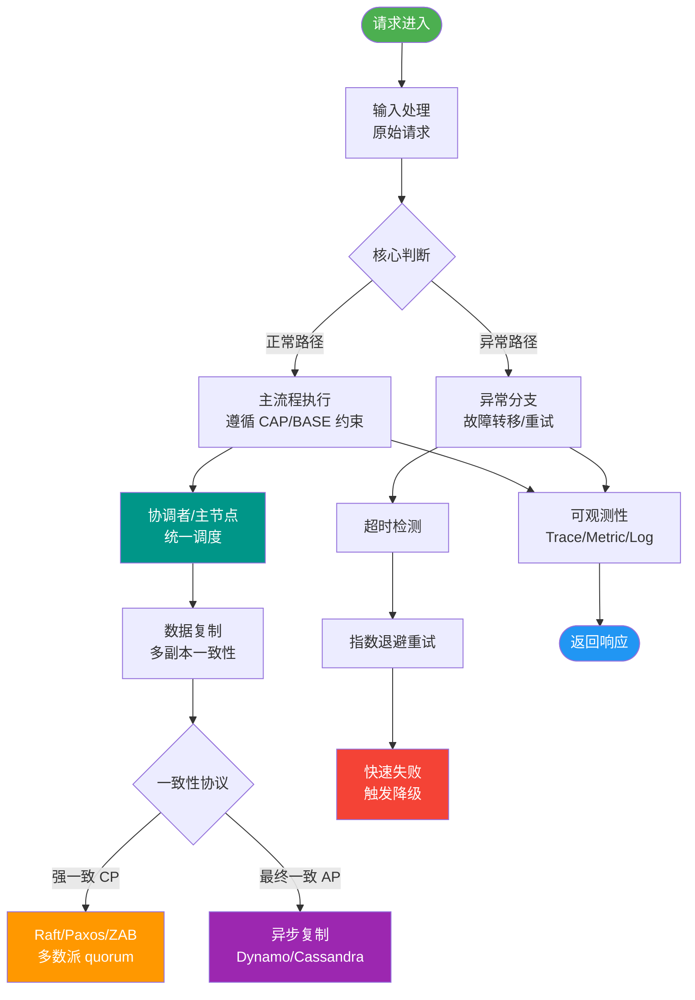
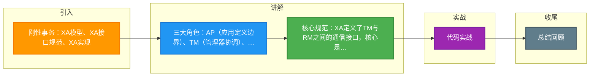

# 刚性事务：XA模型、XA接口规范、XA实现

### 刚性事务：XA模型、XA接口规范、XA实现

#### 1. XA模型 (X/Open DTP模型)

X/Open DTP (Distributed Transaction Processing) 是一个分布式事务模型，主要使用两阶段提交 (2PC) 来保证分布式事务的完整性。

**模型中的三个角色**：
- **AP (Application)**：应用程序，定义哪些操作属于一个事务。
- **TM (Transaction Manager)**：事务管理器。负责管理全局事务的生命周期，协调各资源管理器。
- **RM (Resource Manager)**：资源管理器。通常是数据库，也可以是消息队列等。

**架构交互图**：

```text
    AP (Application)             TM (Transaction Manager)          RM (Resource Manager)
  +-----------------+         +-------------------------+         +-------------------+
  |                 |  Begin  |                         |  XA Open|  (MySQL, Oracle)  |
  |  Business Logic | ------> |   Global Transaction    | <------ |                   |
  |                 |         |      Coordinator        |         |                   |
  |  SQL Ops (DB1)  | ------->|   (e.g. Seata/Atomikos) |-------> |  Branch 1 (XA)    |
  |                 |  Enlist |                         |  Enlist |                   |
  |  SQL Ops (DB2)  | ------->|                         |-------> |  Branch 2 (XA)    |
  |                 |         |                         |         |                   |
  |  Commit/Rollback| ------->|  2PC Coordination       |-------> |  Commit/Rollback  |
  +-----------------+         +-------------------------+         +-------------------+
```

**工作流程**：
AP定义事务边界 -> TM协调全局事务 -> RM管理实际资源（如DB）。XA规范定义了TM和RM之间的接口，使TM能够协调多个RM进行事务提交或回滚。

#### 2. XA为什么需要TM？

在分布式系统中，两台机器理论上无法达到一致的状态（FLP impossibility），需要引入一个单点进行协调。TM控制着全局事务，管理事务生命周期，并协调资源。

#### 3. XA的主要限制

- **数据源限制**：必须所有数据源都支持XA协议（如MySQL仅InnoDB支持）。
- **性能问题**：需要锁定所有涉及的资源，产生长事务，性能较差，不适合高并发场景。

#### 4. 实战深化：选型与坑

**实战案例**：在电商大促场景中，曾尝试用XA同步扣减库存和扣减积分，结果因数据库锁持有时间过长导致数据库连接池耗尽，最终回退到最终一致性的柔性事务方案。

**对比表格：XA vs TCC**

| 维度 | XA (刚性事务) | TCC (柔性事务) |
| :--- | :--- | :--- |
| **一致性** | 强一致性 | 最终一致性 |
| **代码侵入** | 低 (协议层实现) | 高 (需编写Try/Confirm/Cancel接口) |
| **性能** | 低 (资源锁定时间长) | 高 (资源锁定时间短) |
| **适用场景** | 内部管理系统，并发量小 | 高并发互联网业务 |

**代码示例：使用Seata AT模式（类XA思想但优化了锁）**
```java
// Seata AT模式示例，虽非标准XA但解决了性能痛点
@GlobalTransactional(name = "create-order", rollbackFor = Exception.class)
public void createOrder(OrderDTO orderDTO) {
    // 1. 扣减库存 (自动生成回滚日志)
    stockFeign.deduct(orderDTO.getProductId(), orderDTO.getCount());
    // 2. 创建订单
    orderMapper.insert(orderDTO);
    // 3. 此处抛出异常，Seata自动回滚步骤1和2
    if (orderDTO.getPrice() < 0) throw new RuntimeException("价格异常");
}
```

## 常见考点
1. **XA与本地事务的区别**：为什么XA在MySQL中性能较差？（涉及到锁的持有时间和日志写入机制）
2. **RM故障恢复**：如果在Phase 1后RM宕机，重启后如何依据XA日志进行恢复？
3. **单点故障**：TM宕机后，RM持有的资源锁如何释放？（涉及超时机制）
4. **JTA与XA的关系**：JTA是Java的API规范，XA是底层协议标准，二者的对应关系是什么？


## 核心流程图



## 记忆要点

- 三大角色：AP(应用定义边界)、TM(管理器协调)、RM(资源管理器如DB)
- 核心规范：XA定义了TM与RM之间的通信接口，核心是2PC协议
- 致命弱点：需长时锁定资源，性能极差，绝对不适合高并发场景
- 实战对比：XA靠底层锁强一致低侵入，TCC靠业务补偿高并发高侵入

## 结构化回答


**30 秒电梯演讲：** TM是组长，RM是组员，组长发号施令，组员一起投票决定干活还是撂挑子。

**展开框架：**
1. **XA模型包含AP** — （应用）、TM（事务管理器）、RM（资源管理器）
2. **XA规范定义了T** — M和RM之间的双向接口
3. **依赖2PC协议保** — 依赖2PC协议保证强一致性。

**收尾：** 这是我实战中的理解，您想深入哪一段？


## 视频脚本

> 预计时长：2 分钟 | 由浅入深

| 时间 | 画面/字幕 | 口播台词 | 讲解要点 |
|------|----------|----------|----------|
| 0:00 | 标题卡：刚性事务：XA模型、XA接口规范、XA实 | "刚性事务：XA模型、XA接口规范、XA实，一分钟讲透。" | 开场钩子 |
| 0:35 | 生活类比动画 | "打个比方——TM是组长，RM是组员，组长发号施令，组员一起投票决定干活还是撂挑子。" | 核心类比 |
| 1:10 | 概念定义动画 | "一句话：XA是分布式事务的工业标准，通过TM协调RM实现2PC强一致。" | 核心定义 |
| 1:50 | XA模型 图解 | "XA模型包含AP(应用)、TM(事务管理器)、RM(资源管理器)。" | XA模型 |

### 视频流程图



