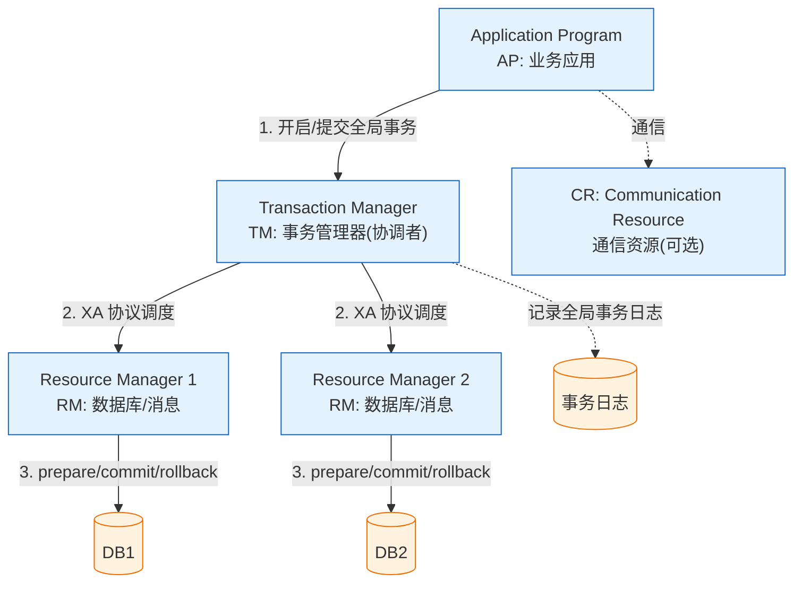

# XA模型 或者 X/Open DTP模型

### 柔性事务与刚性事务对比

**柔性事务**指的是，不要求强一致性，而是要求最终一致性，允许有中间状态，也就是Base理论，换句话说，就是AP状态。
与刚性事务相比，柔性事务的特点为：有业务改造，最终一致性，实现补偿接口，实现资源锁定接口，高并发，适合长事务。

**分类**：
- 柔性事务：TCC/FMT、Saga（状态机模式、Aop模式）、本地事务消息、消息事务（半消息）
- 刚性事务：XA模型、XA接口规范、XA实现

### XA模型 或者 X/Open DTP模型

**背景**：X/OPEN是一个组织.X/Open国际联盟有限公司是一个欧洲基金会，它的建立是为了向UNIX环境提供标准。它的主要目标是促进对UNIX语言、接口、网络和应用的开放式系统协议的制定。它还促进在不同的UNIX环境之间的应用程序的互操作性，以及支持对电气电子工程师协会（IEEE）对UNIX的可移植操作系统接口（POSIX）规范。

**定义**：X/Open DTP(Distributed Transaction Process) 是一个分布式事务模型。这个模型主要使用了两段提交(2PC - Two-Phase-Commit)来保证分布式事务的完整性。

**模型角色**：
1. **AP: Application**，应用程序。也就是业务层。哪些操作属于一个事务，就是AP定义的。
2. **TM: Transaction Manager**，事务管理器。接收AP的事务请求，对全局事务进行管理，管理事务分支状态，协调RM的处理，通知RM哪些操作属于哪些全局事务以及事务分支等等。这个也是整个事务调度模型的核心部分。
3. **RM：Resource Manager**，资源管理器。一般是数据库，也可以是其他的资源管理器，如消息队列(如JMS数据源)，文件系统等。

**核心逻辑**：
XA把参与事务的角色分成AP，RM，TM。
- AP，即应用，也就是我们的业务服务。
- RM指的是资源管理器，即DB，MQ等。
- TM则是事务管理器。
AP自己操作TM，当需要事务时，AP向TM请求发起事务，TM负责整个事务的提交，回滚等。

**XA规范主要定义了(全局)事务管理器和(局部)资源管理器之间的接口。**
XA接口是双向的系统接口，在事务管理器以及一个或多个资源管理器之间形成通信桥梁。

**XA之所以需要引入事务管理器是因为**，在分布式系统中，从理论上讲（参考Fischer等的论文），两台机器理论上无法达到一致的状态，需要引入一个单点进行协调。事务管理器控制着全局事务，管理事务生命周期，并协调资源。资源管理器负责控制和管理实际资源（如数据库或JMS队列）。

#### 实战深化：踩坑与对比

**实战案例**：在旧系统改造中，曾将本地事务迁移至JTA（基于XA），结果发现因为跨库查询的需求，原有的DAO层查询逻辑失效，因为XA要求连接严格绑定，不得不引入复杂的路由规则。

**对比表格：刚性事务 vs 柔性事务**

| 特性 | 刚性事务 (XA) | 柔性事务 (TCC/Saga) |
| :--- | :--- | :--- |
| **一致协议** | 2PC/3PC | 补偿/异步消息 |
| **状态** | 只有成功/失败 | 允许中间状态（如：处理中） |
| **并发能力** | 低（锁粒度大） | 高（锁粒度小/无锁） |
| **回滚机制** | 自动回滚（数据库层） | 业务编码实现回滚 |

**代码示例：模拟TCC事务框架接口**
```java
public interface TccTransaction {
    // Try阶段：预留资源
    @Transactional
    boolean try();
    // Confirm阶段：确认提交
    boolean confirm();
    // Cancel阶段：取消回滚
    boolean cancel();
}
// 实际业务中，需保证Try、Confirm、Cancel操作的幂等性
```

### X/Open DTP 模型角色架构图




## 记忆要点

- 模型角色记口诀：AP应用发请求，TM管家做协调，RM底层管资源
- 核心定义：XA规范定义了TM(全局事务管理器)与RM(局部资源管理器)的接口桥梁
- 为何需TM：分布式节点无法自发达一致，必须引入TM单点做2PC调度协调
- 适用场景：因为同步阻塞资源锁定久，所以仅适合并发小的内部管理系统

## 结构化回答

**30 秒电梯演讲：** DTP模型定义了AP、TM、RM三方角色协作，XA规范定义了TM与RM的通信接口。打比方——AP是包工头，TM是监理，RM是施工队，监理通过XA协议指挥施工队一起干活。落到工程上，DTP模型包含AP(应用)、TM(协调者)、RM(参与者)。

**展开框架：**
1. **DTP模型** — DTP模型包含AP(应用)、TM(协调者)、RM(参与者)。
2. **XA规范定义了TM和** — XA规范定义了TM和RM之间的双向接口标准。
3. **2PC协议保证分布式** — 利用2PC协议保证分布式事务的原子性和一致性。

**收尾：** 以上三点都能配合实战聊。我可以展开任一要点，您想先深入哪一块？

## 视频脚本

> 预计时长：3 分钟 | 由浅入深

| 时间 | 画面/字幕 | 口播台词 | 讲解要点 |
|------|----------|----------|----------|
| 0:00 | 标题卡：XA模型 或者 X/Open DTP模型 | "XA模型 或者 X/Open DTP模型，这题我会分三步讲。" | 开场钩子 |
| 0:41 | 概念定义动画 | "一句话：DTP模型定义了AP、TM、RM三方角色协作，XA规范定义了TM与RM的通信接口。" | 核心定义 |
| 1:22 | 生活类比动画 | "打个比方——AP是包工头，TM是监理，RM是施工队，监理通过XA协议指挥施工队一起干活。" | 核心类比 |
| 2:03 | DTP模型 图解 | "DTP模型包含AP(应用)、TM(协调者)、RM(参与者)。" | DTP模型 |
| 2:50 | XA规范定义了TM和 图解 | "XA规范定义了TM和RM之间的双向接口标准。" | XA规范定义了TM和 |
