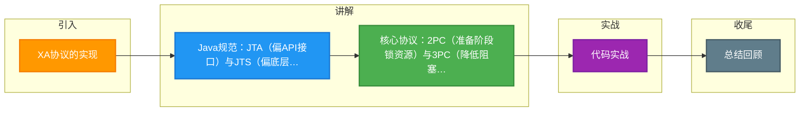

# XA协议的实现

### XA协议的实现

#### 1. 2PC/3PC协议

- **2PC (Two-Phase Commit)**：XA规范定义的数据一致性协议，分为准备阶段和提交阶段。
- **3PC (Three-Phase Commit)**：对2PC的扩展，增加了CanCommit阶段以降低阻塞风险。

#### 2. Java规范中的XA实现

##### JTA规范
JTA (Java Transaction API) 定义了Java平台上对XA事务的支持。它基于XA架构建模，定义了TransactionManager、UserTransaction等接口。实现由供应商提供（如J2EE容器JBoss，或独立实现Atomikos）。

##### JTS规范
JTS (Java Transaction Service) 定义了事务角色之间交互的底层细节规范。JTA侧重框架接口，JTS侧重实现交互（通常使用CORBA OTS，但现在较少使用）。

#### 3. 常见分布式事务中间件

##### Seata
一款开源的分布式事务解决方案，提供AT、TCC、SAGA和XA模式。AT模式是增强型2PC，通过解析SQL生成回滚日志，避免长锁。

##### Atomikos
提供开源的TransactionEssentials和商业版的ExtremeTransactions，支持JTA/XA、JDBC、JMS事务，常与Spring整合。

#### 4. XA的主要限制

1. 必须所有数据源支持XA协议（如MySQL的InnoDB）。
2. 同步阻塞，性能较差，锁定资源时间长，不适合高并发场景。

#### 5. 实战深化：配置与原理

**实战案例**：在使用Atomikos时，遇到跨库事务 MySQL `XA RBDEADLOCK` 死锁回滚，排查发现是因为索引不一致导致加锁顺序冲突，XA场景下死锁检测更容易触发全局回滚。

**代码示例：Atomikos 配置 (Spring Boot)**
```java
@Bean(name = "orderDataSource")
public DataSource orderDataSource() throws Throwable {
    MysqlXADataSource mysqlXADataSource = new MysqlXADataSource();
    mysqlXADataSource.setUrl(jdbcUrl);
    mysqlXADataSource.setUser(username);
    mysqlXADataSource.setPassword(password);
    AtomikosDataSourceBean xaDataSource = new AtomikosDataSourceBean();
    xaDataSource.setXaDataSource(mysqlXADataSource);
    xaDataSource.setUniqueResourceName("orderDataSource");
    return xaDataSource;
}
```

**对比表格：Seata AT模式 vs Seata XA模式**

| 模式 | 依赖 | 锁机制 | 隔离级别 | 性能 |
| :--- | :--- | :--- | :--- | :--- |
| **AT模式** | 解析SQL（需配合UndoLog） | 全局行锁（记录锁代理） | 读未提交（需配合全局锁） | 高（阶段一即释放本地锁） |
| **XA模式** | 数据库原生支持 | 数据库本身锁机制 | 严格串行化 | 低（一直持锁到Commit） |

## 常见考点
1. **Seata AT模式与XA模式的区别**：AT模式如何通过“自动解析SQL”实现无侵入的分布式事务？其回滚日志是如何工作的？
2. **JTA在Spring Boot中的配置**：如何配置多个DataSource支持XA事务？
3. **连接池隔离**：在XA事务中，为什么要求数据库连接必须是物理隔离的（不能被其他事务复用）？
4. **3PC的改进点与缺陷**：虽然3PC降低了阻塞，但在网络分区下是否完全解决了数据一致性问题？


## 核心流程图

```mermaid
sequenceDiagram
    classDef start fill:#4CAF50,color:#fff
    classDef process fill:#2196F3,color:#fff
    classDef decision fill:#FF9800,color:#fff
    classDef special fill:#9C27B0,color:#fff
    classDef error fill:#f44336,color:#fff
    classDef info fill:#607D8B,color:#fff
    class ACK start
    class C process
    class Commit decision
    class Coordinator special
    class NO error
    class P1 info
    class P2 start
    class P3 process
    class Participant decision
    class Prepare special
    class YES error
    class abort info
    class as start
    class commit process
    class prepare decision
    class redo special
    class rollback error
    class undo info
    participant C as Coordinator 协调者
    participant P1 as Participant 1
    participant P2 as Participant 2
    participant P3 as Participant 3

    Note over C,P3: 阶段1: Prepare 准备阶段
    C->>P1: prepare 询问能否提交
    C->>P2: prepare
    C->>P3: prepare
    P1->>P1: 写 undo/redo 日志 加锁
    P2->>P2: 写日志 加锁
    P3-->>C: YES/NO

    alt 所有参与者都 YES
        Note over C,P3: 阶段2: Commit 提交阶段
        C->>P1: commit
        C->>P2: commit
        C->>P3: commit
        P1-->>C: ACK
        P2-->>C: ACK
        P3-->>C: ACK
        C->>C: 事务完成
    else 任一参与者 NO 或超时
        C->>P1: abort/rollback
        C->>P2: abort
        P1-->>C: ACK
        Note over C,P3: 全局回滚 释放锁
    end

    Note over C,P3: 2PC 缺点: 协调者单点/同步阻塞/数据不一致
```

## 记忆要点

- Java规范：JTA(偏API接口)与JTS(偏底层实现)，常见中间件Atomikos
- 核心协议：2PC（准备阶段锁资源）与3PC（降低阻塞但未解决网络分区）
- Seata AT：增强型2PC，解析SQL写UndoLog，一阶段即提交不持长锁
- 避坑指南：所有数据源必须支持XA（如MySQL InnoDB），且极易死锁

## 结构化回答

**30 秒电梯演讲：** XA协议通过JTA等规范落地，Seata等中间件对其优化，但仍存在锁资源性能瓶颈。打比方——JTA制定了法律，Atomikos是执法机构，Seata是改良后的调解员，大家按规矩办事。落到工程上，2PC是XA的核心，JTA是Java对XA的实现。

**展开框架：**
1. **2PC** — 2PC是XA的核心，JTA是Java对XA的实现。
2. **Seata AT模式** — Seata AT模式优化了2PC锁问题，提升性能。
3. **XA要求强一致** — XA要求强一致且所有资源支持，限制较多。

**收尾：** 以上三点都能配合实战聊。我可以展开任一要点，您想先深入哪一块？

## 视频脚本

> 预计时长：4 分钟 | 由浅入深

| 时间 | 画面/字幕 | 口播台词 | 讲解要点 |
|------|----------|----------|----------|
| 0:00 | 标题卡：XA协议的实现 | "XA协议的实现，30 秒讲清楚核心。" | 开场钩子 |
| 0:45 | 概念定义动画 | "一句话：XA协议通过JTA等规范落地，Seata等中间件对其优化，但仍存在锁资源性能瓶颈。" | 核心定义 |
| 1:30 | 生活类比动画 | "打个比方——JTA制定了法律，Atomikos是执法机构，Seata是改良后的调解员，大家按规矩办事。" | 核心类比 |
| 2:15 | 2PC 图解 | "2PC是XA的核心，JTA是Java对XA的实现。" | 2PC |
| 3:00 | Seata AT模式 图解 | "Seata AT模式优化了2PC锁问题，提升性能。" | Seata AT模式 |
| 3:50 | XA要求强一致 图解 | "XA要求强一致且所有资源支持，限制较多。" | XA要求强一致 |

### 视频流程图



