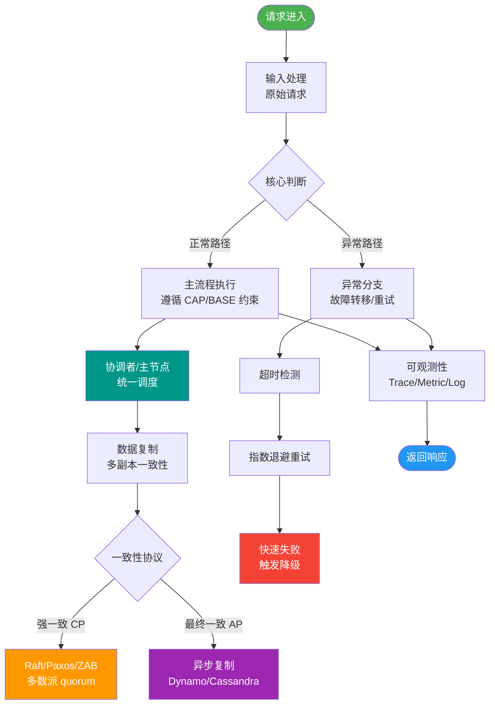

# 2pc解决的是分布式数据强一致性问题

### 2PC 解决的问题

2PC 解决的是分布式数据的**强一致性**问题。

2PC 包含两个角色：
1.  **事务协调者**（Coordinator）：如 Seata、Atomikos、LCN 等中间件；
2.  **事务参与者**（Participant）：通常指应用的数据库（资源管理器 RM）。

顾名思义，两阶段提交分为两个阶段：
*   **Voting（投票阶段）**：也称为 Prepare 阶段；
*   **Commit（提交阶段）**：根据投票结果执行最终的提交或回滚。

#### 架构角色图
```text
    ┌──────────────────┐
    │   应用程序 (AP)   │
    └────────┬─────────┘
             │
             ▼
    ┌──────────────────┐       1. 定义事务分支
    │  事务管理器 (TM)  │ ──────────────────┐
    │  (协调者)         │                   │
    └────────┬─────────┘                   │
             │                            │
             ▼                            │
    ┌──────────────────┐                   │
    │   通信资源管理器  │ ◄────────────────┘
    └────────┬─────────┘
             │
      ┌──────┴──────┐
      ▼             ▼
┌─────────┐   ┌─────────┐
│ 数据库1 │   │ 数据库2 │
│ (RM)    │   │ (RM)    │
└─────────┘   └─────────┘
```

#### 补充细节
*   **强一致性定义**：指分布式事务执行结束后，所有节点的数据状态完全一致。从外部看，要么都成功，要么都失败。
*   **XA 规范**：2PC 是 X/Open DTP（Distributed Transaction Processing）模型的核心协议。Java 中的 JTA (Java Transaction API) 对 XA 有标准实现。

#### 实战案例
电商大促下单时，同时扣减库存库和扣减积分库，若库存 Prepare 成功但积分库响应超时，2PC 会阻塞库存库的锁释放，导致后续下单请求积压，甚至拖垮整个库存服务。

#### 代码示例（Java JTA）
```java
// javax.transaction.UserTransaction 标准接口
UserTransaction utx = (UserTransaction) new InitialContext().lookup("java:comp/UserTransaction");

try {
    utx.begin(); // 开启全局事务
    // 1. 操作数据库 A (库存)
    jdbcTemplate.update("UPDATE stock SET count = count - 1 WHERE id = 1");
    // 2. 操作数据库 B (积分)
    jdbcTemplate.update("UPDATE points SET score = score + 100 WHERE user_id = 1");
    utx.commit(); // 协调者发起提交 (两阶段)
} catch (Exception e) {
    utx.rollback(); // 协调者发起回滚
}
```

---

## 常见考点
1.  **2PC 是否解决了 CAP 理论中的问题？**
    *   2PC 倾向于保证 CP（一致性 + 分区容错），牺牲了 A（可用性），因为在网络分区或节点故障时，系统会阻塞或拒绝服务。
2.  **协调者和参与者的职责分别是什么？**
    *   协调者负责决策和控制全局事务边界；参与者负责执行本地事务分支并上报状态。
3.  **Seata 的 AT 模式是标准的 2PC 吗？**
    *   不是。Seata AT 模式改进了 2PC，通过解析 SQL 生成前后镜像，利用“全局锁”机制，在第一阶段就释放本地锁，提升了性能，属于对 2PC 的变体优化。

---


## 核心流程图



## 记忆要点

- 核心目标：2PC解决分布式数据强一致性问题，属于CAP中的CP模型
- 阶段一(投票/Prepare)：各参与者执行并锁资源，反馈Yes/No
- 阶段二(提交/Commit)：协调者根据投票结果，决定全局Commit或Rollback
- 实战避坑：一阶段持锁过久易拖垮数据库，高并发场景应弃用2PC改用柔性事务

## 结构化回答


**30 秒电梯演讲：** 乐团指挥（协调者）先问乐手们（参与者）准备好了没，确认后统一开始演奏。

**展开框架：**
1. **目标** — 目标是解决分布式数据的强一致性问题。
2. **包含协调者和** — 包含协调者和参与者两个角色。
3. **分为投票和提** — 分为投票和提交两个阶段。

**收尾：** 这是我实战中的理解，您想深入哪一段？


## 视频脚本

> 预计时长：1 分 30 秒 | 由浅入深

| 时间 | 画面/字幕 | 口播台词 | 讲解要点 |
|------|----------|----------|----------|
| 0:00 | 标题卡：2pc解决的是分布式数据强一致性问题 | "2pc解决的是分布式数据强一致性问题，一分钟讲透。" | 开场钩子 |
| 0:25 | 生活类比动画 | "打个比方——乐团指挥(协调者)先问乐手们(参与者)准备好了没，确认后统一开始演奏。" | 核心类比 |
| 0:50 | 概念定义动画 | "一句话：通过协调者统筹全局，确保多节点事务要么全做，要么全不做。" | 核心定义 |
| 1:20 | 目标 图解 | "目标是解决分布式数据的强一致性问题。" | 目标 |
