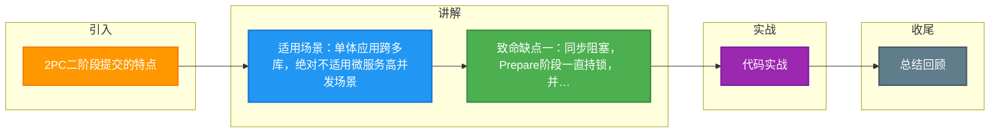

# 2PC二阶段提交的特点

### 2PC 的特点

2PC 方案比较适合单体应用内跨多个库的分布式事务。它依赖于一个**事务管理器**来协调多个数据库（资源管理器）。

#### 工作机制
事务管理器先询问各个数据库“你准备好了吗？”
*   如果都回复 OK，则正式提交事务，在各数据库上执行操作；
*   如果任一数据库回复不 OK，则回滚事务。

#### 适用场景
2PC 效率较低，绝对不适合高并发场景。在微服务架构中，通常规定每个服务只能操作自己对应的一个数据库。禁止直连其他服务的数据库，必须通过调用接口实现，以避免架构混乱和数据安全隐患。

#### 优缺点分析
**优点**：
*   原理简单。
*   提供了强一致性的保证（只要网络最终恢复，数据终将一致）。

**缺点**：
1.  **同步阻塞**：所有参与者处于阻塞状态，无法进行其他操作，性能较差；
2.  **单点故障**：协调者是单点，一旦出现问题，参与者无法释放资源；
3.  **数据不一致**：若协调者发送 Commit 请求后崩溃，部分参与者可能未收到请求，导致数据不一致（部分提交，部分未提交）；
4.  **容错机制差**：只能依赖超时机制来决定提交或中断，无法快速感知故障。

#### 补充细节
*   **性能瓶颈**：2PC 在 Prepare 阶段需要持锁直到 Commit，这导致长事务会长时间占用数据库连接和锁，极大地降低了并发吞吐量。
*   **单点故障的后果**：协调者在发送 Commit 命令前崩溃，参与者由于不知道该提交还是回滚，只能一直阻塞持有锁，导致数据库死锁或资源耗尽。

#### 实战案例
某金融系统使用 ShardingSphere 进行 XA 分库分表事务。在双11大促期间，由于网络抖动导致协调者与部分分片节点连接超时，这些分片节点一直持有行锁未释放，最终导致数据库连接池爆满，全线服务不可用。

#### 代码示例（Seata AT 模式 - 改进版 2PC 思想）
```java
@GlobalTransactional // Seata 开启全局事务
public void purchase(String userId, String commodityCode, int orderCount) {
    // 阶段一：本地事务执行，自动生成 undo_log，提交后释放本地锁
    stockService.deduct(commodityCode, orderCount);
    orderService.createOrder(userId, commodityCode, orderCount);
    // 阶段二：异步上报状态给 TC (Transaction Coordinator)，由 TC 决定全局回滚或提交
}
```

---

## 常见考点
1.  **为什么 2PC 在互联网高并发场景下很少使用？**
    *   主要因为同步阻塞导致的性能问题和单点故障导致的可用性风险。互联网场景通常追求 AP（高可用+分区容错），倾向于使用最终一致性方案（如 TCC、Saga、消息队列）。
2.  **如果协调者在第二阶段发出 Commit 后宕机，怎么恢复？**
    *   这是最糟糕的情况。有的参与者收到了 Commit 并提交了，有的没收到还在阻塞。协调者恢复后，需要查询所有参与者的状态来决定补发 Commit，但很难保证完全一致（这也是需要引入补偿机制的原因）。
3.  **什么是“锁竞争”在 2PC 中的体现？**
    *   多个全局事务如果涉及同一行数据，在 Prepare 阶段就会产生行锁冲突，导致大量事务回滚或排队等待。

---


## 核心流程图

```mermaid
sequenceDiagram
    classDef start fill:#4CAF50,color:#fff
    classDef process fill:#2196F3,color:#fff
    classDef decision fill:#FF9800,color:#fff
    classDef special fill:#9C27B0,color:#fff
    classDef error fill:#f44336,color:#fff
    classDef info fill:#607D8B,color:#fff
    class ACK start
    class C process
    class Commit decision
    class Coordinator special
    class NO error
    class P1 info
    class P2 start
    class P3 process
    class Participant decision
    class Prepare special
    class YES error
    class abort info
    class as start
    class commit process
    class prepare decision
    class redo special
    class rollback error
    class undo info
    participant C as Coordinator 协调者
    participant P1 as Participant 1
    participant P2 as Participant 2
    participant P3 as Participant 3

    Note over C,P3: 阶段1: Prepare 准备阶段
    C->>P1: prepare 询问能否提交
    C->>P2: prepare
    C->>P3: prepare
    P1->>P1: 写 undo/redo 日志 加锁
    P2->>P2: 写日志 加锁
    P3-->>C: YES/NO

    alt 所有参与者都 YES
        Note over C,P3: 阶段2: Commit 提交阶段
        C->>P1: commit
        C->>P2: commit
        C->>P3: commit
        P1-->>C: ACK
        P2-->>C: ACK
        P3-->>C: ACK
        C->>C: 事务完成
    else 任一参与者 NO 或超时
        C->>P1: abort/rollback
        C->>P2: abort
        P1-->>C: ACK
        Note over C,P3: 全局回滚 释放锁
    end

    Note over C,P3: 2PC 缺点: 协调者单点/同步阻塞/数据不一致
```

## 记忆要点

- 适用场景：单体应用跨多库，绝对不适用微服务高并发场景
- 致命缺点一：同步阻塞，Prepare阶段一直持锁，并发吞吐量极低
- 致命缺点二：协调者单点故障，导致参与者永久阻塞、资源锁死
- 致命缺点三：网络分区致部分Commit部分未执行，引发数据不一致

## 结构化回答


**30 秒电梯演讲：** 像老式开会，大家都要举手表决，没投完票前谁都不准干别的，效率很低。

**展开框架：**
1. **同步阻塞协议** — 同步阻塞协议，性能差，不适合高并发。
2. **协调者存在单** — 协调者存在单点故障风险。
3. **极端情况下可** — 极端情况下可能出现数据不一致。

**收尾：** 这是我实战中的理解，您想深入哪一段？


## 视频脚本

> 预计时长：3 分钟 | 由浅入深

| 时间 | 画面/字幕 | 口播台词 | 讲解要点 |
|------|----------|----------|----------|
| 0:00 | 标题卡：2PC二阶段提交的特点 | "2PC二阶段提交的特点，这题我会分三步讲。" | 开场钩子 |
| 0:41 | 概念定义动画 | "一句话：强一致、低性能、阻塞式的分布式事务方案，适合单体架构。" | 核心定义 |
| 1:22 | 生活类比动画 | "打个比方——像老式开会，大家都要举手表决，没投完票前谁都不准干别的，效率很低。" | 核心类比 |
| 2:03 | 同步阻塞协议 图解 | "同步阻塞协议，性能差，不适合高并发。" | 同步阻塞协议 |
| 2:50 | 协调者存在单点故 图解 | "协调者存在单点故障风险。" | 协调者存在单点故 |

### 视频流程图



