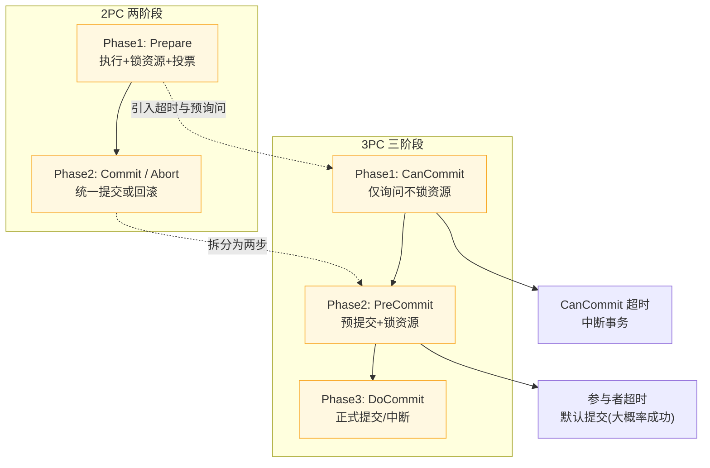

# 2PC和3PC的区别

### 2PC 和 3PC 的区别

3PC 是在 2PC 基础上的改进，旨在降低阻塞范围并解决单点故障后的恢复问题。

#### 主要区别
1.  **阶段划分**：
    *   **2PC**：Prepare（投票 + 锁资源） + Commit（执行）。
    *   **3PC**：CanCommit（询问，不锁资源） + PreCommit（预提交，锁资源） + DoCommit（执行）。3PC 将 2PC 的第一阶段拆分为两步，先询问可行性，再锁资源预执行。

2.  **超时机制**：
    *   **2PC**：仅协调者拥有超时机制。参与者如果协调者挂了，会一直阻塞。
    *   **3PC**：协调者和参与者都引入了超时机制。
        *   参与者在 PreCommit 阶段超时：默认提交（因为大概率其他节点都成功了）。
        *   参与者在 CanCommit 阶段超时：中断事务。

#### 3PC 的优化与问题
*   **优化点**：
    *   **减少阻塞**：参与者超时后自动释放资源或提交，避免了因协调者宕机导致的永久阻塞。
    *   **缓冲阶段**：PreCommit 阶段保证了各节点状态的一致性，降低了进入第三阶段后因网络故障导致不一致的概率。

*   **依然存在的问题**：
    3PC 依然无法完全解决数据一致性问题。例如，在 DoCommit 阶段，如果协调者发送 Abort 请求，而参与者 A 因网络分区未收到并超时自动提交，会导致数据不一致。且 3PC 相比 2PC 增加了网络交互次数，性能更差。

#### 对比总结表

| 特性 | 2PC (两阶段提交) | 3PC (三阶段提交) |
| :--- | :--- | :--- |
| **阶段数** | 2 (Prepare, Commit) | 3 (CanCommit, PreCommit, DoCommit) |
| **阻塞点** | Prepare 阶段即锁资源 | PreCommit 阶段才锁资源 |
| **超时处理** | 仅协调者有超时，参与者无限阻塞 | 协调者和参与者均有超时，可自动决策 |
| **一致性** | 强一致性 | 理论上降低不一致概率，但仍可能发生 |
| **性能** | 较差（一次网络往返） | 更差（两次网络往返，吞吐量低） |
| **适用场景** | 传统数据库 XA 事务 | 理论模型，实际应用极少 |
| **容错性** | 协调者单点故障会导致死锁 | 参与者超时机制降低了死锁概率 |

#### 实战案例
在 legacy 的跨行转账系统中，为了保证资金绝对一致，曾使用标准的 XA (2PC)。但在迁移改造时，由于网络环境不稳定，出现过数据库长时间锁库导致交易中断。评估改用 3PC 后，发现虽然解决了锁库问题，但在 PreCommit 阶段因网络抖动导致部分节点自动提交、部分回滚的"资金裂变"风险过高，最终放弃 3PC，改为基于 MQ 的最终一致性对账方案。

---

## 常见考点
1.  **为什么说 3PC 只是降低了数据不一致的概率，而不是彻底解决了？**
    *   因为在 PreCommit 阶段后，如果协调者决定 Abort，但网络分区导致部分参与者只收到了 Commit（或超时自动 Commit），就会导致不一致。只要涉及网络分区的异步消息传递，无法在 CAP 中同时满足 C 和 A。
2.  **参与者超时后为什么倾向于提交？**
    *   在 PreCommit 阶段超时，意味着大多数节点都已经 Ack 了，且已经写入了 Redo/Undo 日志。此时回滚的代价很大，且认为系统大概率是正常的，因此倾向于提交以减少阻塞。
3.  **现在的分布式事务主流方案是什么？为什么不用 3PC？**
    *   主流是 TCC、Saga、Seata（AT 模式）或基于 MQ 的最终一致性方案。因为这些方案虽然放弃了强一致性，但换来了极高的可用性和性能，更符合微服务架构的需求。

---

### 2PC 与 3PC 阶段对比流程

## 记忆要点

- 阶段对比：2PC是Prepare加Commit，而3PC将其拆分为Can加Pre加Do
- 锁时机对比：2PC在Prepare即锁资源，而3PC延迟到PreCommit才锁资源
- 容错对比：2PC参与者无限阻塞，而3PC参与者有超时机制可自行决策提交或中断
- 性能对比：3PC因为多一轮RTT网络交互，性能比2PC更差

## 结构化回答

**30 秒电梯演讲：** 3PC增加超时和预询问，降低了阻塞，但未根本解决一致性问题。打比方——2PC是死板的指令，3PC增加了限时反馈和预确认，虽然灵活了但容易产生误会。落到工程上，3PC拆分第一阶段，增加CanCommit。

**展开框架：**
1. **3PC拆分第一阶段** — 3PC拆分第一阶段，增加CanCommit。
2. **参与者也拥** — 参与者也拥有超时机制，防无限阻塞。
3. **网络分区时** — 网络分区时可能导致数据不一致。

**收尾：** 以上三点都能配合实战聊。我可以展开任一要点，您想先深入哪一块？

## 视频脚本

> 预计时长：3 分钟 | 由浅入深

| 时间 | 画面/字幕 | 口播台词 | 讲解要点 |
|------|----------|----------|----------|
| 0:00 | 标题卡：2PC和3PC的区别 | "2PC和3PC的区别，这题我会分三步讲。" | 开场钩子 |
| 0:41 | 概念定义动画 | "一句话：3PC增加超时和预询问，降低了阻塞，但未根本解决一致性问题。" | 核心定义 |
| 1:22 | 生活类比动画 | "打个比方——2PC是死板的指令，3PC增加了限时反馈和预确认，虽然灵活了但容易产生误会。" | 核心类比 |
| 2:03 | 3PC拆分第一阶段 图解 | "3PC拆分第一阶段，增加CanCommit。" | 3PC拆分第一阶段 |
| 2:50 | 参与者也拥 图解 | "参与者也拥有超时机制，防无限阻塞。" | 参与者也拥 |
