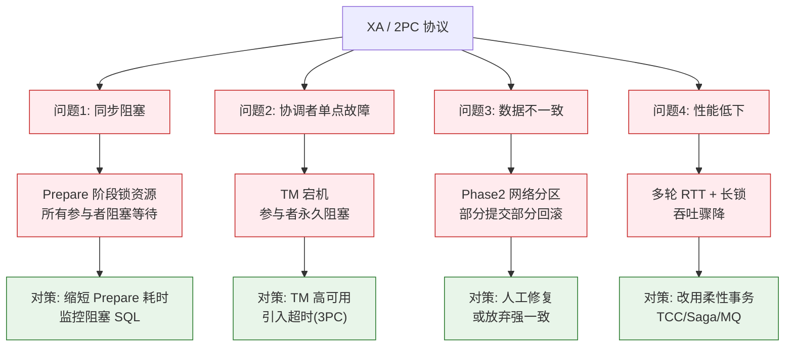

# XA规范的问题

### XA 规范的问题

XA 规范是分布式事务的行业标准，但自 1994 年出现以来，在互联网领域并未大规模流行，主要存在以下缺陷：

1.  **数据锁定**：事务未结束前，为了保障一致性，需根据隔离级别对数据进行锁定，长事务会导致大量资源占用。
2.  **协议阻塞**：本地事务在全局事务未 Commit 或 Rollback 前，一直处于阻塞等待状态。
3.  **性能损耗高**：增加了事务协调的 RT（往返时间）成本，且并发事务通过锁竞争导致阻塞。
4.  **数据库支持度**：
    *   MySQL 对 XA 的实现不理想（如 5.7 之前版本），未记录 Prepare 阶段日志，主备切换可能导致数据不一致。
    *   许多 NoSQL 不支持 XA，导致应用场景狭隘。

#### XA 协议两阶段提交流程

```text
      应用程序 (AP)           事务协调器 (TM)            资源管理器 (RM)
          |                        |                        |
          | ------ 1. Begin ------> |                        |
          |                        |                        |
          | -- 2. 注册分支事务 --> |                        |
          |                        | -- 3. 询问 Prepare --> |  (DB1)
          |                        |                        | -- 锁定资源
          |                        | <-- 4. 结果:Yes ------- |
          |                        |                        |
          |                        | -- 3. 询问 Prepare --> |  (DB2)
          |                        |                        | -- 锁定资源
          |                        | <-- 4. 结果:Yes ------- |
          |                        |                        |
          | <-- 5. 决策 Commit --- |                        |
          |                        | -- 6. 全局 Commit ---> |  (DB1)
          |                        |                        | -- 释放锁
          |                        | <-- 7. Ack ------------ |
          |                        |                        |
          |                        | -- 6. 全局 Commit ---> |  (DB2)
          |                        |                        | -- 释放锁
          |                        | <-- 7. Ack ------------ |
```

**流程详解**：
*   **阶段一（准备阶段）**：TM 向所有 RM 发送 Prepare 指令。RM 执行事务但**不提交**，锁定资源并返回 Yes/No。
*   **阶段二（提交阶段）**：若所有 RM 均返回 Yes，TM 发送 Commit；否则发送 Rollback。
*   **阻塞点**：在收到 TM 的最终指令前，RM 一直持有数据库锁，无法响应其他请求。

#### 对比表格：XA vs TCC (主流替代方案)

| 维度 | XA 规范 | TCC (Try-Confirm-Cancel) |
| :--- | :--- | :--- |
| **一致性** | 强一致性 | 最终一致性 |
| **资源锁定** | 数据库层面持锁，时间长 | 应用层面锁定资源，时间短 |
| **代码侵入性** | 低（仅配置） | 高（需编写三个接口）
| **性能** | 差（长连接、锁阻塞） | 较好（无长事务锁） |
| **适用场景** | 传统内部系统，并发低 | 互联网高并发，核心业务 |

#### 实战案例
某支付平台在早期对接银行渠道时使用 XA 协议保证本地账务与渠道流水一致性。后来发现，只要银行侧接口响应慢（超过 3s），本地数据库的关键行锁就会一直被持有，导致整个支付系统的吞吐量从 2000 TPS 下跌到 50 TPS，且极易造成数据库连接池耗尽，最终被迫将 XA 改造为异步对账模式。

#### 代码示例（MySQL XA 语法）
```sql
-- 1. 开启一个 XA 事务 (分支)
XA START 'xid_01';

-- 2. 执行业务 SQL
UPDATE account SET balance = balance - 100 WHERE user_id = 1;

-- 3. 进入 Prepare 阶段 (不提交，但持久化 Redo Log)
XA END 'xid_01';
XA PREPARE 'xid_01';

-- 此时连接断开，事务依然挂起，其他事务无法修改该行

-- 4. 协调者下发指令：提交或回滚
-- XA COMMIT 'xid_01';
-- XA ROLLBACK 'xid_01';
```

#### 适用场景
虽然 XA 在高并发互联网场景下表现不佳，但在传统软件（如 IBM 大型机 CICS 系统）中应用广泛，适合对强一致性要求高、并发量不高、且涉及异构数据库（如同时操作 Oracle 和 DB2）的传统 ETL 或银行核心系统。

---

### XA 规范的核心问题与对策




## 记忆要点

- 致命弱点：长事务导致数据库级别长期持锁，并发性能极差
- 协议阻塞：本地事务在全局事务结束前一直处于Prepare阻塞状态
- 兼容性差：MySQL早期版本Prepare日志记录不全，且多数NoSQL不支持
- 方案对比：XA属强一致性数据库层锁，而TCC属最终一致性应用层锁

## 结构化回答


**30 秒电梯演讲：** 像老式火车调度，必须全线封锁才能换轨，安全但效率极低，容易被时代淘汰。

**展开框架：**
1. **数据锁定时间长** — 数据锁定时间长，并发能力差。
2. **同步阻塞协议** — 同步阻塞协议，严重影响性能。
3. **MySQL** — 部分数据库（如MySQL早期）支持不完善。

**收尾：** 这是我实战中的理解，您想深入哪一段？


## 视频脚本

> 预计时长：2 分钟 | 由浅入深

| 时间 | 画面/字幕 | 口播台词 | 讲解要点 |
|------|----------|----------|----------|
| 0:00 | 标题卡：XA规范的问题 | "XA规范的问题，一分钟讲透。" | 开场钩子 |
| 0:35 | 生活类比动画 | "打个比方——像老式火车调度，必须全线封锁才能换轨，安全但效率极低，容易被时代淘汰。" | 核心类比 |
| 1:10 | 概念定义动画 | "一句话：标准但老旧的强一致性协议，因阻塞性能差不适合高并发互联网场景。" | 核心定义 |
| 1:50 | 数据锁定时间长 图解 | "数据锁定时间长，并发能力差。" | 数据锁定时间长 |
