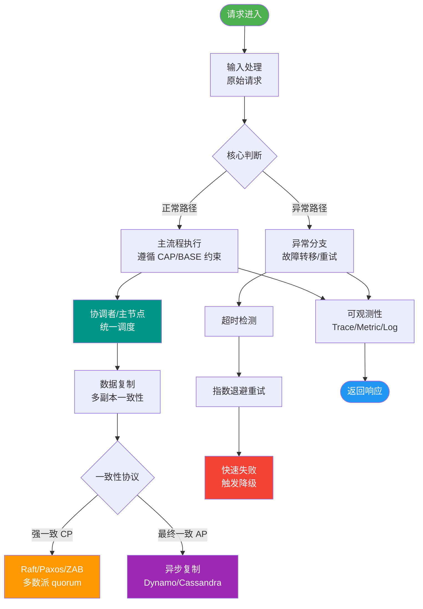

# 异步确保型事务

### 异步确保型事务

异步确保型事务指将一系列同步的事务操作修改为基于消息队列异步执行的操作，以避免分布式事务中同步阻塞带来的性能下降。

其主流实现是 **MQ 事务消息方案**（基于 RocketMQ 等中间件）。

#### MQ 事务消息方案原理
该方案主要依靠 MQ 的**半消息**机制来实现投递消息和参与者自身本地事务的一致性保障。半消息机制借鉴了 2PC 的思路，是二阶段提交的广义拓展。

**半消息机制**：
*   发送方发送半消息到 MQ，此时消息已被 MQ 存储，但对消费者**不可见**（不能被消费）。
*   发送方执行本地事务。
*   根据本地事务执行结果，向 MQ 发送 Commit 或 Rollback 指令：
    *   成功：提交消息，消息对消费者可见，可进行消费；
    *   失败：回滚消息，MQ 丢弃该半消息。
*   **异常处理（回查机制）**：若 MQ 未收到确认（如网络异常、应用挂掉），MQ 会主动反向查询（回调）发送方接口，询问本地事务的状态（Commit 或 Rollback），以解决消息状态未知的问题。

#### 事务消息流程图

```text
    Producer                     MQ Broker                  Consumer
       |                            |                            |
       |--- 1. 发送半消息 ---------->|                            |
       |                            | (存储消息，状态: Unknow)    |
       |<-- 2. 返回发送成功 ---------|                            |
       |                            |                            |
       |--- 3. 执行本地事务 -------->|                            |
       | (成功/失败)                |                            |
       |                            |                            |
       |--- 4. 提交/回滚指令 ------>|                            |
       | (Commit/Rollback)          |                            |
       |                            |                            |
       |                 [分支1: 正常收到指令]                  |
       |                            |--- 5. 投递消息 ----------->|
       |                            | (状态: 可见)               |
       |                            |                            |--- 6. 消费消息
       |                            |                            |<-- 7. ACK
       |                            |                            |
       |                 [分支2: 未收到指令/超时]                |
       |<-- 8. 反向事务状态查询 -----|                            |
       | (Check Local Trans)        |                            |
       |--- 9. 返回事务状态 -------->|                            |
       | (Commit/Rollback)          |                            
```

#### 实战案例
在电商大促场景下，若同步调用积分服务会导致订单下单链路 RT 飙升，造成数据库连接池耗尽。采用异步确保型事务后，订单创建仅需 50ms，积分落库允许延迟 1 秒，极大提升了系统吞吐量。

#### 代码示例 (Java RocketMQ)
```java
// 1. 发送半消息
Message msg = new Message("TopicTest", "TagA", "Key", body);
SendResult sendResult = producer.sendMessageInTransaction(msg, null);

// 2. 执行本地事务并提交状态 (由 TransactionListener 实现)
@Override
public LocalTransactionState executeLocalTransaction(Message msg, Object arg) {
    try {
        // 执行业务逻辑，如插入订单
        orderService.insertOrder(params);
        return LocalTransactionState.COMMIT_MESSAGE; // 成功则提交
    } catch (Exception e) {
        return LocalTransactionState.ROLLBACK_MESSAGE; // 失败则回滚
    }
}

// 3. 反查回调
@Override
public LocalTransactionState checkLocalTransaction(MessageExt msg) {
    // 查询本地订单是否存在
    Order order = orderService.queryOrder(msg.getKeys());
    return order != null ? LocalTransactionState.COMMIT_MESSAGE : LocalTransactionState.ROLLBACK_MESSAGE;
}
```


## 核心流程图



## 记忆要点

- 核心机制：通过MQ半消息保障本地事务执行与消息投递的原子性
- 半消息特性：已被MQ存储但对消费者完全不可见
- 执行流程：发半消息->执行本地事务->根据结果Commit或Rollback
- 兜底策略：断网或应用宕机时，MQ通过反查接口主动获知本地事务状态

## 结构化回答


**30 秒电梯演讲：** 快递员先取件（发半消息），揽收成功后再录入系统（提交消息），揽收失败就退回，不会寄出不存在的包裹。

**展开框架：**
1. **核心是利** — 核心是利用半消息机制。
2. **本地事务执行** — 本地事务执行与消息发送原子绑定。
3. **支持反向查询** — 支持反向查询事务状态防止消息丢失。

**收尾：** 这是我实战中的理解，您想深入哪一段？


## 视频脚本

> 预计时长：1 分 30 秒 | 由浅入深

| 时间 | 画面/字幕 | 口播台词 | 讲解要点 |
|------|----------|----------|----------|
| 0:00 | 标题卡：异步确保型事务 | "异步确保型事务，一分钟讲透。" | 开场钩子 |
| 0:25 | 生活类比动画 | "打个比方——快递员先取件(发半消息)，揽收成功后再录入系统(提交消息)，揽收失败就退回，不会寄出不存在的包裹。" | 核心类比 |
| 0:50 | 概念定义动画 | "一句话：利用本地事务和消息发送的原子性，保证最终一致性。" | 核心定义 |
| 1:20 | 利用半消息机制 图解 | "核心是利用半消息机制。" | 利用半消息机制 |
