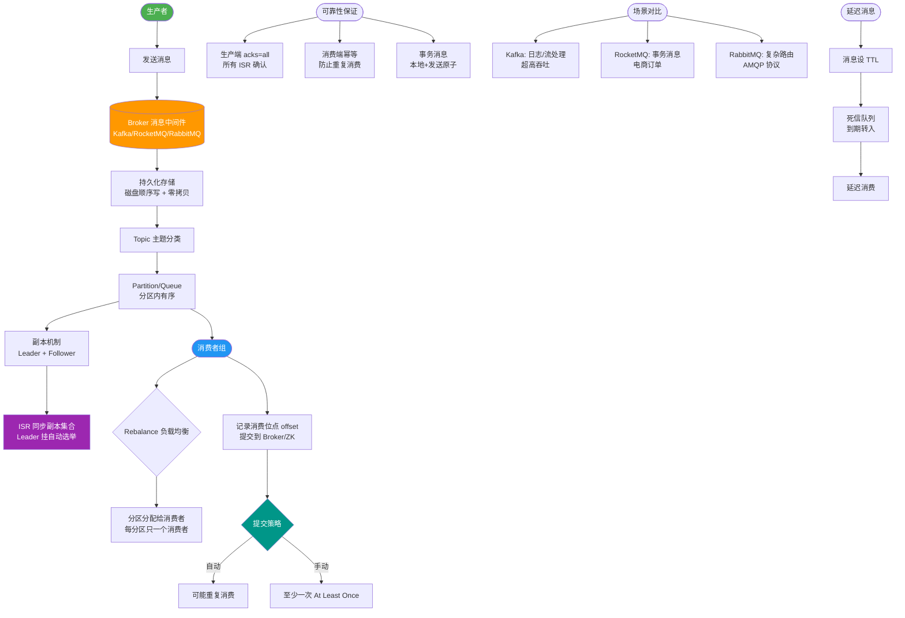

# 基于阿里 RocketMQ实现MQ异步确保型事务

# 基于 RocketMQ 实现异步确保型事务

## 核心原理
目前主流 MQ 中，RocketMQ 和 ActiveMQ 支持事务消息（半消息机制），而 RabbitMQ 和 Kafka 原生不支持（需通过变通方案实现）。

### 详细实现步骤

#### 1. 发送半消息
Producer（A 系统）发送半消息到 Broker。
*   **细节**：半消息内容是完整的，并非残缺消息。发送逻辑与普通消息一致，但对消费者不可见。
*   **存储细节**：Broker 存储半消息时，Topic 被固定为 `RMQ_SYS_TRANS_HALF_TOPIC`，QueueId 固定为 0。这保证了该消息在提交前永远不会被消费。

#### 2. Broker 处理与响应
Broker 存储半消息成功，返回 ACK 给 Producer。

#### 3. 执行本地事务
Producer 收到 ACK 后，执行本地事务（如 A 系统的数据库操作）。

#### 4. 提交/回滚请求
Producer 根据本地事务结果，向 Broker 发送结束请求。
*   **Commit**：Broker 将半消息从 `RMQ_SYS_TRANS_HALF_TOPIC` 移动到原始 Topic 的 Queue 中，此时消费者可见。
*   **Rollback**：Broker 丢弃该消息，不进行投递。

#### 5. 异常处理：反查机制
Producer 的结束请求通常采用 Oneway 方式（发送后不等待确认），存在丢失风险。RocketMQ 提供了兜底方案：
*   **TransactionalMessageCheckService**：Broker 启动的定时任务。
*   **逻辑**：定时扫描半消息队列，找出超时未提交的消息。
*   **回查**：Broker 向 Producer 发起 RPC 请求，询问本地事务状态。
*   **决策**：Producer 根据回查结果返回状态，Broker 据此执行 Commit 或 Rollback。

#### 6. 消费者消费
Consumer（B 系统）正常消费消息，执行本地业务逻辑。

### 代码实现机制
Producer 需实现 `TransactionListener` 接口：

```text
TransactionListener:
├── executeLocalTransaction(Broker 回调)
│   └── 触发时机: 半消息存储成功后
│   └── 作用: 执行本地事务 (DB操作)
│   └── 返回值: COMMIT, ROLLBACK, UNKNOWN
│
└── checkLocalTransaction(Broker 反查回调)
    └── 触发时机: 半消息超时未提交，Broker 主动反查
    └── 作用: 查询本地事务状态 (查库)
    └── 返回值: COMMIT, ROLLBACK, UNKNOWN
```

### 状态流转图
```text
         Producer                              Broker                         Consumer
            |                                    |                                |
[发送 Half Msg] ---------------------------------> | (存储到 RMQ_SYS_TRANS_HALF_TOPIC)  |
            | <------------------------------- [ACK]                                |
            |                                    |                                |
    [执行本地事务]                                  |                                |
            |                                    |                                |
 [发送 End Transaction (Commit)] -----------------> |                                |
            |                                    | [移动消息到真实Topic] -----> [消费消息]
            |                                    |                                |
(若 Crash/Timeout) <------------------------- [反查请求]                           |
            |                                    |                                |
[查询本地DB状态] ---------------------------------> |                                |
            | <------------------------------- [Commit/Rollback]                    |
```

### 实战案例
在电商大促场景下，曾遇到因本地事务执行时间过长（超过 Broker 默认的 1 分钟回查阈值），导致消息在 Commit 前被 Broker 判定为 UNKNOWN 并频繁反查，造成数据库压力激增。**优化方案**是将本地事务逻辑尽量轻量化，并适当调大 `transactionTimeout` 参数，减少不必要的回查干扰。

### 代码示例
```java
// Java: RocketMQ TransactionListener 实现
public class OrderTransactionListenerImpl implements TransactionListener {
    @Override
    public LocalTransactionState executeLocalTransaction(Message msg, Object arg) {
        // 执行本地订单插入逻辑
        boolean success = orderService.insertOrder((OrderDTO)arg);
        return success ? LocalTransactionState.COMMIT_MESSAGE : LocalTransactionState.ROLLBACK_MESSAGE;
    }

    @Override
    public LocalTransactionState checkLocalTransaction(MessageExt msg) {
        // 兜底：查询订单是否已存在，防止消息丢失或状态未知
        String orderId = msg.getKeys();
        return orderService.isOrderExist(orderId) ? 
               LocalTransactionState.COMMIT_MESSAGE : LocalTransactionState.ROLLBACK_MESSAGE;
    }
}
```


## 核心流程图



## 记忆要点

- 存储细节：RocketMQ将半消息固定存入RMQ_SYS_TRANS_HALF_TOPIC
- 提交流程：Commit将消息移入真实Topic，Rollback则不投递
- 代码实现：Producer需实现执行本地事务及反查事务状态两个回调方法
- 兜底机制：TransactionalMessageCheckService定时扫描超时未决消息并发起回查

## 结构化回答


**30 秒电梯演讲：** 寄信前先到邮局挂号，办完事确认后再投递。

**展开框架：**
1. **Topic** — 半消息存于特定Topic，对消费者不可见
2. **Topic** — 提交时将消息复制到真实Topic
3. **回滚时直接丢** — 回滚时直接丢弃半消息

**收尾：** 这是我实战中的理解，您想深入哪一段？


## 视频脚本

> 预计时长：3 分钟 | 由浅入深

| 时间 | 画面/字幕 | 口播台词 | 讲解要点 |
|------|----------|----------|----------|
| 0:00 | 标题卡：基于阿里 RocketMQ实现MQ异步确 | "基于阿里 RocketMQ实现MQ异步确，这题我会分三步讲。" | 开场钩子 |
| 0:41 | 概念定义动画 | "一句话：利用RocketMQ半消息与反查机制实现事务。" | 核心定义 |
| 1:22 | 生活类比动画 | "打个比方——寄信前先到邮局挂号，办完事确认后再投递。" | 核心类比 |
| 2:03 | 半消息存于特定T 图解 | "半消息存于特定Topic，对消费者不可见。" | 半消息存于特定T |
| 2:50 | 提交时 图解 | "提交时将消息复制到真实Topic。" | 提交时 |
