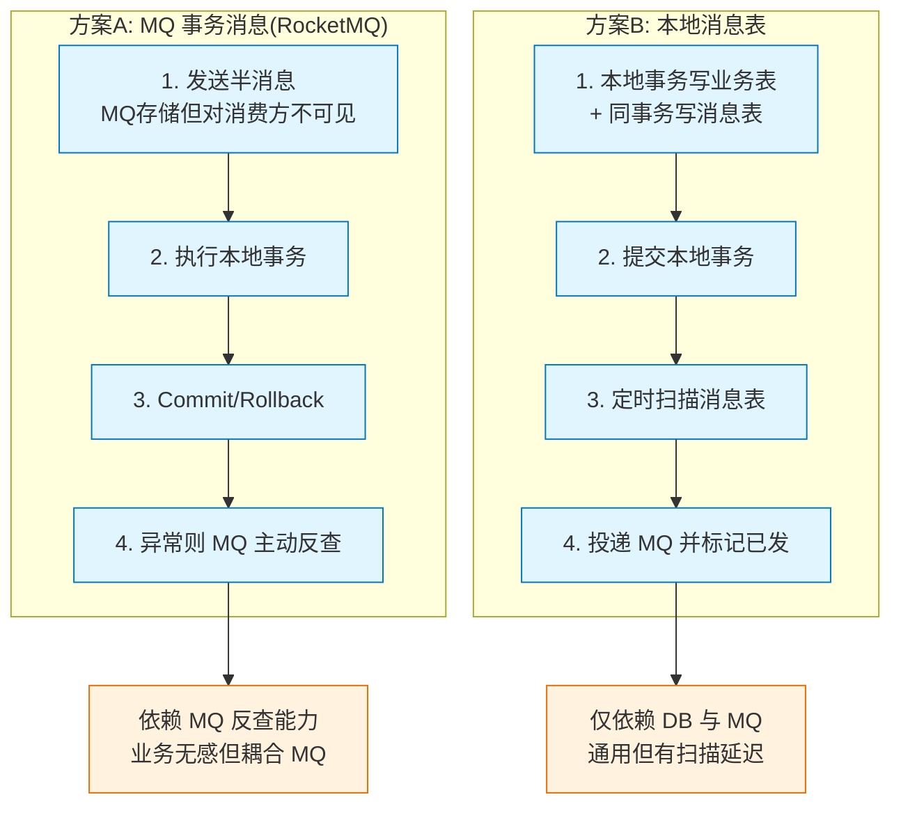

# MQ事务消息 VS 本地消息表

# MQ 事务消息 VS 本地消息表

## 二者的共性
1.  **异步执行**：都依赖 MQ 进行事务通知，将同步调用转为异步处理，提升系统吞吐量。
2.  **重复投递风险**：事务消息在投递方都存在重复投递的可能，都需要配套机制降低重复率。
3.  **幂等性要求**：消费方必须进行消费去重设计或服务幂等设计，以应对重复消息。

## 二者的区别

### 1. MQ 事务消息
*   **实现原理**：利用 MQ 内部的半消息机制和事务回查接口。
*   **MQ 要求**：强依赖 MQ 中间件的原生支持（如 RocketMQ）。
*   **存储位置**：事务状态数据存储在 MQ Broker 端。
*   **侵入性**：具有较大的业务侵入性，业务方必须实现特定的 `TransactionListener` 接口（本地事务执行方法和回查方法）。
*   **性能**：优于本地消息表，减少了数据库 IO（不需要写业务库的消息表），但增加了网络交互（回查）。
*   **去重能力**：通常由 MQ 内部机制较好地处理了半消息的去重问题。

### 2. DB 本地消息表
*   **实现原理**：在业务数据库中建表，利用本地事务保证业务和消息一致，通过定时任务轮询发送。
*   **MQ 要求**：对 MQ 无特殊要求，普通的 MQ（RabbitMQ, Kafka）即可支持。
*   **存储位置**：事务状态数据存储在业务数据库中。
*   **侵入性**：侵入性相对较低。虽然需要建表和写定时任务，但不需要修改业务逻辑来提供回查接口，业务逻辑只需关注自身。
*   **性能**：相对较差。因为增加了数据库的读写压力（写入消息记录、轮询扫描消息表），在高并发下可能成为瓶颈。
*   **一致性延迟**：由于是轮询发送（通常是定时任务），一致性的到达时间可能略高于 MQ 事务消息。

## 对比总结表
| 维度 | MQ 事务消息 | 本地消息表 |
| :--- | :--- | :--- |
| **依赖** | 依赖特定 MQ (如 RocketMQ) | 依赖数据库，不依赖 MQ 类型 |
| **数据存储** | Broker 端 | 业务数据库 |
| **网络交互** | 需回查 RPC | 无需回查，轮询 DB |
| **代码侵入** | 中高 (需实现 Listener) | 中 (需建表、写逻辑) |
| **并发性能** | 高 (不占用业务 DB IO) | 中 (占用业务 DB IO) |
| **实时性** | 较好 (秒级) | 一般 (取决于轮询间隔) |
| **适用场景** | 高并发内部微服务交互 | 通用方案，跨系统或非事务型 MQ |

## 常见考点
1.  **如何选择这两种方案**？
    *   如果系统使用 RocketMQ，且对性能要求高，优先选 **MQ 事务消息**。
    *   如果系统使用 RabbitMQ/Kafka，或者不想让业务代码实现回查接口，且数据库能承受压力，选 **本地消息表**。
2.  **本地消息表为什么性能较差**？
    *   因为“写消息”和“扫描消息”都是数据库 IO 操作，会与业务操作争抢数据库连接和 IO 资源。
3.  **本地消息表的“最小侵入”体现在哪里**？
    *   可以利用 AOP 切面，在业务方法提交后自动写入消息表，业务代码本身几乎无感知（除了注解），比 MQ 事务消息强制实现接口要灵活一些。


### 实战案例
在某物流核心系统中，初期使用本地消息表导致业务库在高峰期 IO 打满。后来迁移至 RocketMQ 事务消息方案，**效果**：数据库 TPS 下降 30%，吞吐量显著提升，但增加了对 MQ Broker 稳定性的依赖。

### 代码示例
```java
// Java: 对比伪代码

// 方案 A: RocketMQ 事务消息 (需实现接口)
transactionMQProducer.sendMessageInTransaction(msg, new TransactionListener() {
    public LocalTransactionState executeLocalTransaction(Message msg, Object arg) {
        // 业务逻辑 + DB操作
        return dbSuccess ? COMMIT : ROLLBACK;
    }
}, null);

// 方案 B: 本地消息表 (业务无感，需额外 Job)
@Transactional
public void doBusiness() {
    dbOperation(); // 业务操作
    messageMapper.insert(msg); // 同一事务插入消息表
}
// 独立线程池
job.scanTableAndSendToMQ();
```

### MQ事务消息 vs 本地消息表 方案流程




## 核心知识点图


## 记忆要点

- 共性：都依赖MQ且存在重复投递风险，所以消费方必须保证幂等。
- 存储依赖：MQ事务强依赖特定MQ（如RocketMQ）存Broker端；本地表依赖业务DB。
- 性能与实时性：MQ事务不占用DB且有回查，性能高秒级；本地表需轮询DB，高并发易遇瓶颈。
- 选型口诀：高并发内部交互选MQ事务，通用或无特殊MQ选本地表。

## 结构化回答


**30 秒电梯演讲：** 前者是自带锁的保险箱，后者是自己造锁的普通柜。

**展开框架：**
1. **MQ** — MQ事务消息依赖中间件特性，代码侵入低
2. **本地消息表依赖数据库** — 本地消息表依赖数据库，成本低但性能受限
3. **两者都** — 两者都需消费方幂等处理

**收尾：** 这是我实战中的理解，您想深入哪一段？


## 视频脚本

> 预计时长：1 分 30 秒 | 由浅入深

| 时间 | 画面/字幕 | 口播台词 | 讲解要点 |
|------|----------|----------|----------|
| 0:00 | 标题卡：MQ事务消息 VS 本地消息表 | "MQ事务消息 VS 本地消息表，一分钟讲透。" | 开场钩子 |
| 0:25 | 生活类比动画 | "打个比方——前者是自带锁的保险箱，后者是自己造锁的普通柜。" | 核心类比 |
| 0:50 | 概念定义动画 | "一句话：对比事务消息(中间件支持)与本地消息表(应用实现)。" | 核心定义 |
| 1:20 | MQ事务消息依赖中间 图解 | "MQ事务消息依赖中间件特性，代码侵入低。" | MQ事务消息依赖中间 |

---

## 延伸：本地消息表方案

> 合并自 `dst-035`（相似度 67%）

# 本地消息表方案

## 适用场景
当现有的 MQ 组件不支持事务消息（如 RabbitMQ/Kafka），或者为了减少对业务方的侵入性时，可以使用“基于 DB 本地消息表”的方案。该方案最初由 eBay 提出，核心思想是将分布式事务拆分为多个本地事务进行处理。

## 核心流程

### 1. 发送消息方

*   **数据库设计**：在业务数据库中增加一张本地消息表，记录消息发送状态（待发送、发送中、已发送）。
*   **原子写入**：业务数据和消息表数据在同一个数据库中，利用本地事务将业务操作和消息记录写入。
    *   *原理*：BEGIN TRANS -> 插入业务数据 -> 插入消息记录 -> COMMIT。这保证了“业务成功”与“消息存在”的原子性。
*   **消息投递**：使用独立的定时任务或专门的投递线程扫描消息表。
*   **可靠传输**：
    *   将消息发送到 MQ。
    *   根据 MQ 返回的 ACK 更新消息表状态为“已发送”或“发送成功”。
    *   **重试机制**：如果发送失败，在任务下一次扫描时进行重试（需设置最大重试次数）。

### 2. 消息消费方

*   **消费消息**：监听 MQ 消息。
*   **执行逻辑**：完成本地业务逻辑。
*   **幂等处理**：消费端必须支持幂等，防止因消息重复投递导致的数据重复。
*   **失败处理**：如果本地事务执行失败，重试执行。如果是业务逻辑层面的非法失败（如余额不足），可通知生产方进行业务补偿或记录死信队列。

### 3. 定时校验（兜底）
*   生产方和消费方都可以有定时任务。
*   生产方：扫描长时间“待发送”的消息进行补偿。
*   消费方：可以通过对账逻辑，检查业务数据与消息状态是否一致（可选）。

## 架构图
```text
   发送方系统                                    消息队列                      接收方系统
      |                                            |                               |
      |  1. 开启本地事务                              |                               |
      |  2. 写入业务数据                              |                               |
      |  3. 写入本地消息表 (状态: 待发送)               |                               |
      |  4. 提交本地事务 ---------------------------> |                               |
      |                                            |                               |
      | <--- 事务提交成功                             |                               |
      |                                            |                               |
      |  5. 定时任务扫描消息表                         |                               |
      |      (捞出: 状态=待发送)                      |                               |
      |                                            |                               |
      | ------- 6. 发送消息 ----------------------> |                               |
      |                                            |                               |
      | <---- 7. ACK (成功/失败) ------------------- |                               |
      |      (成功->更新状态)                        |                               |
      |                                            | ------- 8. 投递消息 -------> |
      |                                            |                               |
      |                                            |                          9. 消费+幂等
```

### 实战案例
在某金融对账系统中，初期采用简单的 `SELECT *` 扫描全表，随着数据量增长，定时任务导致业务库 CPU 飙升。**踩坑经验**：必须利用索引优化查询（如 `status='SENDING' AND create_time > NOW() - 1 DAY`），且每次拉取数量需限制（如 LIMIT 500），并支持分片处理以防锁表。

### 代码示例
```sql
-- SQL: 本地事务原子写入业务与消息
BEGIN TRANSACTION;

-- 1. 扣减账户余额
UPDATE account SET balance = balance - 100 WHERE user_id = 1001;

-- 2. 写入本地消息表
INSERT INTO local_message (biz_id, topic, content, status, create_time)
VALUES ('TX20231001', 'payment_notify', '{"amount":100}', 'SENDING', NOW());

COMMIT;
-- 随后由独立 Job 读取 status='SENDING' 的记录发送至 MQ
```

## 记忆要点

- 适用场景：MQ原生不支持事务消息(如Kafka/RabbitMQ)时的替代方案
- 原子写入：业务数据与本地消息记录利用同一个DB本地事务保证同生共死
- 投递机制：独立线程或定时任务不断扫描消息表并向MQ发送，收到ACK更新状态
- 关键保障：消费端必须保证幂等，需利用索引优化扫表查询避免性能瓶颈

## 结构化回答


**30 秒电梯演讲：** 记账时把正账和通知单写在一个本子上，保证一起成功。

**展开框架：**
1. **业务库中建本** — 业务库中建本地消息表
2. **业务操作与写** — 业务操作与写消息在同一本地事务
3. **独立进程定时** — 独立进程定时扫描表发送消息

**收尾：** 这是我实战中的理解，您想深入哪一段？


## 视频脚本

> 预计时长：2 分钟 | 由浅入深

| 时间 | 画面/字幕 | 口播台词 | 讲解要点 |
|------|----------|----------|----------|
| 0:00 | 标题卡：本地消息表方案 | "本地消息表方案，一分钟讲透。" | 开场钩子 |
| 0:35 | 生活类比动画 | "打个比方——记账时把正账和通知单写在一个本子上，保证一起成功。" | 核心类比 |
| 1:10 | 概念定义动画 | "一句话：在同一数据库本地事务中同写业务数据与消息。" | 核心定义 |
| 1:50 | 业务库中建本地消息表 图解 | "业务库中建本地消息表。" | 业务库中建本地消息表 |
