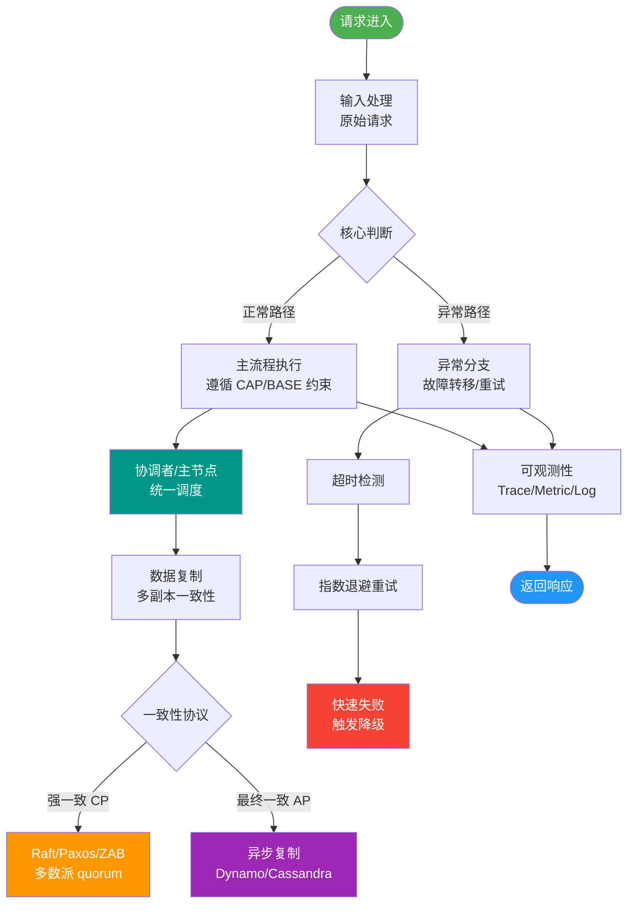

# 最大努力通知事务 VS 异步确保型事务

# 最大努力通知事务 VS 异步确保型事务

最大努力通知事务与异步确保型事务虽然都属于最终一致性方案，但在应用场景、交互机制及兜底策略上有显著区别。

### 核心概念与机制

**1. 异步确保型事务**
- **适用场景**：主要适用于内部微服务架构下的分布式事务（如同一个网络体系内的服务交付）。
- **交互模式**：基于消息队列（MQ），生产者将消息发送至 MQ，消费者**主动拉取**并消费消息。
- **核心逻辑**：重点在于保证消息的可靠投递。通常利用本地消息表或事务消息机制，确保“业务操作”与“消息发送”的原子性。只要消息成功到达 MQ，就认为业务流程完成，最终由消费者保证消费成功。

**2. 最大努力通知事务**
- **适用场景**：适用于跨平台、跨企业的系统对接（如支付回调、第三方API通知），即跨网络边界的业务交互。
- **交互模式**：通常由业务主动方**主动推送**（Push）通知给业务被动方。由于对方系统不可控，必须建立多档次时间的重试机制（如：1min, 5min, 10min, 30min, 1h, 24h），直到通知 N 次后停止。
- **兜底机制**：除了重试，必须引入**定期校验机制**（如对账系统）。主动方定期查询被动方数据状态，若发现不一致，进行报警、记日志或人工介入，必要时进行业务回滚或补单，确保数据最终一致性。

### 对比总结

| 维度 | 最大努力通知事务 | 异步确保型事务 |
| :--- | :--- | :--- |
| **参与者** | 跨平台、跨企业（外部系统） | 内部微服务（同网络体系） |
| **消息流向** | 主动方**推送**，强依赖重试策略 | 消费者**拉取**，利用 MQ 自身高可靠 |
| **数据兜底** | **必须**有定期校验/对账机制 | 依赖 MQ 的可靠性，通常无需额外数据校验 |
| **一致性保障** | 尽最大努力，允许短期不一致，最终人工介入兜底 | 保证消息不丢，消费者处理完成后即一致 |
| **消息媒介** | HTTP/RPC/MQ 皆可，常见 HTTP 回调 | 强依赖 MQ (Kafka/RocketMQ 等) |
| **实现复杂度** | 高（需实现指数退避重试+对账） | 中（依赖 MQ 中间件特性） |

### 架构示意图

```
+-------------------+          重试队列          +-------------------+
|  业务主动方        | ----(Push/通知)-------> |  业务被动方        |
| (Internal System) |   失败 -> 延时重试      | (External System) |
+-------------------+                        +-------------------+
        |   ^                                        |
        |   |                                        |
        |   +----------------------------------------+
        |              定期对账/查询状态
        v
+-------------------+
|  报警/人工介入     |
+-------------------+
```

### 实现细节
- **幂等性**：业务被动方必须提供幂等的服务接口，防止重复通知导致数据重复。
- **重试策略**：通常采用指数退避策略，避免对被动方系统造成压力（例如：前 5 次每分钟一次，之后每小时一次，共尝试 10 次）。

## 常见考点
1. **重试机制失效怎么办？**：必须强调定期对账（Job）作为最后一道防线，发现数据不一致时进行人工干预或自动补偿。
2. **如何保证消息不丢？**：虽然叫“最大努力”，但在发送端通常也要结合本地消息表记录发送状态，防止自身重启导致通知丢失。
3. **与异步确保型最大的区别？**：重点在于“外部对接”场景和“主动推送+定期校验”的组合。
4. **停止通知后怎么办？**：达到阈值停止通知后，应触发报警流程，转为人工处理。

### 实战案例
某支付网关在“双11”期间，因商户方服务器宕机导致 2 小时内支付回调全部失败。**解决方案**：最大努力通知机制按策略重试失败后，并未丢弃数据，而是转入“待对账队列”，次日凌晨 T+1 自动文件对账时发现未达账款项，自动触发了补单操作，完成了资金结算。

### 代码示例
```java
// Java: 最大努力通知 + 主动查询兜底
public void maxEffortNotify(PayResult result) {
    boolean success = httpNotify(result); // 尝试推送
    if (!success) {
        // 降级方案：主动查询对方接口以确认状态
        PayStatus remoteStatus = queryPayStatusFromThirdParty(result.getOrderNo());
        if (remoteStatus == PayStatus.SUCCESS) {
            updateLocalStatus(result.getOrderNo(), "CONFIRMED");
        } else {
            scheduleRetry(result); // 继续重试或转人工
        }
    }
}
```


## 核心流程图



## 记忆要点

- 场景对比：最大努力用于跨网络的外部对接，异步确保用于同体系的内部交互。
- 交互对比：最大努力是主动方推送加强依赖重试，异步确保是消费方主动拉取。
- 兜底对比：最大努力必须引入定期对账校验，异步确保只需依赖MQ自身高可靠。
- 一致性：最大努力尽人事允许短暂不一致，异步确保只要消息不丢即一致。

## 结构化回答


**30 秒电梯演讲：** 对陌生人写信尽力寄到（最大努力），对家人留言确认收到（异步确保）。

**展开框架：**
1. **最大努力通知适** — 最大努力通知适用于跨平台、跨企业
2. **最大努力通知** — 最大努力通知需要主动推送重试
3. **异步确保适** — 异步确保适用于内部系统

**收尾：** 这是我实战中的理解，您想深入哪一段？


## 视频脚本

> 预计时长：2 分钟 | 由浅入深

| 时间 | 画面/字幕 | 口播台词 | 讲解要点 |
|------|----------|----------|----------|
| 0:00 | 标题卡：最大努力通知事务 VS 异步确保型事务 | "最大努力通知事务 VS 异步确保型事务，一分钟讲透。" | 开场钩子 |
| 0:35 | 生活类比动画 | "打个比方——对陌生人写信尽力寄到(最大努力)，对家人留言确认收到(异步确保)。" | 核心类比 |
| 1:10 | 概念定义动画 | "一句话：区分适用于外部最大努力通知与内部异步确保的场景。" | 核心定义 |
| 1:50 | 最大努力通知适 图解 | "最大努力通知适用于跨平台、跨企业。" | 最大努力通知适 |
