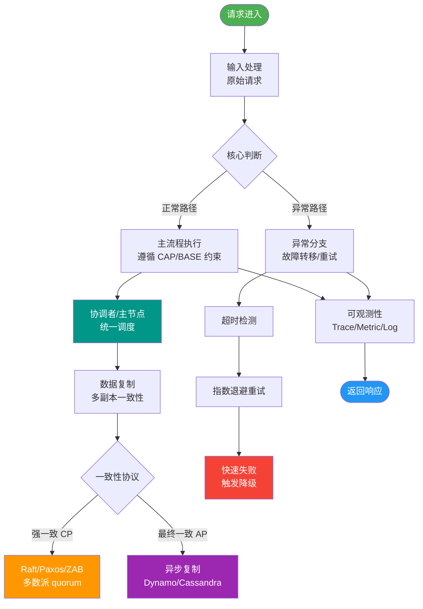

# 通知型事务的问题

通知型事务（基于消息队列的最终一致性方案）在实现过程中，面临着一个核心的理论难题：无法彻底解决本地事务执行与消息发送的原子性问题。

### 核心问题分析

本地事务（数据库操作）与消息发送（网络IO操作）是两个独立的动作。问题在于网络通信的不确定性（CAP中的P）：

1.  **发送失败**：数据库事务提交成功，但消息发送失败。结果是：数据已变更，但下游未收到通知，导致数据不一致。
2.  **发送超时**：数据库事务提交成功，消息发送超时。此时发送方无法确定消息是否真正到达了 MQ。
    -   如果发送方认为失败而回滚事务，但消息其实已发送，会导致下游收到消息但本地数据未变更（数据不一致）。
    -   如果发送方认为成功而提交事务，但消息其实未发送，会导致本地数据变更但下游未收到消息（数据不一致）。

**结论**：由于网络不确定性的存在，简单的“先发消息”或“先做事务”都无法保证严格的一致性。

### 解决方案
为了解决这个问题，业界演化出了两种主要的模式：

**1. 本地消息表**
-   **原理**：在同一个本地数据库中，同时写入业务数据和消息记录。利用本地数据库的事务特性，保证这两者的原子性。
-   **流程**：业务操作 + 写消息记录 -> 提交本地事务 -> 定时任务轮询消息记录发送消息 -> 成功后删除或标记消息。

**2. 事务消息（如 RocketMQ 半消息机制）**
-   **原理**：利用消息中间件的事务消息功能。发送方发送“半消息”给 MQ（此时下游不可见），执行本地事务，根据本地事务结果向 MQ 发送 Commit 或 Rollback 指令。
-   **异常处理**：如果 MQ 收不到 Commit/Rollback 指令（如网络断开），MQ 会主动回调发送方查询事务状态。

### 实战案例
曾遇过一个订单支付场景，开发直接在 DB 事务最后调用 MQ 发送消息。结果因 MQ 宕机导致发送线程阻塞超时，DB 事务回滚，但几秒后 MQ 恢复，消息竟被发出去了（异常捕获逻辑有误），导致用户扣了钱却未收到订单，最终只能通过对账脚本修复。

### 方案对比

| 特性 | 本地消息表 | 事务消息 |
| :--- | :--- | :--- |
| **实现复杂度** | 低（依赖 DB） | 高（依赖 MQ 特性） |
| **数据一致性** | 最终一致性 | 最终一致性 |
| **系统耦合度** | 高（业务库与消息表耦合） | 低（业务与 MQ 解耦） |
| **适用场景** | 无特定 MQ 支持，数据量不大 | 高并发，已有 RocketMQ 等中间件 |
| **额外存储** | 需占用业务 DB 存储 | 依赖 MQ 存储 |

### 代码示例（本地消息表核心逻辑）
```java
@Transactional
public void orderPay(PayRequest req) {
    // 1. 执行业务逻辑
    orderDAO.updateStatus(req.getOrderId(), "PAID");
    // 2. 同一事务写入本地消息表
    localMessageDAO.insert(new LocalMessage(req.getOrderId(), "TOPIC_PAY", JSON.toJSONString(req)));
}
// 定时任务扫描发送
public void sendPendingMessages() {
    List<LocalMessage> msgs = localMessageDAO.queryPending();
    msgs.forEach(msg -> {
        try {
            mqProducer.send(msg.getTopic(), msg.getBody());
            localMessageDAO.delete(msg.getId()); // 发送成功删除
        } catch (Exception e) {
            // 记录日志，等待下次重试
        }
    });
}
```

### 流程对比图

```
┌───────────────┐      Commit/Rollback      ┌───────────────┐
│   业务系统     | -----------------------> │   消息队列     │
│ (本地事务+消息) |                           │ (半消息/状态)  │
└───────┬───────┘                           └───────┬───────┘
        │                                           │
        | 1. 发送 Half Message                        |
        |-------------------------------------------> │
        |                                           │
        | 2. 执行本地事务                             │
        | (DB Update + 记录状态)                      │
        |                                           │
        | 3. 消费结果                                 │
        |                                           v
        |                                   ┌───────────────┐
        └----------------------------------- │   下游消费     │
                                            └───────────────┘
```

### 常见考点
1. **为什么本地事务和消息发送不能直接放在一个事务里？**：因为数据库事务和消息队列是两个不同的资源，无法进行两阶段提交（2PC）跨资源，且网络IO会破坏事务的ACID特性。
2. **本地消息表的缺点？**：需要额外的存储空间，且需要开发定时任务扫描，耦合了业务系统与消息逻辑。
3. **RocketMQ 事务消息如何解决消息回查？**：发送方需提供反查接口，MQ 在未收到确认时会主动调用该接口查询本地事务状态。
4. **如果下游消费失败怎么办？**：这属于消费端的问题，需要由下游通过重试、死信队列或人工处理来保证最终一致性，与发送一致性问题不同。


## 核心流程图



## 记忆要点

- 核心难题：网络不确定性导致本地DB事务与消息发送无法保证绝对原子性。
- 发送超时：业务提交后若MQ响应超时，不论发不发消息都会导致状态不一致。
- 本地表解法：业务与消息同库提交保原子性，定时任务轮询发送保证最终一致。
- 事务消息解法：MQ半消息加回查机制，避免本地事务与网络IO的直接耦合。

## 结构化回答


**30 秒电梯演讲：** 一边打电话一边记事，电话挂了记事可能没完成。

**展开框架：**
1. **消息发送存在** — 消息发送存在网络超时不确定性
2. **业务提交成功** — 业务提交成功但消息发送失败会丢数据
3. **业务回滚但消息发送成功** — 业务回滚但消息发送成功会导致脏数据

**收尾：** 这是我实战中的理解，您想深入哪一段？


## 视频脚本

> 预计时长：2 分钟 | 由浅入深

| 时间 | 画面/字幕 | 口播台词 | 讲解要点 |
|------|----------|----------|----------|
| 0:00 | 标题卡：通知型事务的问题 | "通知型事务的问题，一分钟讲透。" | 开场钩子 |
| 0:35 | 生活类比动画 | "打个比方——一边打电话一边记事，电话挂了记事可能没完成。" | 核心类比 |
| 1:10 | 概念定义动画 | "一句话：普通消息无法解决本地事务与消息发送的原子性。" | 核心定义 |
| 1:50 | 消息发送存在网络超时 图解 | "消息发送存在网络超时不确定性。" | 消息发送存在网络超时 |
