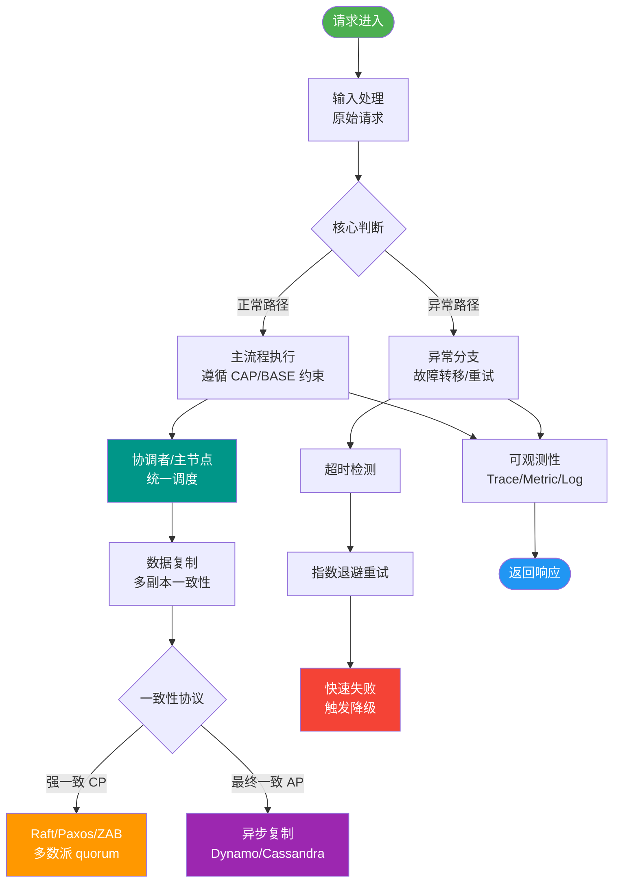
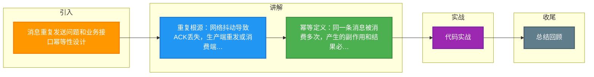

# 消息重复发送问题和业务接口幂等性设计

### 消息重复发送的根源
在分布式系统中，消息重复发送是无法完全避免的现象，主要原因包括：
1.  **生产者重复发送**：生产者发送消息后，由于网络抖动未收到 MQ 的确认（ACK），导致生产者重试。
2.  **MQ 存储重复**：MQ 主备同步时，消息在主节点已写入，但 ACK 丢失，导致生产者重发，备节点可能收到重复消息（视 MQ 实现而定）。
3.  **消费者重复消费**：消费者处理成功但断连，MQ 未收到 Commit/ACK，认为消费失败，再次投递。

### 业务接口幂等性设计核心
幂等性是指：**无论一个操作被执行一次还是多次，其产生的副作用和结果是一致的。** 在 MQ 消费场景下，意味着同一条消息被消费多次，业务数据不会被重复处理。

### 常见幂等设计方案

#### 1. 数据库唯一索引
-   **原理**：为业务表中的关键业务字段（如订单号）建立唯一索引，或者建立独立的去重表。
-   **流程**：消费者处理消息时，尝试插入数据。如果消息 ID 或订单号已存在，数据库会抛出唯一键冲突异常，捕获该异常并直接返回成功。
-   **优点**：实现简单，依赖数据库 ACID 特性，可靠性高。
-   **缺点**：依赖数据库存储，高并发下可能有性能瓶颈。

#### 2. Redis 原子性操作
-   **原理**：利用 Redis 的 `setnx`（Set if Not eXists）命令。
-   **流程**：
    1.  消息到达，以 `biz_id` 为 Key 向 Redis 写入值（过期时间可设为消息处理超时时间）。
    2.  如果返回成功（Key 不存在），说明第一次处理，执行业务逻辑。
    3.  如果返回失败（Key 已存在），说明是重复请求，直接跳过。
-   **进阶**：使用 `SET key value NX EX 30` 原子命令。

#### 3. 状态机判断
-   **原理**：业务单据有明确的状态流转（如：待支付 -> 已支付）。
-   **流程**：处理消息前先查询当前状态。只有当前状态为“待支付”时，才执行更新为“已支付”的操作；如果已经是“已支付”，则拒绝处理。

#### 4. 令牌机制
-   **原理**：类似于 Redis 方案，通常用于请求接口的幂等。

### 方案对比

| 方案 | 适用场景 | 优点 | 缺点 | 实战建议 |
| :--- | :--- | :--- | :--- | :--- |
| **数据库唯一索引** | 普通并发，强一致性依赖 | 实现最稳健，无额外组件维护 | 高并发时数据库IO压力大 | **首选方案**，配合独立去重表效果更佳 |
| **Redis 原子操作** | 高并发抢购、限流 | 性能极高，减轻数据库压力 | 存在数据丢失风险（若Redis挂），需设置合理过期时间 | 适合做前置快速过滤，需配合DB兜底 |
| **状态机判断** | 订单、工单等有状态流转 | 符合业务语义，逻辑清晰 | 无法防止重复新增操作（需配合唯一索引） | 必须配合乐观锁（`UPDATE ... WHERE status=old`）使用 |

### 实战案例
在电商“秒杀”场景中，曾有服务仅依赖 Redis 去重，结果 Redis 节点发生故障重启，Key 丢失，导致重启瞬间大量重复消息“穿透”到数据库，造成库存超卖。**改进方案**：采用“Redis 预检 + 数据库唯一索引”的双重防护机制，Redis 过滤 99% 的重复流量，数据库兜底保证数据绝对正确。

### 代码示例
```java
// Java: 通用幂等处理模板
public void processMessage(String messageId, Order order) {
    // 1. Redis 原子性去重 (Key不存在则设置成功，过期30分钟)
    boolean isLocked = redisTemplate.opsForValue().setIfAbsent(
        "idempotency:" + messageId, "1", 30, TimeUnit.MINUTES
    );
    if (!isLocked) {
        log.info("重复消息，直接忽略: {}", messageId);
        return; // 直接返回成功，避免重复消费
    }

    try {
        // 2. 执行业务逻辑 (如插入订单)
        // 建议：DB层依然利用唯一索引作为最后一道防线
        orderMapper.insert(order);
    } catch (DuplicateKeyException e) {
        // 3. 极端情况：Redis失效，DB唯一索引拦截
        log.warn("DB层拦截重复数据: {}", e.getMessage());
    }
}
```

### 架构图

```
      MQ 投递             重复投递
+----------------+  (ACK超时)  +----------------+
|    消费者      | <---------- |     MQ         |
+-------+--------+             +----------------+
        |
        | 1. 获取消息 ID (biz_id)
        v
+-------+--------+
|  幂等性检查器   | <---(DB查询/Redis.Get)----
+-------+--------+
        |
        +---> 存在? ---> Yes ---> 丢弃/返回成功
        |
        No
        |
        v
+-------+--------+
|  执行业务逻辑   |
+-------+--------+
        |
        v
+-------+--------+
|  标记已处理     | ---> (插入去重表/Redis.Set/更新状态)
+----------------+
```

## 常见考点
1.  **Redis 实现幂等的原子性问题？**：必须使用 `SET NX EX` 单条命令，不能分两步（先查后 set），否则并发下不安全。
2.  **分布式锁和幂等的关系？**：分布式锁是实现幂等的一种手段，防止并发请求同时通过“不存在”的检查。
3.  **下游服务挂了，消息还在重试，下游恢复了会不会重复？**：如果下游消费逻辑不是幂等的，就会重复处理。所以幂等是必须要做的，不能假设网络绝对可靠。
4.  **MQ 如何保证消息不丢失，又保证不重复？**：鱼与熊掌不可兼得。通常优先保证“不丢失”，这必然带来“重复”的风险，因此必须在消费端做幂等。


## 核心流程图



## 记忆要点

- 重复根源：网络抖动导致ACK丢失，生产端重发或消费端重复消费是常态。
- 幂等定义：同一条消息被消费多次，产生的副作用和结果必须完全一致。
- DB唯一索引：强一致首选，通过唯一键冲突拦截重复，最稳健但高并发有瓶颈。
- Redis原子：高并发首选，用setnx快速过滤，但需防缓存宕机需DB兜底。
- 防超卖实战：Redis前置过滤拦击高频重复，DB唯一索引兜底确保数据绝对正确。

## 结构化回答


**30 秒电梯演讲：** 不论收到多少张相同的汇款单，只按金额存一次。

**展开框架：**
1. **ACK** — 网络抖动或ACK丢失导致消息重复
2. **ID** — 消费端需唯一标识（如业务ID）
3. **执行前先检查是否已处理** — 执行前先检查是否已处理过

**收尾：** 这是我实战中的理解，您想深入哪一段？


## 视频脚本

> 预计时长：2 分钟 | 由浅入深

| 时间 | 画面/字幕 | 口播台词 | 讲解要点 |
|------|----------|----------|----------|
| 0:00 | 标题卡：消息重复发送问题和业务接口幂等性设计 | "消息重复发送问题和业务接口幂等性设计，一分钟讲透。" | 开场钩子 |
| 0:35 | 生活类比动画 | "打个比方——不论收到多少张相同的汇款单，只按金额存一次。" | 核心类比 |
| 1:10 | 概念定义动画 | "一句话：重复消息不可避免，业务接口需具备幂等性。" | 核心定义 |
| 1:50 | 网络抖动或ACK丢失 图解 | "网络抖动或ACK丢失导致消息重复。" | 网络抖动或ACK丢失 |

### 视频流程图



