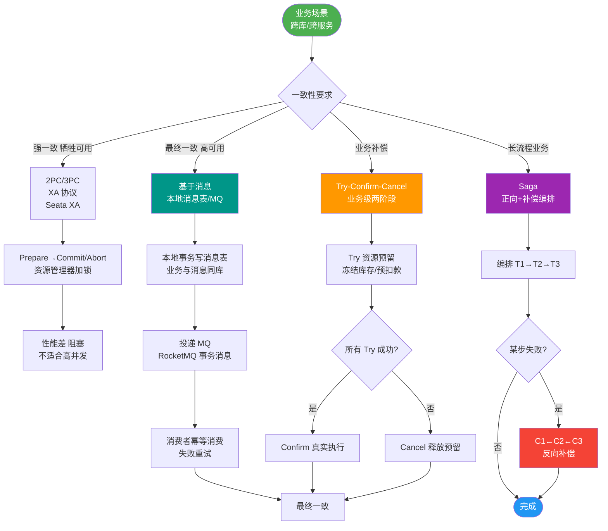

# TCC事务模型的要求

TCC 事务模型对业务逻辑有以下核心要求：

1. **可查询操作**
   - 每个服务操作需具备全局唯一标识和确定的时间，便于追踪状态。

2. **幂等性**
   - 重复调用多次产生的结果与调用一次相同。
   - 实现方式：业务逻辑去重、缓存请求与处理结果、检测重复请求自动返回旧结果。

3. **TCC 操作定义**
   - **Try**：完成业务检查，预留资源（实现一致性），实现准隔离性。
   - **Confirm**：执行业务，不做检查，仅使用 Try 预留的资源，必须幂等。
   - **Cancel**：释放 Try 预留的资源，必须幂等。
   - **与 2PC 区别**：TCC 位于业务层（非资源层），Try 阶段兼备操作与准备能力，锁定粒度更灵活，但开发成本更高。

4. **可补偿操作**
   - **Do（正向操作）**：执行业务，结果对外可见。
   - **Compensate（补偿操作）**：抵消正向操作结果，必须幂等。
   - 约束：补偿在业务上可行，且风险成本可控。TCC 的 Confirm 和 Cancel 即属于补偿操作。

---

### 深化补充

**实战案例**：
在积分兑换场景中，由于网络超时，Try 阶段成功但未收到响应，触发了 Cancel 执行。随后 Try 的延迟响应到达并再次执行，导致积分被重复冻结。解决方案是在 Cancel 执行成功后，插入一个“已回滚”标记，Try 执行前需检查该标记以防止“悬挂”事务。

**代码示例**：
```java
// Cancel 阶段：处理空回滚与幂等 (Java)
@Transactional
public boolean cancelFreeze(String userId, BigDecimal amount, String transId) {
    // 1. 检查是否存在 Try 记录 (处理空回滚: Try未执行但Cancel先到)
    TransactionLog log = transactionLogDao.get(transId);
    if (log == null) {
        // 记录 Cancel 日志，标记为已回滚，防止后续 Try 成功导致悬挂
        transactionLogDao.insertLog(transId, "CANCELED_NO_TRY");
        return true; 
    }
    
    // 2. 幂等检查：如果已经是 CANCELED 状态，直接返回
    if ("CANCELED".equals(log.getStatus())) {
        return true;
    }
    
    // 3. 执行业务解冻
    accountDao.unfreezeBalance(userId, amount);
    transactionLogDao.updateStatus(transId, "CANCELED");
    return true;
}
```


## 核心流程图



## 记忆要点

- 核心要求：TCC业务必须满足操作可查询、接口幂等性、以及可补偿性。
- Try要求：完成业务检查并预留资源，具备准隔离性，但绝不能持有长锁。
- Confirm与Cancel：分别执行正向真业务与反向资源释放，二者必须绝对幂等。
- 防悬挂空回滚：Try需检查是否已防悬挂，Cancel需检查是否需防空回滚。

## 结构化回答


**30 秒电梯演讲：** 像订票流程：选座预留、确认出票、退票退款，每一步都要能安全重试。

**展开框架：**
1. **必须支持幂等性防** — 必须支持幂等性防止重复操作
2. **Try阶段预留资** — Try阶段预留资源保证隔离性
3. **Confirm和** — Cancel属于补偿操作

**收尾：** 这是我实战中的理解，您想深入哪一段？


## 视频脚本

> 预计时长：2 分钟 | 由浅入深

| 时间 | 画面/字幕 | 口播台词 | 讲解要点 |
|------|----------|----------|----------|
| 0:00 | 标题卡：TCC事务模型的要求 | "TCC事务模型的要求，一分钟讲透。" | 开场钩子 |
| 0:35 | 生活类比动画 | "打个比方——像订票流程：选座预留、确认出票、退票退款，每一步都要能安全重试。" | 核心类比 |
| 1:10 | 概念定义动画 | "一句话：要求业务逻辑支持预留、确认、取消，且必须可查询、幂等、可补偿。" | 核心定义 |
| 1:50 | 必须 图解 | "必须支持幂等性防止重复操作。" | 必须 |
