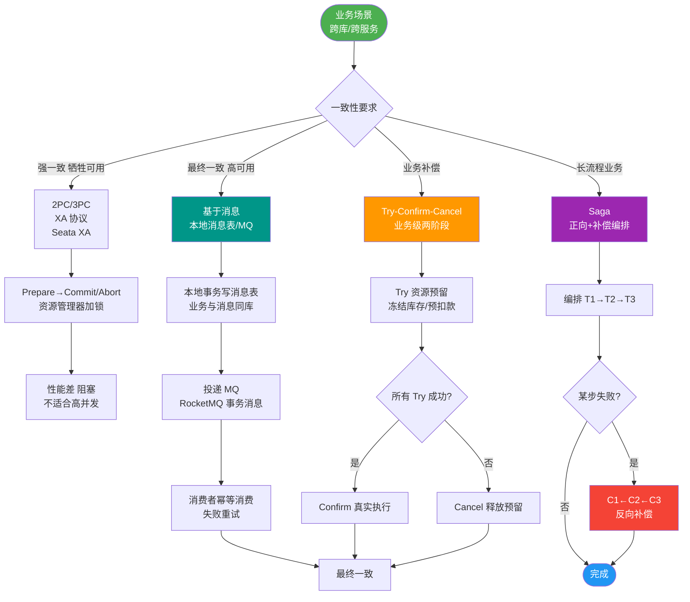
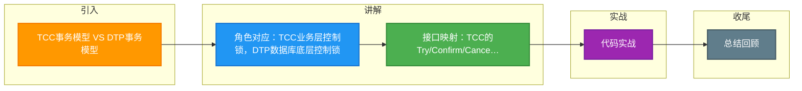

# TCC事务模型 VS DTP事务模型

TCC 模型与 DTP 模型对比如下：

**1. 角色对应关系**
- **TCC 主业务服务（事务发起者）** ≈ **DTP AP (Application)**：负责发起全局事务，组装业务流程。
- **TCC 从业务服务（参与者）** ≈ **DTP RM (Resource Manager)**：负责管理具体资源（如库存、账户）。
- **TCC 事务协调器** ≈ **DTP TM (Transaction Manager)**：负责驱动 Try/Confirm/Cancel 的调用方向。
- **区别**：DTP 的 RM 通常是 MySQL、Oracle 等数据库，由数据库底层控制锁；而 TCC 的 RM 是其他业务服务，由业务代码控制锁（或数据库行锁）。

**2. 接口对应关系**
- **Try/Confirm/Cancel** ≈ **Prepare/Commit/Rollback**。
- DTP 遵循 XA 协议，由数据库驱动提供标准接口，开发者无感知；
- TCC 由业务服务自定义业务逻辑接口，开发者需显式编写三个方法的代码。

**3. 核心差异**
- **一致性级别**：
  - DTP 是强一致性（ACID），遵循 XA 规范。
  - TCC 是最终一致性（BASE），属于柔性事务。
- **锁机制与性能**：
  - DTP 依赖数据库锁，Prepare 阶段到 Commit 阶段期间长时间持有锁，阻塞其他事务，性能较差。
  - TCC 的锁由业务逻辑控制（如 UPDATE ... WHERE stock > 0），不依赖数据库全局锁，仅在 Try 阶段短暂持有，性能较高。

## 常见考点
1. **阻塞性风险**：XA/DTP 在两阶段之间如果 TM 挂掉，RM 一直阻塞锁资源，TCC 如何规避这个问题（通过业务层的超时释放）？
2. **适用场景**：什么情况下选 XA（强一致要求高、并发低），什么情况下选 TCC（高并发、业务逻辑复杂）？
3. **资源管理器范围**：TCC 中的 RM 可以是非数据库资源（如Redis、ES、第三方API接口），而 DTP 的 RM 通常仅限关系型数据库。

---

### 深化补充

**对比表格**：

| 特性 | TCC 模型 | DTP/XA 模型 |
| :--- | :--- | :--- |
| **一致性** | 最终一致 (BASE) | 强一致 (ACID) |
| **实现位置** | 业务层 (应用代码) | 资源层 (数据库驱动) |
| **锁机制** | 业务逻辑控制 (如乐观锁) | 数据库行锁/表锁 (全局锁) |
| **锁持有时长** | 短 (Try 阶段结束释放连接) | 长 (从 Prepare 到 Commit 全程持有) |
| **并发性能** | 高 (不阻塞读，锁粒度灵活) | 低 (长时间加锁，锁竞争严重) |
| **资源范围** | 支持非 DB 资源 (Redis, HTTP, MQ) | 仅支持支持 XA 协议的 DB (MySQL, Oracle) |
| **开发成本** | 高 (需写 Try/Confirm/Cancel 三个方法) | 低 (配置即可，代码无侵入) |

**实战案例**：
在某供应链金融系统中，对接银行核心系统（不支持 XA）放款。TCC 模型作为 RM，将银行接口的“预占额度”视为 Try，“正式放款”视为 Confirm，“取消额度”视为 Cancel。这种跨异构系统的场景是 DTP 模型无法覆盖的，必须使用 TCC 或 Saga。

## 核心流程图

## 记忆要点

- 角色对应：TCC业务层控制锁，DTP数据库底层控制锁
- 接口映射：TCC的Try/Confirm/Cancel等价于DTP的Prepare/Commit/Rollback
- 一致性：DTP强一致(ACID)长锁低性能，TCC最终一致(BASE)短锁高性能
- 资源范围：TCC兼容非DB资源(如Redis/MQ)，DTP仅限支持XA协议的DB

## 结构化回答

**30 秒电梯演讲：** TCC将DTP的数据库资源管理器转化为业务服务管理器，接口业务化。打比方——DTP是银行柜员按标准流程办业务，TCC是多个部门经理协商配合办业务。落到工程上，主业务服务对应AP，从业务服务对应RM。

**展开框架：**
1. **主业务服务** — 主业务服务对应AP，从业务服务对应RM
2. **Try/** — Try/Confirm/Cancel对应Prepare/Commit/Rollback
3. **TCC资源提供者** — TCC资源提供者是业务服务而非数据库

**收尾：** 以上三点都能配合实战聊。我可以展开任一要点，您想先深入哪一块？

## 视频脚本

> 预计时长：3 分钟 | 由浅入深

| 时间 | 画面/字幕 | 口播台词 | 讲解要点 |
|------|----------|----------|----------|
| 0:00 | 标题卡：TCC事务模型 VS DTP事务模型 | "TCC事务模型 VS DTP事务模型，这题我会分三步讲。" | 开场钩子 |
| 0:41 | 概念定义动画 | "一句话：TCC将DTP的数据库资源管理器转化为业务服务管理器，接口业务化。" | 核心定义 |
| 1:22 | 生活类比动画 | "打个比方——DTP是银行柜员按标准流程办业务，TCC是多个部门经理协商配合办业务。" | 核心类比 |
| 2:03 | 主业务服务 图解 | "主业务服务对应AP，从业务服务对应RM。" | 主业务服务 |
| 2:50 | Try/ 图解 | "Try/Confirm/Cancel对应Prepare/Commit/Rollback。" | Try/ |

### 视频流程图

