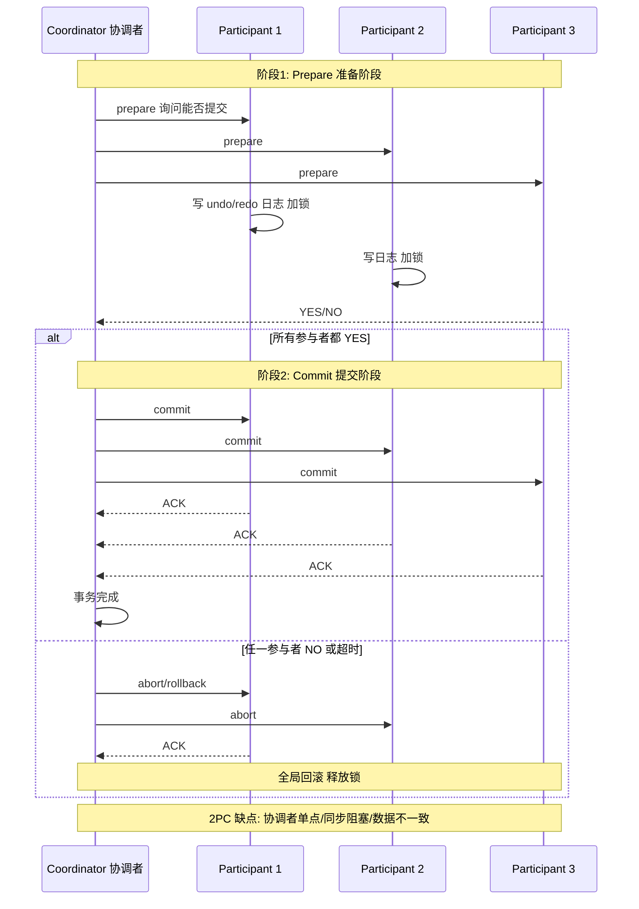

# TCC与2PC对比

TCC 与 2PC（两阶段提交）的对比：

**1. 阶段逻辑**
- **阶段 1**：
  - **2PC (XA)**：执行 Prepare 指令。RM 执行本地事务，写入 Redo/Undo 日志，**锁定资源**，但不提交，等待 TM 指令。
  - **TCC**：执行 Try 逻辑。进行业务校验，**预留资源**（如冻结资金），但不完成核心业务，预留成功即返回。
- **阶段 2**：
  - **2PC (XA)**：TM 根据所有 RM 的 Prepare 结果，下发 Commit 或 Rollback。RM 释放锁并完成提交或回滚。
  - **TCC**：根据 Try 结果，调用 Confirm（使用预留资源完成业务）或 Cancel（释放预留资源）。

**2. 核心区别**
- **实现层面与锁机制**：
  - **2PC (XA)**：位于**资源层**（数据库驱动/DML）。依赖数据库协议实现的强一致性。**全过程持有数据库行锁/表锁**，直到 Commit/Rollback，并发性能极差。
  - **TCC**：位于**业务层**（应用代码）。属于最终一致性。锁由业务逻辑控制（如乐观锁、悲观锁），Try 阶段结束后即可释放数据库连接，**不长期持有 DB 锁**，并发性能好。
- **开发与侵入成本**：
  - **2PC (XA)**：对业务代码**无侵入**，配置数据源即可，依赖数据库对 XA 协议的支持（且不支持跨 DB 种类如 MySQL 到 Oracle 的某些复杂场景）。
  - **TCC**：侵入性极大，需为每个业务拆解 Try/Confirm/Cancel 三个方法，代码量倍增，且需处理空回滚、悬挂等边缘情况，维护成本高。

**锁持有时间对比图**：
```text
时间轴 ────────────────────────────────────────────>

2PC (XA) 模型:
[Prepare] ──────(长时间持有DB锁)─────> [Commit]
(阻塞其他事务读写)

TCC 模型:
[Try] ─(预留资源，释放DB连接)─> [网络传输] ─> [Confirm]
(DB锁仅在Try执行期间极短存在)
```

## 常见考点
1. **性能瓶颈**：为什么说 XA 协议不适合高并发互联网场景？（锁竞争严重，连接池长时间占用）
2. **可用性**：2PC 在 TM 或 RM 宕机时存在单点故障导致全局阻塞的风险，TCC 如何通过本地事务表提升可用性？
3. **业务改造成本**：能否列举一个 TCC 改造困难的场景？（如复杂的非幂等查询业务、难以逆向补偿的业务）。

---

### 深化补充

**对比表格**：

| 维度 | 2PC (XA) | TCC |
| :--- | :--- | :--- |
| **协议层** | 数据库层协议 (标准 XA) | 应用层自定义协议 (RPC 接口) |
| **第一阶段** | Prepare (写入 Redo/Undo 锁资源) | Try (检查并预留资源) |
| **资源锁定** | 全局锁，阻塞所有读写 | 应用层锁/行锁，短暂锁定 |
| **第二阶段** | Commit/Rollback (释放锁) | Confirm/Cancel (使用/释放预留) |
| **性能开销** | 极高 (锁竞争严重，DB 连接占用久) | 较高 (2-3 次网络交互 + DB 交互) |
| **适用资源** | 仅数据库 | 任何资源 (DB, 缓存, 接口) |
| **代码侵入** | 无 | 强侵入 (需实现三个阶段逻辑) |

**实战案例**：
旧系统升级时，曾尝试将高并发的秒杀扣库存接口从 2PC 迁移至 TCC。虽然解决了连接池耗尽问题，但发现 TCC 的 Try 阶段并发竞争非常激烈（大量 UPDATE 冲突）。最终优化方案是将 Try 阶段的逻辑改为 Redis Lua 脚本预扣，Confirm 异步落库，利用非阻塞资源提升了吞吐量。


## 核心流程图



## 记忆要点

- 锁层级：2PC在资源层长锁阻塞，TCC在业务层短暂锁高并发
- 两阶段：2PC是Prepare锁资源/Commit释放，TCC是Try预留资源/Confirm确认
- 开发成本：2PC无侵入靠配置，TCC强侵入需手写三接口
- 适用场景：2PC适合强一致低并发，TCC适合高并发复杂业务

## 结构化回答


**30 秒电梯演讲：** 2PC像强管制统一排队，TCC像凭票入场，中间过程不堵路。

**展开框架：**
1. **PC** — 2PC在资源层强一致，TCC在业务层最终一致
2. **PC** — 2PC全程锁资源，TCC仅预留资源
3. **TCC** — TCC开发侵入性高，需实现三个接口

**收尾：** 这是我实战中的理解，您想深入哪一段？


## 视频脚本

> 预计时长：3 分钟 | 由浅入深

| 时间 | 画面/字幕 | 口播台词 | 讲解要点 |
|------|----------|----------|----------|
| 0:00 | 标题卡：TCC与2PC对比 | "TCC与2PC对比，这题我会分三步讲。" | 开场钩子 |
| 0:41 | 概念定义动画 | "一句话：TCC是业务层的2PC，用应用逻辑换取了性能和灵活性。" | 核心定义 |
| 1:22 | 生活类比动画 | "打个比方——2PC像强管制统一排队，TCC像凭票入场，中间过程不堵路。" | 核心类比 |
| 2:03 | 2PC在资源层强一致 图解 | "2PC在资源层强一致，TCC在业务层最终一致。" | 2PC在资源层强一致 |
| 2:50 | 2PC全程锁资源 图解 | "2PC全程锁资源，TCC仅预留资源。" | 2PC全程锁资源 |
