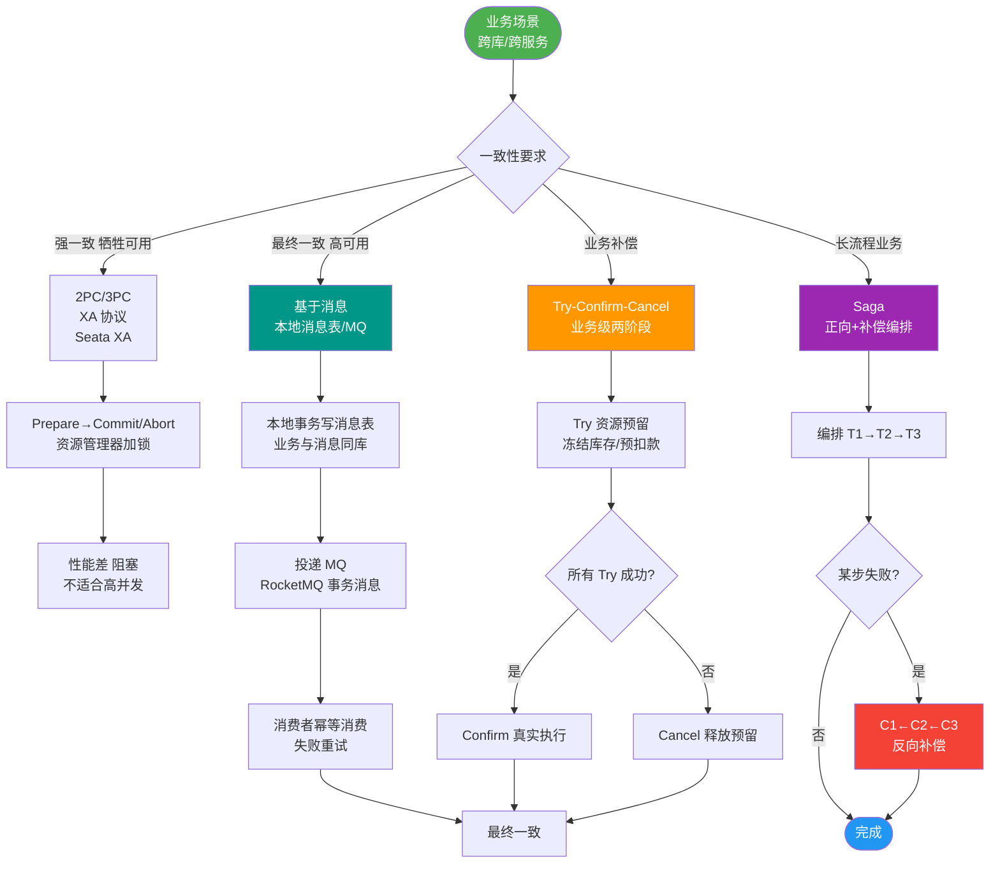

# TCC 的使用场景

TCC 的使用场景分析：

**1. 隔离性与锁机制**
- Try、Confirm、Cancel 各自开启本地事务保证 ACID。
- 由于是独立的本地事务，执行完即提交，**不会对资源长期加锁**，避免了长事务阻塞。
- **关键细节**：
  - **Try 阶段**：主要是资源检查和预留，必须遵循“**预留所有资源**”原则。例如，账户余额冻结而不是直接扣减，库存锁定而不是直接扣减。
  - **锁机制**：TCC 本身不依赖数据库层面的行锁贯穿全过程，而是通过应用层的“预留”状态来实现隔离。但需防止并发下的“超扣”问题（如 A、B 同时 Try 同一资源），通常需要在数据库层利用唯一索引或乐观锁控制并发。
  - **空回滚**：当 Try 阶段未执行（网络丢包），但触发了 Cancel 时，Cancel 必须识别出 Try 未做操作并能正确返回成功，这要求业务设计支持幂等性和空回滚判定（如记录事务日志或检查资源状态）。

**2. 补偿性事务**
- Confirm/Cancel 是独立的 ACID 本地事务，用于补偿之前的影响。
- 相比于巨大的分布式 ACID 事务，将长事务拆解为多个短本地事务并立即提交，可用性更高。
- **边界条件**：
  - **幂等性**：由于网络重试，Confirm/Cancel 可能被重复调用，业务层必须保证重复调用结果与单次调用一致。
  - **悬挂**：当 Cancel 比 Try 先执行时，需要拒绝悬挂的 Cancel 请求，防止 Try 执行后资源无法被释放（通常通过在 Cancel 中检查 Try 是否已执行来处理）。

**3. 适用场景**
- **适合**：对性能要求高、业务逻辑复杂、且能接受最终一致性的场景（如支付、金融核心链路）。
- **不适合**：业务简单、对数据一致性要求极高且无法接受补偿逻辑的场景。

**局限性**：
- 业务侵入性极强，每个参与方都需要实现三个接口，代码逻辑复杂，维护困难。

## 常见考点
1. **TCC 的空回滚和悬挂是如何产生的，如何解决？**
2. **TCC 与 Saga 模式的核心区别是什么？**（TCC 是先预留资源，Saga 是直接提交资源再补偿）
3. **TCC 如何解决并发问题？**（资源层锁控制与业务层幂等）

---

### 深化补充

**实战案例**：
在跨境汇款业务中，Try 阶段锁定了用户资金，但 Confirm 阶段调用境外银行接口时发生未知错误。由于无法确定境外端是否成功（网络超时），进入中间状态。此时需要接入人工对账平台或引入定时任务扫描“预扣款”状态的资金进行二次确认或自动回滚，避免资金长期挂起。

**代码示例**：
```java
// 处理悬挂事务的 Try 逻辑 (Java)
@Transactional
public boolean tryFreezeWithHangCheck(String userId, BigDecimal amount, String transId) {
    // 1. 检查是否发生过 Cancel (防止悬挂：Cancel 先执行，后 Try 执行)
    TransactionLog cancelLog = transactionLogDao.getLogByStatus(transId, "CANCELED_NO_TRY");
    if (cancelLog != null) {
        // 如果之前 Cancel 已执行，本次 Try 应该拒绝执行，否则资源会被永久冻结
        throw new BusinessException("Transaction already canceled, cannot try");
    }
    
    // 2. 正常 Try 逻辑
    // ...
}
```


## 核心流程图



## 记忆要点

- 核心场景：资金链路等高并发且能接受最终一致性的核心业务
- 隔离机制：不依赖DB全程锁，靠应用层资源预留(如冻结)和短事务提交
- 防悬挂：Cancel先到需拒Try，防资源被永久冻结无法释放
- 防空回滚：Try未执行却触发Cancel，需查日志识别并直接返回成功
- 强幂等：网络重试要求Confirm和Cancel接口必须保证幂等性

## 结构化回答


**30 秒电梯演讲：** 像双十一秒杀：先把名额锁住（Try），慢慢扣款（Confirm），不要让所有人排队等。

**展开框架：**
1. **将长事务拆分** — 将长事务拆分为短本地事务
2. **不长期持** — 不长期持有锁，并发性能高
3. **严重依赖补偿逻辑** — 严重依赖补偿逻辑，业务侵入性强

**收尾：** 这是我实战中的理解，您想深入哪一段？


## 视频脚本

> 预计时长：2 分钟 | 由浅入深

| 时间 | 画面/字幕 | 口播台词 | 讲解要点 |
|------|----------|----------|----------|
| 0:00 | 标题卡：TCC 的使用场景 | "TCC 的使用场景，一分钟讲透。" | 开场钩子 |
| 0:35 | 生活类比动画 | "打个比方——像双十一秒杀：先把名额锁住(Try)，慢慢扣款(Confirm)，不要让所有人排队等。" | 核心类比 |
| 1:10 | 概念定义动画 | "一句话：适用于高性能、高并发但对一致性要求不是强实时的核心业务。" | 核心定义 |
| 1:50 | 长事务拆分为短本 图解 | "将长事务拆分为短本地事务。" | 长事务拆分为短本 |
