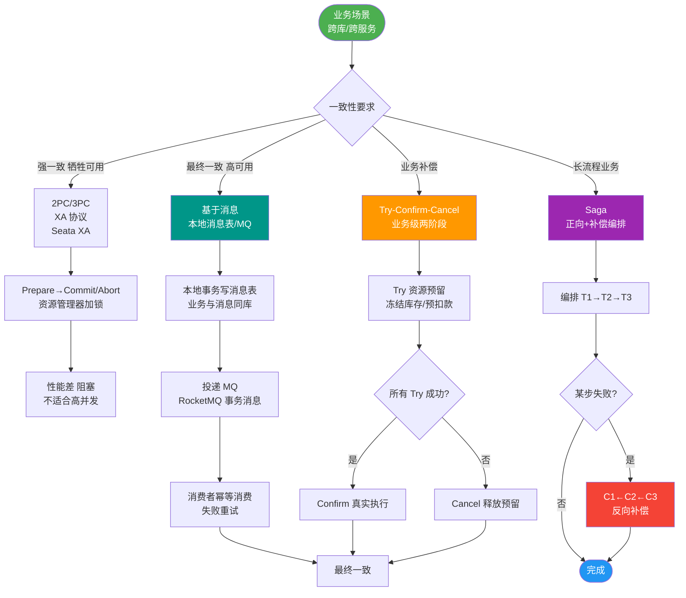

# Saga相关概念

Saga 是一种长事务模型，旨在解决 Long Lived Transaction（长活事务）问题。

**1. 核心概念**
- 将一个分布式事务拆分为多个本地事务。
- 每个本地事务都有对应的执行动作和补偿动作。
- 若某一步失败，按顺序执行前面所有步骤的补偿动作，回滚状态。

**2. 组成部分**
- **LLT (Long Live Transaction)**：由一连串本地事务组成（T1+T2+...+Tn）。
- **补偿 (Compensation)**：每个 Ti 对应一个补偿 Ci。

**3. 恢复策略**
- **向后恢复**：任意子事务失败，补偿所有已完成的子事务（T1, T2, T3,失败 -> C3, C2, C1）。
- **向前恢复**：重试失败的事务，适用于必须成功的场景（不提供补偿，直接重试 Ti）。

**4. 特性**
- 牺牲了一定的隔离性和一致性，换取了长事务的高可用性。

**5. 实现方式**
- **编排式**：由一个中央协调器负责指挥各个参与方，逻辑集中，但协调器是单点瓶颈。
- **协同式**：各参与方通过事件交换消息，无中心节点，架构松耦合但流程难以追踪（容易产生循环依赖）。

```text
      正常流程 (T1->T2->T3)             异常回滚流程 (T1->T2 Fail)
    ┌─────────────────────┐           ┌───────────────────────┐
    │                     │           │                       │
    │  ┌───┐    ┌───┐    ┌───┐        │  ┌───┐    ┌───┐       │
    │  │T1 │───>│T2 │───>│T3 │        │  │T1 │───>│T2 │───X   │
    │  └───┘    └───┘    └───┘        │  └───┘    └───┘       │
    │  Success  Success  Success      │  Success  Fail        │
    │                     │           │         │             │
    │                     │           │         ▼             │
    │                     │           │      ┌─────────┐      │
    │                     │           │      │   C2    │      │
    │                     │           │      │(Undo T2)│      │
    │                     │           │      └─────────┘      │
    │                     │           │         │             │
    │                     │           │         ▼             │
    │                     │           │      ┌─────────┐      │
    │                     │           │      │   C1    │      │
    │                     │           │      │(Undo T1)│      │
    │                     │           │      └─────────┘      │
    └─────────────────────┘           └───────────────────────┘
```

**实战案例**：在电商“下单+扣库存+发积分”场景中，若用户支付成功但积分服务宕机导致增加积分失败，编排器会触发“退款”补偿。曾遇到因补偿逻辑未做幂等控制，导致积分服务恢复后重复执行退款，造成用户余额异常。

**代码示例（Java - 编排式状态定义）**：
```java
@SagaOrchestrationStart
public void startOrderSaga(Order order) {
    sagaManager.choreography()
        .step("reserveInventory")
            .invokeParticipant("inventoryService").withAction(order)
        .step("processPayment")
            .invokeParticipant("paymentService").withAction(order)
        .onCompensation("processPayment", "refundPayment")
        .onCompensation("reserveInventory", "releaseInventory")
        .run();
}
```

**实现方式对比**：

| 特性 | 编排式 | 协同式 |
| :--- | :--- | :--- |
| **控制逻辑** | 集中在协调器 | 分散在各参与方 |
| **耦合度** | 协调器依赖所有服务 | 服务间通过事件松耦合 |
| **复杂度** | 流程清晰，易于维护 | 容易产生循环依赖，难以调试 |
| **并发** | 由协调器串行或并行控制 | 依赖事件总线的顺序保证 |

## 常见考点
1. **Saga 的“级联失败”问题：如果补偿动作 C2 也失败了怎么办？**（通常引入重试队列或人工介入）
2. **Saga 缺乏隔离性会导致什么问题？如何缓解？**（脏读、脏写；通常通过悲观锁、乐观锁或业务层状态机解决）
3. **编排式和协同式 Saga 的优缺点对比。**


## 核心流程图



## 记忆要点

- 核心定义：拆分长事务为多个短事务，每步必配逆向补偿动作
- 向后恢复：某步失败则按序逆向执行已完成事务的补偿(C3->C2->C1)
- 向前恢复：必成场景直接重试失败步骤，无需补偿
- 实现方式：编排式(中心协调易追踪)与协同式(事件驱动松耦合)

## 结构化回答


**30 秒电梯演讲：** 像旅游行程安排：先订机票、酒店，若机票失败，则取消酒店。

**展开框架：**
1. **每个本地事务都有对** — 每个本地事务都有对应的补偿操作
2. **支持向后恢复** — 支持向后恢复(回滚)和向前恢复(重试)
3. **保证最终一致性** — 保证最终一致性，非强一致性

**收尾：** 这是我实战中的理解，您想深入哪一段？


## 视频脚本

> 预计时长：2 分钟 | 由浅入深

| 时间 | 画面/字幕 | 口播台词 | 讲解要点 |
|------|----------|----------|----------|
| 0:00 | 标题卡：Saga相关概念 | "Saga相关概念，一分钟讲透。" | 开场钩子 |
| 0:35 | 生活类比动画 | "打个比方——像旅游行程安排：先订机票、酒店，若机票失败，则取消酒店。" | 核心类比 |
| 1:10 | 概念定义动画 | "一句话：将长事务拆分为多个带补偿的本地事务，失败时依次回滚。" | 核心定义 |
| 1:50 | 每个本地事务都 图解 | "每个本地事务都有对应的补偿操作。" | 每个本地事务都 |
