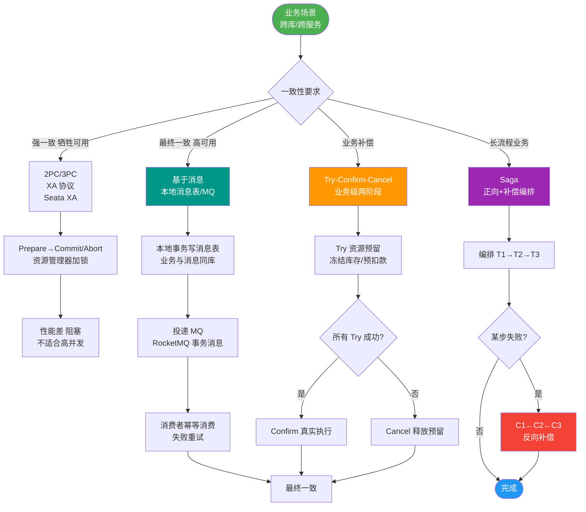
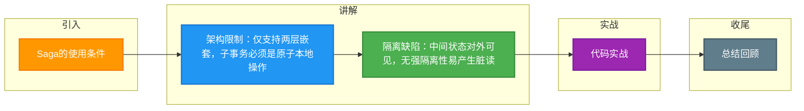

# Saga的使用条件

Saga 模型的使用限制条件：

1. **嵌套限制**：Saga 只允许两个层次的嵌套，即顶级的 Saga 和简单的子事务。
   - **细节说明**：Saga 不支持子事务内部再包含复杂的分布式子事务，否则补偿逻辑将呈指数级复杂，难以维护。子事务必须是原子的本地操作。

2. **原子性限制**：在外层，**不满足**完全的原子性。即 Saga 可能会看到其他 Saga 的部分结果（脏读风险）。
   - **细节说明**：由于各子事务直接提交数据库，中间状态对外可见。例如，Saga A 扣除了账户余额但尚未给 Saga B 增加，此时第三方查询会看到资金“消失”了。

3. **独立性**：每个子事务应该是独立的原子行为。
   - **关键原则**：子事务之间应避免强依赖，尤其是非数据库状态的依赖（如依赖上一步的内存计算结果），否则重试或补偿时难以恢复上下文。

**补偿的注意事项**：
- 补偿事务在语义上撤销了操作，但未必能将数据库物理恢复到原状（如发邮件无法撤回，只能再发一封解释）。
- 业务上必须能接受这种“语义撤销”而非“物理回滚”。
- **可逆性设计**：在定义 Ti 时，必须同时定义可逆的 Ci。对于某些天然不可逆的操作（如打印发票），Saga 不适用或需设计业务上的“冲红”操作来代替。

**实战案例**：在机票预订系统中，支付成功后出票接口超时。根据 Saga 设计，系统尝试回滚退款。实际踩坑中发现，第三方支付通道已扣款但尚未回调通知，导致本地处于“未知”状态，此时发起退款被第三方拒绝（需原单全额退款），最终需人工介入对账。

**代码示例（Java - 补偿逻辑设计）**：
```java
// 正向操作：增加积分
public void addPoints(String userId, int points) {
    repo.updatePoints(userId, points); // 直接提交
}

// 补偿操作：扣除积分（需处理余额不足等异常）
public void compensatePoints(String userId, int points) {
    // 使用 CAS 乐观锁确保不会扣成负数
    repo.updatePointsWithVersion(userId, -points); 
}
```

**适用性对比**：

| 操作类型 | 是否适用 Saga | 理由 | 替代方案 |
| :--- | :--- | :--- | :--- |
| **数据库更新** | ✅ 适用 | 支持反向更新（扣减/增加） | TCC、2PC |
| **消息发送** | ⚠️ 谨慎 | 无法“撤回”已读消息 | 发送解释性消息 |
| **外部 API 调用** | ⚠️ 谨慎 | 依赖外部 API 支持冲正 | 人工介入、TCC (Try 阶段预占) |
| **物理打印/物流** | ❌ 不适用 | 物理世界不可逆 | 无，需业务规避 |

## 常见考点
1. **为什么 Saga 模型不适用于需要强实时隔离性的业务？**（因为中间状态可见）
2. **如果补偿逻辑无法完全恢复原状（如外部接口已调用），业务上该如何设计？**（设计“冲正”业务流，而非数据回滚）
3. **Saga 子事务的设计原则是什么？**（原子性、幂等性、可补偿性）


## 核心流程图



## 记忆要点

- 架构限制：仅支持两层嵌套，子事务必须是原子本地操作
- 隔离缺陷：中间状态对外可见，无强隔离性易产生脏读
- 语义撤销：补偿是业务层面撤销，无法物理恢复(如发出的邮件)
- 适用边界：不适用不可逆操作(如物流发货)，需设计业务冲正

## 结构化回答


**30 秒电梯演讲：** 像泼出去的水收不回，只能通过擦干地板来补偿。

**展开框架：**
1. **只能看到部分结果** — 只能看到部分结果，隔离性弱
2. **补偿** — 补偿是逻辑上的撤销
3. **子事务必须保** — 子事务必须保持独立性

**收尾：** 这是我实战中的理解，您想深入哪一段？


## 视频脚本

> 预计时长：2 分钟 | 由浅入深

| 时间 | 画面/字幕 | 口播台词 | 讲解要点 |
|------|----------|----------|----------|
| 0:00 | 标题卡：Saga的使用条件 | "Saga的使用条件，一分钟讲透。" | 开场钩子 |
| 0:35 | 生活类比动画 | "打个比方——像泼出去的水收不回，只能通过擦干地板来补偿。" | 核心类比 |
| 1:10 | 概念定义动画 | "一句话：Saga只能保证逻辑回滚，无法保证完全原子性和物理状态复原。" | 核心定义 |
| 1:50 | 看到部分结果 图解 | "只能看到部分结果，隔离性弱。" | 看到部分结果 |

### 视频流程图



