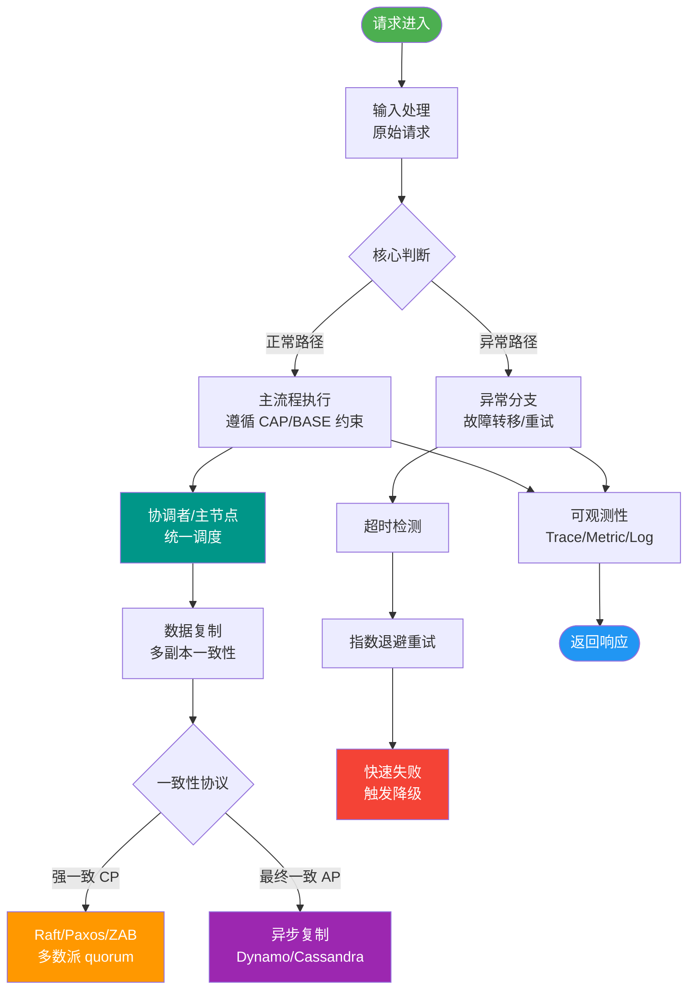
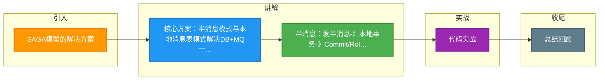

# SAGA模型的解决方案

SAGA 模型在 DB + MQ 场景下的解决方案：

**方案一：半消息模式（如 RocketMQ 事务消息）**
1. 发送半消息到 MQ（不可消费）。
2. 执行本地数据库事务。
3. 根据本地事务结果，向 MQ 发送 Commit/Rollback 指令。
4. **回查机制**：若 MQ 未收到确认（如应用挂了），会主动回查生产者状态，确保一致性。
   - **关键细节**：
     - **消息序号**：本地事务需关联该半消息的唯一 ID（如 TranscationId），以便回查时能精准定位事务状态。
     - **回查限制**：回查次数和间隔需配置，避免无限重试。
     - **一致性边界**：保证了“本地事务成功”与“消息发送成功”的原子性，但不保证消费端处理的成功（消费端需自己幂等）。

**方案二：本地消息表**
1. 在同一个本地事务中，向业务表和消息表插入数据。
2. 定时任务轮询消息表，将消息发送到 MQ。
3. 消费端处理成功后发送 ACK，生产端删除消息。
   - **关键细节**：
     - **业务入侵**：需要在同一 DB 实例中创建额外的消息表，利用 DB 的 ACID 保证业务操作和消息写入的同生共死。
     - **轮询优化**：定时任务通常支持“延迟轮询”策略（失败后下次轮询时间指数级退避），减少 DB 压力。
     - **可靠性**：即使 MQ 挂了，消息依然在 DB 中，不丢失。

**实战案例**：在金融跨行转账场景中，使用 RocketMQ 事务消息。曾因未实现回查接口，导致网络抖动时 Commit 指令丢失，消息一直处于“不可消费”状态，造成转账超时。修复时在回查逻辑中增加了对本地事务流水表的查询，以判断最终状态。

**代码示例（Java - RocketMQ 发送逻辑）**：
```javan// 1. 发送半消息
Message msg = new Message("TopicPay", body);
TransactionSendResult result = producer.sendMessageInTransaction(msg, null);

// 2. 执行本地事务 (在 TransactionListener 中实现)
@Override
public LocalTransactionState executeLocalTransaction(Message msg, Object arg) {
    try {
        businessService.doTransaction(); // 执行业务 SQL
        return LocalTransactionState.COMMIT_MESSAGE;
    } catch (Exception e) {
        return LocalTransactionState.ROLLBACK_MESSAGE;
    }
}
```

**方案对比**：

| 维度 | 半消息模式 (RocketMQ) | 本地消息表模式 |
| :--- | :--- | :--- |
| **实现复杂度** | 低（依赖 MQ 功能） | 中高（需开发定时任务） |
| **存储依赖** | 依赖 MQ 存储中间态 | 依赖 DB 存储（与业务同库） |
| **外部系统一致性** | 无法保证消费端执行成功 | 无法保证消费端执行成功 |
| **适用场景** | 高并发、解耦要求高 | 通用性强、不支持事务 MQ 的场景 |

```text
方案一：RocketMQ 半消息流程
┌──────────┐      ┌─────────────┐      ┌──────────────┐
│ Producer │─────>│   MQ Broker │─────>│   Consumer   │
└────┬─────┘      └──────┬──────┘      └──────────────┘
     │ 1.Send HalfMsg      │
     │<────────────────────│
     │                     │
     │ 2.Exec Local Tx     │
     │ (Commit/Rollback)   │
     │────────────────────>│ 3.Commit/Rollback
     │                     │    (Make Msg Visible)
     │                     │<────────────────────>│ 4.Consume
     │                     │                     │
     │        ┌────────────┴─────────────┐
     │        │ 5.Check Back (If Timeout)│
     │        │ (Ask Producer Status)   │
     │        └─────────────────────────┘
```

## 常见考点
1. **如果消费者消费失败，如何保证数据一致性？**（消息重试 + 死信队列 + 人工介入，生产端通常不负责回滚）
2. **本地消息表是如何保证消息不丢失的？**（利用 DB 事务和定时任务轮询）
3. **RocketMQ 事务消息的回查机制解决了什么问题？**（解决了本地事务提交成功但 Commit 指令丢失导致消息未发送的问题）


## 核心流程图



## 记忆要点

- 核心方案：半消息模式与本地消息表模式解决DB+MQ一致性
- 半消息：发半消息->本地事务->Commit/Rollback，异常靠回查机制保证
- 消息表：利用本地DB事务将业务和消息同库写入，定时任务轮询发送
- 消费端：两种方案均不保证消费端成功，消费端业务必须实现幂等

## 结构化回答

**30 秒电梯演讲：** 通过消息中间件或本地表记录操作，异步保证跨系统的最终一致性。打比方——像寄挂号信：先登记(本地表)，再寄信(MQ)，丢了好查重发。落到工程上，半消息利用MQ回查机制保证一致性。

**展开框架：**
1. **半消息** — 半消息利用MQ回查机制保证一致性
2. **本地消息表** — 本地消息表将分布式事务转为本地事务
3. **都需要** — 都需要保证消息的可靠投递

**收尾：** 以上三点都能配合实战聊。我可以展开任一要点，您想先深入哪一块？

## 视频脚本

> 预计时长：3 分钟 | 由浅入深

| 时间 | 画面/字幕 | 口播台词 | 讲解要点 |
|------|----------|----------|----------|
| 0:00 | 标题卡：SAGA模型的解决方案 | "SAGA模型的解决方案，这题我会分三步讲。" | 开场钩子 |
| 0:41 | 概念定义动画 | "一句话：通过消息中间件或本地表记录操作，异步保证跨系统的最终一致性。" | 核心定义 |
| 1:22 | 生活类比动画 | "打个比方——像寄挂号信：先登记(本地表)，再寄信(MQ)，丢了好查重发。" | 核心类比 |
| 2:03 | 半消息 图解 | "半消息利用MQ回查机制保证一致性。" | 半消息 |
| 2:50 | 本地消息表 图解 | "本地消息表将分布式事务转为本地事务。" | 本地消息表 |

### 视频流程图



