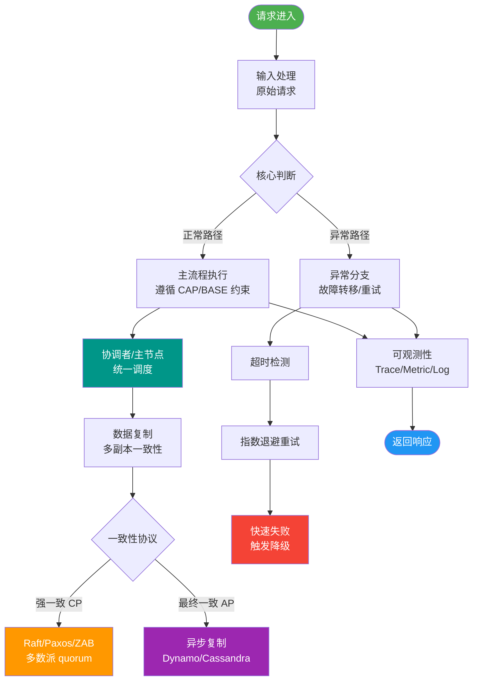
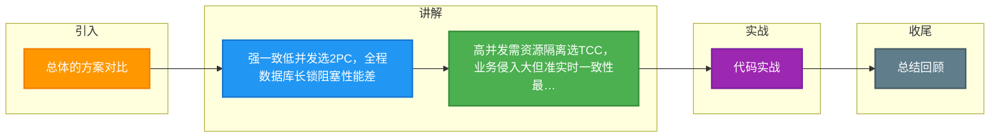

# 总体的方案对比

以下是 2PC、TCC、Saga、异步确保型事务及尽最大努力通知的总体方案对比。

### 实战案例
在支付系统中，对“用户支付”和“余额增加”使用 Seata AT/TCC 保证强一致性；但对“发货通知”和“积分发放”，则降级为“异步确保型（本地消息表）”，允许几分钟延迟以换取高吞吐，避免核心链路阻塞。

### 方案对比表

| 属性 | 2PC | TCC | Saga | 异步确保型事务 | 尽最大努力通知 |
| :--- | :---: | :---: | :---: | :---: | :---: |
| **事务一致性** | 强 | 最终一致 | 最终一致 | 最终一致 | 最终一致 |
| **复杂性** | 中 | 高 | 中 | 低 | 低 |
| **业务侵入性** | 小 | 大 | 小 | 中 | 中 |
| **使用局限性** | 大 | 大 | 中 | 小 | 中 |
| **性能** | 低 | 中 | 高 | 高 | 高 |
| **维护成本** | 低 | 高 | 中 | 低 | 中 |

### 代码示例（本地消息表 - 关键逻辑）
```java
@Transactional
public void orderPayment(Order order) {
    // 1. 执行业务操作
    orderDao.updateStatus(order.getId(), "PAID");
    // 2. 将待发送消息写入本地同一数据库的事务中
    localMessageDao.insert(new Message(order.getId(), "PAYMENT_SUCCESS_TOPIC"));
}
// 定时任务轮询发送消息并删除，保证业务与消息一致性
```

### Saga 与 TCC 的核心区别
二者均为补偿型事务，核心差异在于：

**劣势（共同点）**：
- 无法保证隔离性（可能读取到中间状态，即脏读）。

**优势**：
- **高性能**：一阶段直接提交本地事务，无锁等待。
- **高吞吐**：事件驱动模式，参与者可异步执行。
- **低侵入（对比 TCC）**：Saga 只需提供逆向 Cancel 操作；TCC 需要对业务进行全局性的流程改造（Try/Confirm/Cancel）。

### 分布式事务选型决策图
```text
     开始
       │
       ├─ 是否要求强一致性？
       │   ├─ 是 ──> 2PC (XA) / Seata XA 模式
       │   │         (性能较低，并发量小)
       │   │
       │   └─ 否 ──> 流程是否较长？
       │             ├─ 是 ──> Saga 模式
       │             │         (适合长流程，低侵入)
       │             │
       │             ├─ 否 ──> 对性能要求极高？
       │             │         ├─ 是 ──> 异步确保 / 本地消息表
       │             │         │         (如支付结果通知)
       │             │         │
       │             │         └─ 否 ──> TCC 模式
       │             │                   (资源预留，一致性控制最好)
       │             │
       │             └─ 尽最大努力通知
       │                   (跨系统通知，如银行回调)
```

## 常见考点
1. **2PC 为什么性能差？**
   在 Prepare 阶段，所有资源都被锁住，直到所有参与者都 Ready 才能 Commit，导致锁持有时间长，并发度低。

2. **什么是“本地消息表”模式？**
   属于异步确保型事务。业务操作与消息存储在同一个本地 DB 事务中，利用定时任务轮询发送消息，保证业务与消息的一致性。

3. **Seata AT 模式属于哪一类？**
   Seata AT 模式改进了 2PC，通过“自动生成反向 SQL”实现无侵入的补偿，属于增强型 2PC，但也存在锁竞争和脏读问题。


## 核心流程图



## 记忆要点

- 强一致低并发选2PC，全程数据库长锁阻塞性能差
- 高并发需资源隔离选TCC，业务侵入大但准实时一致性最好
- 长流程/跨第三方选Saga，无预留直接提交，只需提供补偿接口
- 异步解耦高吞吐选异步确保(本地消息表)，允许业务延迟几分钟

## 结构化回答

**30 秒电梯演讲：** 分布式事务方案在一致性、性能和复杂度上各有利弊，需按需取舍。打比方——像选择交通工具：飞机快(高性能)但贵(高复杂)，公交慢但便宜。落到工程上，强一致性往往牺牲性能和可用性。

**展开框架：**
1. **强一致性往往牺牲性** — 强一致性往往牺牲性能和可用性
2. **Saga 和 TCC 都** — Saga 和 TCC 都是补偿型，Saga 实现更简单
3. **2PC 性** — 2PC 性能最差，适用于强一致性场景

**收尾：** 以上三点都能配合实战聊。我可以展开任一要点，您想先深入哪一块？

## 视频脚本

> 预计时长：1 分 30 秒 | 由浅入深

| 时间 | 画面/字幕 | 口播台词 | 讲解要点 |
|------|----------|----------|----------|
| 0:00 | 标题卡：总体的方案对比 | "总体的方案对比，一分钟讲透。" | 开场钩子 |
| 0:25 | 生活类比动画 | "打个比方——像选择交通工具：飞机快(高性能)但贵(高复杂)，公交慢但便宜。" | 核心类比 |
| 0:50 | 概念定义动画 | "一句话：分布式事务方案在一致性、性能和复杂度上各有利弊，需按需取舍。" | 核心定义 |
| 1:20 | 强一致性往往牺牲性 图解 | "强一致性往往牺牲性能和可用性。" | 强一致性往往牺牲性 |

### 视频流程图



