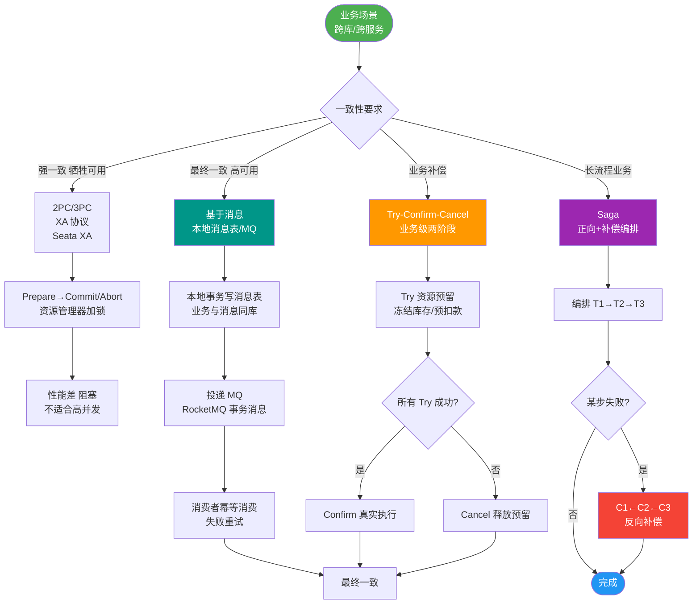
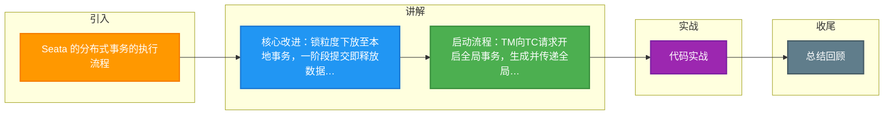

# Seata 的分布式事务的执行流程

Seata 的分布式事务执行流程基于三大核心模块（TC、TM、RM）协同工作，核心改进在于将锁粒度下放至本地事务，实现高性能的一致性保障。

### 实战案例
在处理高并发秒杀时，若 TM 发起全局提交后 TC 突然宕机，RM 会根据配置重试向 TC 汇报状态。此时若 TC 采用 DB 存储，恢复后可继续推进；若采用 File 存储且未及时同步，可能导致分支事务锁超时，开发者需监控 TC 的高可用状态。

### 三大模块回顾
- **TC (Transaction Coordinator)**：事务协调者，独立部署，维护全局事务和分支事务的状态，驱动全局提交或回滚。
- **TM (Transaction Manager)**：事务发起者，嵌入业务应用（通常在发起方），定义全局事务的范围（开始、提交、回滚）。
- **RM (Resource Manager)**：资源管理者，嵌入业务应用（参与者），管理分支事务资源，向 TC 注册分支并汇报状态，驱动分支提交或回滚。

### 架构交互流程图
```text
    ┌───────────┐                    ┌───────────┐                    ┌───────────┐
    │   App 1   │                    │   App 2   │                    │    TC     │
    │ (TM + RM) │                    │   (RM)    │                    │ (Seata)   │
    └─────┬─────┘                    └─────┬─────┘                    └─────┬─────┘
          │                                │                                │
   1. Begin │                                │                                │
   (Global) ├───────────────────────────────>│  2. Generate XID                │
          │                                │   (Begin Request)              │
          │<───────────────────────────────┤                                │
          │                                │                                │
   3. Branch Register                     │                                │
          ├───────────────────────────────>│                                │
          │<───────────────────────────────┤  4. Success (Branch ID)       │
          │                                │                                │
   5. Commit/Report                       │                                │
          ├───────────────────────────────>│  6. Report Status (Success)     │
          │                                ├───────────────────────────────>│
          │                                │                                │
   7. Global Commit/                     │  8. Commit/Rollback Branch      │
      Rollback ├───────────────────────────────>│<───────────────────────────────┤
          │                                │                                │
```

## 技术原理

Seata 的分布式事务流程本质是把 X/Open DTP 模型（AP/TM/RM）改造成"分支本地提前提交 + TC 协调最终结果"的模式，核心是降低锁持有时间：

- **XID 的传播机制**：TM 调用 `RootContext.bind(xid)` 把全局事务 ID 绑定到当前线程的 ThreadLocal，再通过服务间调用的拦截器（Dubbo/Feign/RestTemplate 的 Seata filter）把 XID 塞进 RPC 头（如 `TX_XID` header），下游 RM 解析 header 并绑定到自己的 ThreadLocal。这样跨服务的调用链共享同一个 XID，是分支能被归属到同一全局事务的前提。
- **一阶段"提前提交"的关键设计**：传统 XA 在一阶段只 Prepare（持锁不提交），二阶段才统一 Commit，导致数据库锁持有整个全局事务时长。Seata 的改进是 RM 在一阶段就 Commit 本地事务（释放 DB 锁），把回滚所需的前后镜像写入 `undo_log` 表，靠 `undo_log` + TC 全局锁而非 DB 锁来保证一致性——这是性能提升的根本。
- **TC 的状态机和存储**：TC 维护全局事务状态机（Begin/Committing/RollingBack/Finished）和分支事务状态表。存储可选 DB（默认，强一致但慢）或 Redis/File（快但需考虑持久化）。TC 宕机时未决事务会卡住，需要 TC 集群 + 注册中心保证高可用。
- **二阶段决策与驱动**：TM 发起 GlobalCommit/Rollback 后，TC 查所有分支状态：全成功则驱动所有 RM 异步删 undo_log（提交分支）；有失败则驱动所有 RM 用 undo_log 反向补偿（回滚分支）。注意二阶段对 RM 是异步通知，RM 失败时 TC 会重试。

## 注意事项

1. **XID 传播失败的隐蔽坑**：用了非 Seata 内置支持的 RPC 框架（如自定义 HTTP 客户端、gRPC 未加拦截器），XID 不会自动透传，下游服务的 DB 操作会被当作独立本地事务，全局回滚时漏回滚。必须确认所有服务间调用都注册了 Seata 的事务上下文拦截器。
2. **TC 单点故障的后果**：TC 宕机会导致进行中的全局事务无法提交或回滚，分支的 undo_log 残留，业务数据处于"已改但未决"状态。生产必须部署 TC 集群（≥3 节点）+ 注册中心（Nacos）。
3. **重试与超时配置**：RM 向 TC 注册/汇报失败会重试，重试次数和间隔（`client.rm.report.retry-count`、`client.tm.commit-retry-count`）配置不当会导致事务长时间悬挂或最终失败。
4. **全局锁超时**：AT 模式下一阶段要向 TC 申请全局行锁，热点行竞争时获取锁会重试到超时（默认 60s）后回滚。高并发写同一行需评估是否换 TCC。

## 代码示例

```java
// TM 端：定义全局事务边界
@Service
public class OrderBizService {
    @GlobalTransactional(name = "create-order", timeoutMills = 60000)
    public void createOrder(OrderDTO dto) {
        // XID 自动绑定到当前线程 ThreadLocal，并通过 RPC header 透传
        stockService.deduct(dto.getProductId());   // 远程调用，XID 透传
        orderService.create(dto);                  // 远程调用，XID 透传
        pointService.add(dto.getUserId());         // 远程调用，XID 透传
        // 方法正常返回：TM 通知 TC GlobalCommit
        // 抛异常：TM 通知 TC GlobalRollback
    }
}
```

```java
// 自定义 RPC 框架需手动透传 XID（Seata 内置支持 Dubbo/Feign）
public class SeataXidInterceptor implements ClientInterceptor {
    @Override
    public void intercept(Call call) {
        String xid = RootContext.getXID();
        if (xid != null) {
            call.header("TX_XID", xid);          // 关键：把 XID 放进请求头
        }
    }
}
// 服务端解码后绑定：RootContext.bind(header.get("TX_XID"));
```


## 核心流程图



## 记忆要点

- 核心改进：锁粒度下放至本地事务，一阶段提交即释放数据库锁保障高性能。
- 启动流程：TM向TC请求开启全局事务，生成并传递全局事务ID（XID）。
- 执行上报：RM携带XID注册分支事务，执行本地业务后向TC汇报状态。
- 结束决议：TM通知TC提交/回滚，TC汇总后驱动各RM执行二阶段操作。

## 结构化回答


**30 秒电梯演讲：** 就像考试：TM发卷，RM做题并交卷，TC统分并决定是否及格。

**展开框架：**
1. **TM** — TM 向 TC 申请全局 XID
2. **RM** — 各 RM 向 TC 注册分支并汇报状态
3. **TC** — TC 收到所有分支状态后做最终决策

**收尾：** 这是我实战中的理解，您想深入哪一段？


## 视频脚本

> 预计时长：2 分钟 | 由浅入深

| 时间 | 画面/字幕 | 口播台词 | 讲解要点 |
|------|----------|----------|----------|
| 0:00 | 标题卡：Seata 的分布式事务的执行流程 | "Seata 的分布式事务的执行流程，一分钟讲透。" | 开场钩子 |
| 0:35 | 生活类比动画 | "打个比方——就像考试：TM发卷，RM做题并交卷，TC统分并决定是否及格。" | 核心类比 |
| 1:10 | 概念定义动画 | "一句话：TM发起，RM执行并汇报，TC汇总并指挥最终结果。" | 核心定义 |
| 1:50 | TM 向 TC 申请 图解 | "TM 向 TC 申请全局 XID。" | TM 向 TC 申请 |

### 视频流程图



