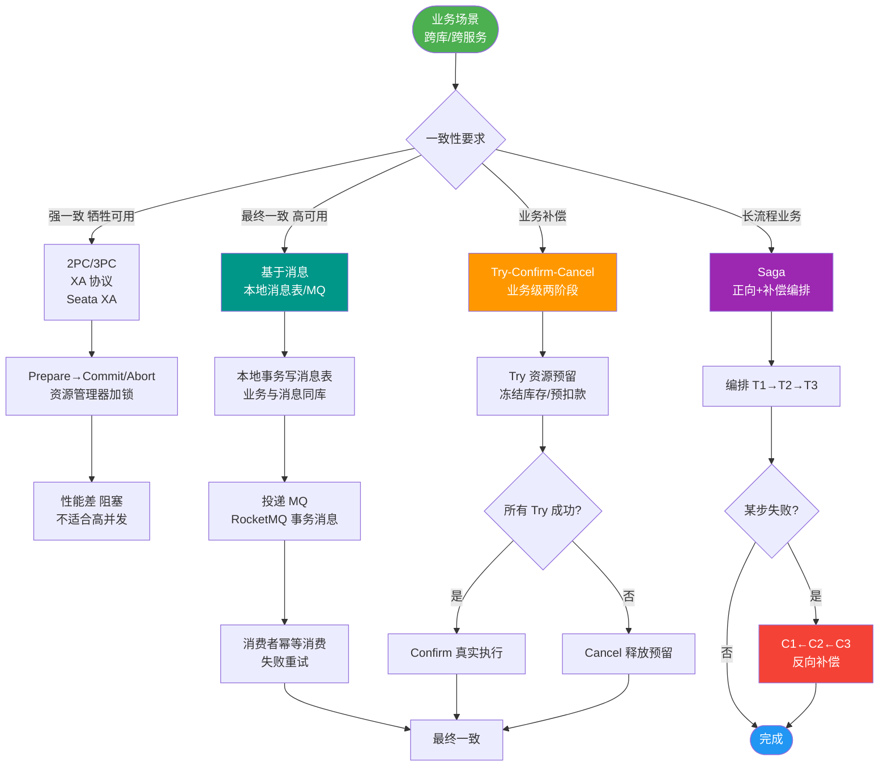
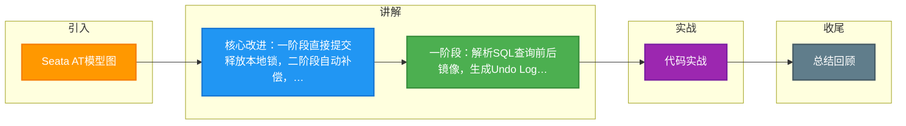

# Seata AT模型图

Seata AT 模式通过“增强型二阶段提交”解决分布式事务问题，核心在于一阶段直接提交和二阶段自动补偿。

### 模型概念
AT 模式是指 Automatic (Branch) Transaction Mode（自动化分支事务模式）。它是对传统 2PC（两阶段提交）的改进，解决了传统 XA 协议在第一阶段长期锁表导致性能低下的问题。

### 使用前提
1. **关系型数据库**：必须支持本地 ACID 事务（如 MySQL InnoDB）。MyISAM 等不支持事务的引擎无法使用。
2. **JDBC 访问**：仅限通过 JDBC 访问数据库的 Java 应用，以便 Seata 拦截 SQL 语句。

### 执行流程
- **一阶段**：
  - 业务 SQL 执行前，查询数据前镜像（Before Image）。
  - 执行业务 SQL。
  - 业务 SQL 执行后，查询数据后镜像（After Image）。
  - 生成回滚日志（Undo Log），与业务操作在同一个本地事务中提交。
  - **释放本地锁和数据库连接**。
- **二阶段**：
  - **提交**：异步删除 Undo Log，无需同步等待。
  - **回滚**：利用 Undo Log 生成补偿 SQL 执行回滚。

### 实战案例
在某次生产环境排查中，发现业务执行极慢，根因是 Seata 数据源代理配置了 `select for update` 的 SQL 解析，但部分老旧代码直接使用了原生 JDBC `PreparedStatement` 而绕过了 Seata 代理，导致全局锁失效。解决方法是在应用启动时强制检查数据源是否已被 Seata 包装。

### 核心代码配置 (Java)
```java
// 自动配置 Seata 数据源代理 (Spring Boot)
@Bean
@ConfigurationProperties(prefix = "spring.datasource")
public DataSource dataSource(DataSource druidDataSource) {
    // 使用 Seata 代理数据源，实现 SQL 拦截
    return new DataSourceProxy(druidDataSource);
}
```

### 模式对比表格

| 特性 | XA 模式 (传统 2PC) | Seata AT 模式 |
| :--- | :--- | :--- |
| **一阶段锁机制** | 长期持有数据库行锁，直到二阶段结束 | 一阶段提交后立即释放本地数据库锁，仅持有全局锁 |
| **锁持有时间** | 长（整个全局事务期间） | 短（仅一阶段本地事务提交期间 + 二阶段极短瞬间） |
| **性能** | 低（资源长期锁定，阻塞高） | 高（本地锁释放早，并发度高） |
| **一致性** | 强一致性 | 最终一致性（基于回滚日志补偿） |
| **代码侵入** | 无（标准协议） | 无（JDBC 代理自动实现） |
| **适用场景** | 对一致性要求极高、并发低的内部系统 | 高并发、对性能要求一般的互联网业务 |


## 核心流程图



## 记忆要点

- 核心改进：一阶段直接提交释放本地锁，二阶段自动补偿，解决传统XA长锁表痛点。
- 一阶段：解析SQL查询前后镜像，生成Undo Log随本地事务一同提交，即刻释放DB锁。
- 二阶段提交：异步删除Undo Log，极速释放资源。
- 二阶段回滚：利用Undo Log生成反向SQL执行补偿，并校验防止脏写。

## 结构化回答


**30 秒电梯演讲：** 像Photoshop的历史记录，每步操作都存快照，错了点撤销。

**展开框架：**
1. **一阶段提交业务数** — 据和 Undo Log
2. **利用 JDBC ** — 拦截解析 SQL 生成镜像
3. **一阶段结束即释放锁** — 一阶段结束即释放锁，提升并发

**收尾：** 这是我实战中的理解，您想深入哪一段？


## 视频脚本

> 预计时长：2 分钟 | 由浅入深

| 时间 | 画面/字幕 | 口播台词 | 讲解要点 |
|------|----------|----------|----------|
| 0:00 | 标题卡：Seata AT模型图 | "Seata AT模型图，一分钟讲透。" | 开场钩子 |
| 0:35 | 生活类比动画 | "打个比方——像Photoshop的历史记录，每步操作都存快照，错了点撤销。" | 核心类比 |
| 1:10 | 概念定义动画 | "一句话：本地事务自动提交并记录前后镜像，异常时用镜像自动回滚。" | 核心定义 |
| 1:50 | 一阶段提交业务数据和 图解 | "一阶段提交业务数据和 Undo Log。" | 一阶段提交业务数据和 |

### 视频流程图



