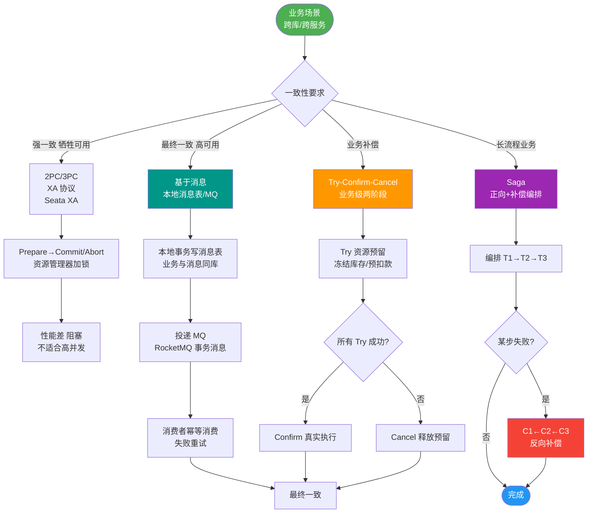

# Seata AT模式的例子

以下以“用户充值同时增加余额和积分”为例，描述 Seata AT 模式的工作流程。

### 业务场景
- **余额服务**：增加用户余额。
- **积分服务**：增加用户积分。
两者必须在同一个全局事务中成功。

### 一阶段流程（核心业务执行）
1. **开启事务**：余额服务的 TM 向 TC 申请开启全局事务，获取 XID。
2. **分支注册**：余额服务 RM 向 TC 注册分支事务。
3. **本地执行**：
   - 解析 SQL，查询 Before Image（如余额 100）。
   - 执行业务 SQL（Update set balance = 200）。
   - 查询 After Image（余额 200）。
   - 生成 Undo Log（记录 {Before:100, After:200}）。
   - **关键点**：在提交本地事务前，必须向 TC 申请该记录的“**全局锁**”。
   - 获取到全局锁后，提交本地事务（业务数据 + Undo Log）。**此时释放数据库锁**。
   - **释放全局锁**（本地事务提交后释放全局锁，但 TC 知晓该分支状态）。
4. **状态汇报**：余额服务 RM 向 TC 汇报分支成功。
5. **远程调用**：余额服务携带 XID 调用积分服务。
6. **分支注册与执行**：积分服务重复步骤 2-4（注册分支、生成 Undo Log、申请全局锁、提交本地事务、汇报状态）。
7. **全局决议**：余额服务 TM 根据本地逻辑，向 TC 申请全局提交或回滚。

### 二阶段流程（结果处理）
- **若全局提交**：
  - TC 通知所有 RM 分支提交。
  - RM 收到指令，**异步**删除 Undo Log。无需操作业务数据。
- **若全局回滚**：
  - TC 通知所有 RM 分支回滚。
  - RM 收到指令，需要再次申请“全局锁”（为了防止二阶段回滚时，其他事务正在并发修改该数据）。
  - 校验数据快照：对比 After Image 与当前库数据。
    - 若一致：生成反向 SQL（Update set balance = 100）执行回滚。
    - 若不一致：说明发生了脏写，上报 TC，需人工介入或重试。

### 实战案例
在积分回滚环节曾出现“脏写”异常，原因是积分服务在余额回滚期间恰好有另一个独立任务修改了该用户的积分。Seata 抛出 `SQLException` 提示数据版本不一致，需要人工介入。解决方法是在业务层增加重试机制，或针对该热点用户的操作进行排队处理。

### 核心代码逻辑
```java
// Seata AT 模式下的 Undo Log 生成逻辑伪代码 (Java)
public void executeUpdate(Connection conn, String sql) {
    // 1. 查询前镜像
    TableRecords beforeImage = queryBeforeImage(conn, sql);
    // 2. 执行业务 SQL
    executeBusinessSql(conn, sql);
    // 3. 查询后镜像
    TableRecords afterImage = queryAfterImage(conn, sql);
    // 4. 生成 Undo Log 并在本地事务中提交
    insertUndoLog(conn, beforeImage, afterImage);
}
```

### 常见考点
1. **为什么一阶段释放了数据库锁，还需要全局锁？**：全局锁是为了解决“写隔离”问题。如果一阶段释放 DB 锁后，不通过全局锁控制，其他全局事务可能读取并提交了修改后的数据，导致回滚时覆盖脏数据。
2. **Undo Log 存在哪里？**：默认存储在业务数据库的同一库中（需要建立 `undo_log` 表），确保和业务数据在同一个本地事务中提交/回滚。
3. **如果一阶段提交了，二阶段回滚时，业务数据已经被别人修改了怎么办？**：这就是脏写。Seata AT 模式利用全局锁机制进行拦截：如果分支一阶段提交了，但全局事务未结束，其他事务如果要修改这行数据，会被全局锁阻塞，直到全局事务结束（Commit 或 Rollback）。因此理论上回滚时数据是不应该变的。


## 核心流程图



## 记忆要点

- 一阶段核心：查询前镜像 -> 执行SQL -> 查询后镜像 -> 携带XID注册分支 -> 生成Undo Log。
- 全局锁：本地事务提交前必须向TC申请该记录的全局锁，成功后提交并释放本地DB锁。
- 二阶段提交：TC通知分支，RM异步删除Undo Log即可。
- 二阶段回滚：RM重新申请全局锁，比对后镜像防脏写，一致则用前镜像反向回滚。

## 结构化回答

**30 秒电梯演讲：** 各服务独立提交并快照，中心协调决定是清理快照还是还原快照。打比方——像组团旅游，各自玩各自报平安，导游决定是行程结束还是让大家退款。落到工程上，各服务本地提交并记录 Undo Log。

**展开框架：**
1. **一阶段** — 各服务本地提交并记录 Undo Log
2. **二阶段提交** — 仅需异步清理 Undo Log
3. **二阶段回滚** — 利用 Undo Log 生成补偿 SQL

**收尾：** 以上三点都能配合实战聊。我可以展开任一要点，您想先深入哪一块？

## 视频脚本

> 预计时长：2 分钟 | 由浅入深

| 时间 | 画面/字幕 | 口播台词 | 讲解要点 |
|------|----------|----------|----------|
| 0:00 | 标题卡：Seata AT模式的例子 | "Seata AT模式的例子，一分钟讲透。" | 开场钩子 |
| 0:35 | 生活类比动画 | "打个比方——像组团旅游，各自玩各自报平安，导游决定是行程结束还是让大家退款。" | 核心类比 |
| 1:10 | 概念定义动画 | "一句话：各服务独立提交并快照，中心协调决定是清理快照还是还原快照。" | 核心定义 |
| 1:50 | 一阶段 图解 | "各服务本地提交并记录 Undo Log。" | 一阶段 |
