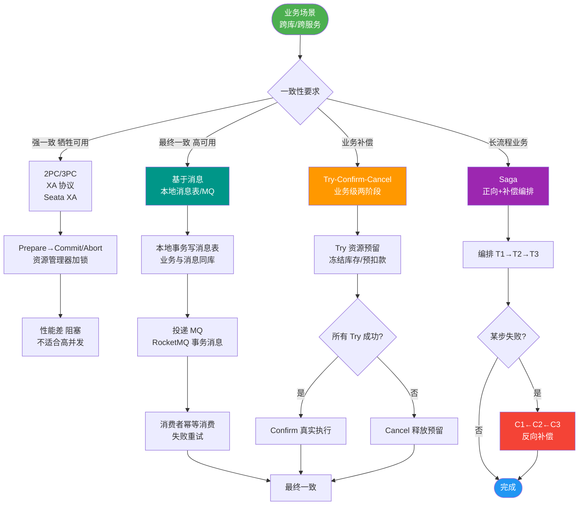

# Spring Cloud集成Seata AT模式

### Seata AT 模式集成与原理

**AT 模式** 是指 Automatic (Branch) Transaction Mode（自动化分支事务模式），其核心目标是**对业务代码无侵入**，通过自动解析 SQL 生成回滚日志来实现分布式事务。

#### 使用前提
1.  **数据库**：必须基于支持本地 ACID 事务的关系型数据库（目前支持 MySQL、Oracle、PostgreSQL）。
2.  **应用**：Java 应用，通过 JDBC 访问数据库。

#### Spring Cloud 集成步骤
1.  **基础设施准备**：
    *   搭建 Seata Server (TC)。
    *   在数据库中创建 `undo_log` 表（用于记录数据修改前后的镜像，以便回滚）。
2.  **引入依赖**：在各个微服务（生产者、消费者）中引入 Seata 的 Spring Cloud Starter 依赖。
3.  **配置数据源代理**：
    *   Seata 需要对数据源进行代理，以便拦截 SQL 并记录 Undo Log。通常配置 `DataSourceProxy` 自动包装原始数据源。
4.  **添加注解**：
    *   在分布式事务发起方（根事务）的方法上添加 `@GlobalTransactional` 注解。
    *   被调用的下游服务（分支事务）如果是数据库操作，Seata 会自动通过 RPC 上下文传播 XID，自动加入全局事务，通常**无需**加注解（除非需要单独配置事务名称等）。

---

### 架构流程：AT 模式工作流

```text
   TM (事务发起者)          TC (事务协调者)         RM (分支事务/数据库)
      │                          │                      │
      │ 1. 开启全局事务           │                      │
      │ ─────────────────────────>                      │
      │     (生成 XID)           │                      │
      │                          │                      │
      │ 2. 调用微服务 (携带 XID)  │                      │
      │ ──────────────────────────────────────────────> │
      │                          │                      │
      │                          │                      │ 3. 开启本地事务
      │                          │                      │ 4. 执行业务 SQL
      │                          │                      │ 5. 查询前镜像 (Before Image)
      │                          │                      │ 6. 执行业务更新
      │                          │                      │ 7. 查询后镜像 (After Image)
      │                          │                      │ 8. 生成 Undo Log
      │                          │                      │ 9. 提交本地事务 (释放 DB 锁)
      │                          │                      │
      │                          │ 10. 注册分支          │
      │                          │ <────────────────────│
      │                          │                      │
      │ 11. ...所有分支执行完毕...
```

#### 深化：实战与选型

**实战案例**：
在高并发场景下，AT 模式的 `undo_log` 表会产生大量数据。曾有项目因未定期清理 `undo_log`，导致表膨胀至数亿行，严重拖慢分支事务的提交速度（需同步插入 Undo Log）。**解决方案**：配置定时任务或利用 Seata 的 `undoLogDeletePeriod` 参数定期清理历史日志。

**代码示例**：
```java
// 业务代码：无侵入，仅需添加注解
@GlobalTransactional(name = "create-order", rollbackFor = Exception.class)
public void createOrder(OrderDTO order) {
    // 1. 扣减库存（库存服务，自动加入全局事务）
    stockFeignClient.deduct(order.getProductId(), order.getCount());
    // 2. 创建订单（本地事务）
    orderMapper.insert(order);
    // 3. 扣减余额（账户服务，自动加入全局事务）
    accountFeignClient.deduct(order.getUserId(), order.getAmount());
}
```

**AT 与 TCC 模式对比**：

| 特性 | Seata AT 模式 | Seata TCC 模式 |
| :--- | :--- | :--- |
| **代码侵入性** | 低（仅需注解） | 高（需编写 Try/Confirm/Cancel 接口） |
| **一致性** | 最终一致 | 最终一致（可由业务控制得更强） |
| **锁机制** | 全局锁（TC 维护），性能适中 | 业务锁（DB 层面），性能较高 |
| **适用场景** | 基础 CRUD、逻辑简单的业务 | 核心高并发业务、非数据库资源（如 RPC） |
| **回滚方式** | 自动生成 Undo Log 反向 SQL | 手动编写补偿逻辑 |


## 核心流程图



## 记忆要点

- 集成四步：建undo_log表 -> 引入starter -> 配置数据源代理 -> 方法加 `@GlobalTransactional`。
- 数据源代理：必须配置 `DataSourceProxy` 拦截JDBC以自动记录Undo Log。
- 注解用法：发起方加 `@GlobalTransactional`，下游服务通过RPC透传XID自动加入事务。
- 性能注意：需定期清理undo_log表防止膨胀拖慢分支提交速度。

## 结构化回答


**30 秒电梯演讲：** 给数据库装了个“监控摄像头”，自动记下每次操作，出问题时自动按记录倒带。

**展开框架：**
1. **ACID** — 需支持本地 ACID 事务的数据库
2. **必须创建 u** — 必须创建 undo_log 表
3. **根事务使** — 根事务使用 @GlobalTransactional 注解

**收尾：** 这是我实战中的理解，您想深入哪一段？


## 视频脚本

> 预计时长：1 分 30 秒 | 由浅入深

| 时间 | 画面/字幕 | 口播台词 | 讲解要点 |
|------|----------|----------|----------|
| 0:00 | 标题卡：Spring Cloud集成Seata | "Spring Cloud集成Seata，一分钟讲透。" | 开场钩子 |
| 0:25 | 生活类比动画 | "打个比方——给数据库装了个“监控摄像头”，自动记下每次操作，出问题时自动按记录倒带。" | 核心类比 |
| 0:50 | 概念定义动画 | "一句话：通过数据源代理自动拦截SQL，利用undo_log实现无侵入的分布式事务。" | 核心定义 |
| 1:20 | 本地 ACID 事务 图解 | "需支持本地 ACID 事务的数据库。" | 本地 ACID 事务 |
