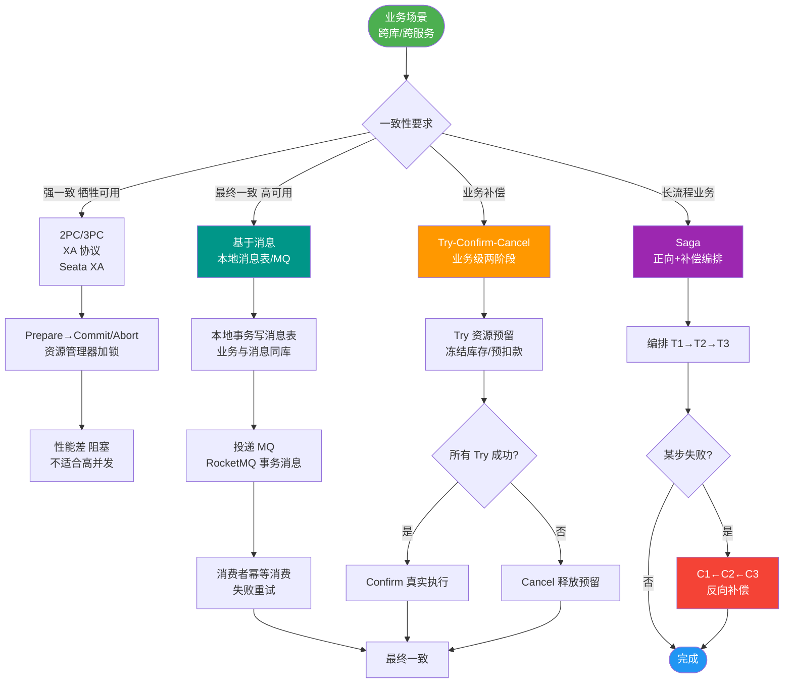
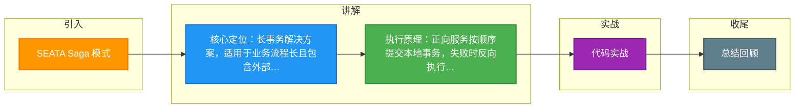

# SEATA Saga 模式

### Seata Saga 模式

Saga 模式是 Seata 提供的**长事务解决方案**，适用于业务流程长、业务流程多且包含外部服务调用的场景。

#### 核心原理
在 Saga 模式中：
1.  **正向服务**：业务流程中的每个参与者按顺序提交本地事务。
2.  **补偿服务**：如果流程中某一个参与者失败，则执行前面已经成功参与者的补偿操作（反向回滚）。

#### 实现方式
目前 Seata 提供的 Saga 模式主要基于**状态机引擎** 实现：
1.  **定义流程**：通过 JSON 状态语言定义服务调用的流程图。
2.  **节点配置**：状态图中的每个节点代表调用一个服务，可以配置其对应的补偿节点。
3.  **驱动执行**：状态机引擎驱动执行状态图。当出现异常时，状态引擎自动反向执行已成功节点对应的补偿节点。

#### 特点与适用场景
*   **优点**：可以编排复杂的业务流程，支持服务编排、单项选择、并发、子流程、参数映射、异常捕获等。
*   **缺点**：**不保证隔离性**（默认情况下可能存在脏写），需要业务层处理并发控制。
*   **适用**：长流程、业务链路长（如旅行规划、采购审批），且对隔离性要求不高的场景。

---

### 状态流转：Saga 状态机回滚

```text
    ┌──────────┐      ┌──────────┐      ┌──────────┐      ┌──────────┐
    │  Service │ ───> │  Service │ ───> │  Service │ ───> │  Service │
    │    A     │      │    B     │      │    C     │      │    D     │
    └──────────┘      └──────────┘      └──────────┘      └──────────┘
         │                 │                 │                 │
         │(成功)           │(成功)           │(失败)            │(未执行)
         v                 v                 v                 v
      [Commit]         [Commit]           [Fail]           [Skip]
         │                 │                 │
         │<────────────────│                 │
         │                 │                 │
         │                 v                 v
         │           [Compensate B]    [Stop Process]
         │                 │
         v                 v
    [Compensate A]    [Rollback End]
         │
         v
    [Rollback End]
```

#### 深化：实战与隔离性

**实战案例**：
在供应链系统中，采购流程涉及“下单 -> 审批 -> 通知物流 -> 财务记账”，整个流程耗时数小时。使用 Saga 模式编排流程，但在“财务记账”回滚时，由于“通知物流”已经发出短信无法撤回，造成了最终数据不一致。**解决方案**：在正向流程中采用“尽力而为”的补偿（如发送取消通知），而非强数据回滚；或在业务层引入版本号控制脏读。

**代码示例 (JSON 定义)**：
```json
{
  "Name": "purchaseOrder",
  "States": [
    {
      "Name": "CreateOrder",
      "Type": "ServiceTask",
      "ServiceName": "orderService.create",
      "ServiceMethod": "create",
      "CompensateState": "CompensateCreateOrder",
      "Input": ["$.input"],
      "Output": {
        "orderId": "$.orderId"
      }
    }
    // ... 其他状态
  ]
}
```

**Saga 与 TCC 选型对比**：

| 特性 | Saga 模式 | TCC 模式 |
| :--- | :--- | :--- |
| **事务长度** | 长事务（小时/天级） | 短事务（秒/毫秒级） |
| **实现粒度** | 流程编排（Process） | 接口/服务级别（Service） |
| **代码侵入** | 低（JSON 配置） | 高（需写 3 个阶段接口） |
| **隔离性** | 无（默认脏读/脏写） | 可通过业务锁实现较强隔离 |
| **适用场景** | 复杂业务流、审批流、跨系统长链路 | 核心高并发交易、资源锁定 |


## 核心流程图



## 记忆要点

- 核心定位：长事务解决方案，适用于业务流程长且包含外部服务调用的场景。
- 执行原理：正向服务按顺序提交本地事务，失败时反向执行已成功节点的补偿服务。
- 实现方式：基于状态机引擎，通过 JSON 定义流程图，异常时引擎自动触发反向补偿。
- 核心缺点：不保证隔离性（默认存在脏写），需业务层自行处理并发控制。
- 选型对比：Saga适合长流程编排，而TCC适合短事务且对隔离性要求较高的核心业务。

## 结构化回答


**30 秒电梯演讲：** 像组装电脑，装错了就按步骤一个个拆回去，不保证别人没动过你的零件。

**展开框架：**
1. **适用于长事务** — 适用于长事务流程
2. **基于状态机引擎定义服务调** — 基于状态机引擎定义服务调用流程
3. **一阶段提交本地事务** — 一阶段提交本地事务，失败后执行补偿

**收尾：** 这是我实战中的理解，您想深入哪一段？


## 视频脚本

> 预计时长：1 分 30 秒 | 由浅入深

| 时间 | 画面/字幕 | 口播台词 | 讲解要点 |
|------|----------|----------|----------|
| 0:00 | 标题卡：SEATA Saga 模式 | "SEATA Saga 模式，一分钟讲透。" | 开场钩子 |
| 0:25 | 生活类比动画 | "打个比方——像组装电脑，装错了就按步骤一个个拆回去，不保证别人没动过你的零件。" | 核心类比 |
| 0:50 | 概念定义动画 | "一句话：长事务的流程编排方案，正向执行业务，失败时执行反向补偿。" | 核心定义 |
| 1:20 | 长事务流程 图解 | "适用于长事务流程。" | 长事务流程 |

### 视频流程图



