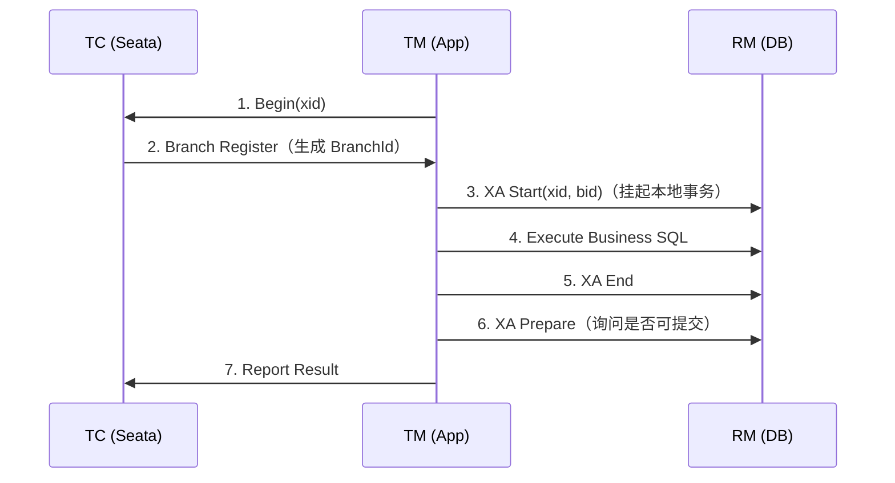

# Seata XA 模式的工作机制

### Seata XA 模式的工作机制

XA 模式是 Seata 实现的对 XA 协议（分布式事务协议）的支持，旨在利用数据库自身的 XA 能力实现强一致性。

#### 1. 整体运行机制
*   运行在 Seata 定义的事务框架内。
*   依赖数据库底层的 XA 事务支持。

#### 2. 数据源代理
Seata XA 模式需要使用 `XAConnection`。获取方式主要有两种：

*   **方式一：配置 XADataSource**
    *   要求开发者直接配置特定数据库的 XA 数据源。
    *   *缺点*：增加了认知负担，违背了透明化设计的目标。

*   **方式二：基于普通 DataSource 创建（推荐）**
    *   Seata 根据普通的 JDBC DataSource 构建出 XAConnection。
    *   *优点*：对开发者友好，编程模型与 AT 模式完全一致，无需关心 XA 细节。

#### 3. 分支注册与执行流程（关键细节）
*   **XA Start** 需要 `Xid` 参数，该参数需关联 Seata 的全局事务 XID 和 BranchId。
*   因此，**分支注册必须在 XA start 之前进行**，以便生成 BranchId。

**执行时序图：**


#### 深化：实战与性能对比

**实战案例**：
某金融系统从 TCC 迁移至 XA 模式以简化代码开发。测试发现在高并发下，数据库连接长时间被 XA Prepare 阶段占用（持有 DB 锁但不释放），导致连接池耗尽，系统吞吐量暴跌 80%。**踩坑经验**：XA 模式强依赖数据库锁，必须确保数据库连接池配置足够大，且仅用于对一致性要求极高、并发量不大的后台账务核对场景。

**代码示例**：
```java
// 配置类：自动代理数据源为 XA 模式
@Configuration
public class SeataConfig {
    
    @Bean("dataSource")
    public DataSource dataSource(DataSource druidDataSource) {
        // 使用 Seata 提供的代理工厂，将 Druid DataSource 包装为 XA 模式
        return DataSourceProxyXA.get(druidDataSource);
    }
}
```

**XA 与 AT 模式对比**：

| 特性 | Seata XA 模式 | Seata AT 模式 |
| :--- | :--- | :--- |
| **一致性** | 强一致性（两阶段提交） | 最终一致性（基于 Undo Log 回滚） |
| **锁机制** | 数据库 XA 锁（持有时间长） | 全局锁 + 本地 DB 锁（释放快） |
| **性能** | 低（锁竞争严重，阻塞性） | 中高（本地事务快速提交） |
| **依赖** | 必须支持 XA 协议的 DB | 关系型数据库即可 |
| **代码侵入** | 无（仅配置数据源） | 无（引入依赖+代理） |
| **适用场景** | 内部管理系统、对数据强一致敏感的短事务 | 大多数互联网业务、高并发业务 |


## 记忆要点

- 核心机制：利用数据库底层的 XA 协议（2PC）实现数据的强一致性。
- 执行顺序：因为 XA Start 需要关联 XID 和 BranchId，所以分支注册必须在 XA Start 之前进行。
- 数据源代理：推荐基于普通 DataSource 创建 XAConnection，对开发者透明且编程模型与 AT 一致。
- 性能瓶颈：因为依赖 DB 锁且 Prepare 阶段不释放，所以高并发下极易耗尽连接池。
- 适用场景：仅用于对一致性要求极高、并发量不大的后台资金账务核对场景。

## 结构化回答


**30 秒电梯演讲：** 像银行转账，直接走银行核心系统的两阶段扣款协议，中间状态由银行维护。

**展开框架：**
1. **依赖数据库原生 ** — XA 支持（强一致性）
2. **数据源代理负责创** — 建 XAConnection
3. **分支注册需在 X** — A start 之前完成

**收尾：** 这是我实战中的理解，您想深入哪一段？


## 视频脚本

> 预计时长：2 分钟 | 由浅入深

| 时间 | 画面/字幕 | 口播台词 | 讲解要点 |
|------|----------|----------|----------|
| 0:00 | 标题卡：Seata XA 模式的工作机制 | "Seata XA 模式的工作机制，一分钟讲透。" | 开场钩子 |
| 0:35 | 生活类比动画 | "打个比方——像银行转账，直接走银行核心系统的两阶段扣款协议，中间状态由银行维护。" | 核心类比 |
| 1:10 | 概念定义动画 | "一句话：基于数据库原生 XA 协议，通过数据源代理实现强一致性分布式事务。" | 核心定义 |
| 1:50 | 依赖数据库原生 XA 图解 | "依赖数据库原生 XA 支持(强一致性)。" | 依赖数据库原生 XA |
