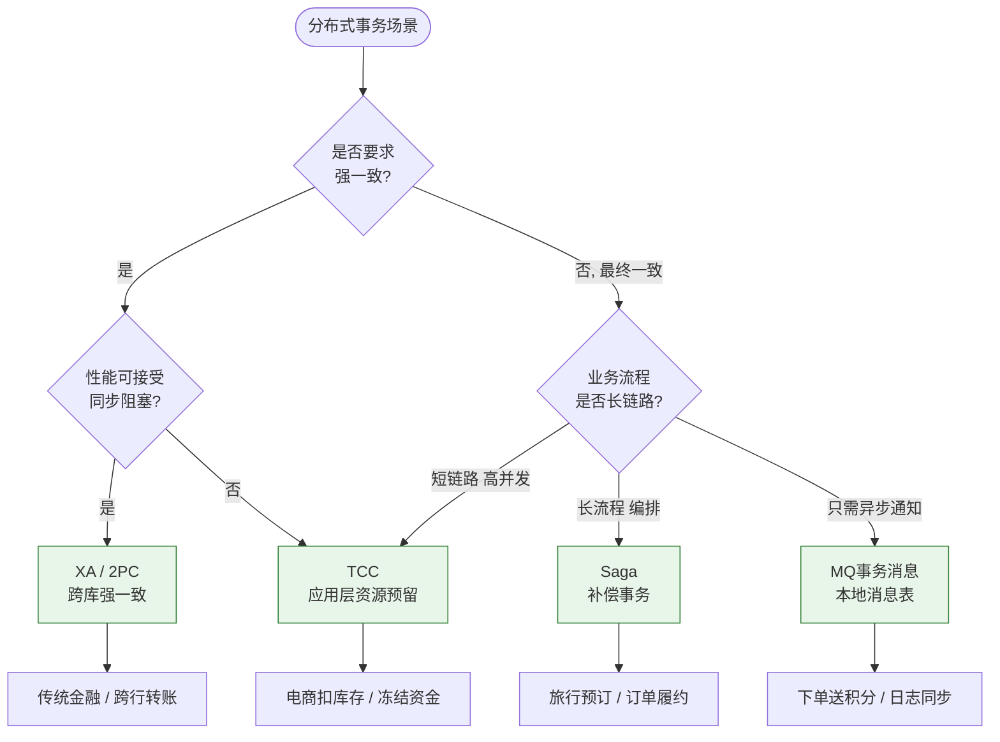
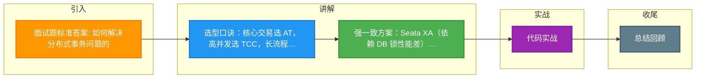

# 面试题标准答案: 如何解决分布式事务问题的

### 面试题：如何解决分布式事务问题？

解决分布式事务问题的方案通常根据一致性要求（强一致性 vs 最终一致性）和业务场景来选择：

#### 1. 强一致性方案（适用于核心业务）
*   **Seata XA 模式**：基于数据库 XA 协议，实现强一致性，但性能较差，锁资源时间长。
*   **Seata AT 模式**：改良版的 XA。通过解析 SQL 生成 Undo Log，实现无侵入的强一致性（虽然是最终一致的效果，但本地隔离级别高），性能优于 XA。

#### 2. 最终一致性方案（适用于高并发、边缘业务）
*   **Seata TCC 模式**：将业务逻辑拆分为 Try、Confirm、Cancel 三个阶段，性能高，不依赖数据库锁，但代码侵入性极强。适用于库存扣减、资金冻结等高并发核心环节。
*   **Seata Saga 模式**：适用于长流程业务，通过状态机编排，失败时补偿。不保证隔离性。
*   **基于消息队列的最终一致性**：利用本地消息表或 MQ 的事务消息，确保上游操作成功后下游一定能执行。

#### 3. 总结
*   **核心模块（交易/订单）**：通常首选 **Seata AT** 模式，兼顾性能和开发效率。
*   **高并发核心（秒杀/库存）**：首选 **Seata TCC** 模式，牺牲开发效率换取高性能。
*   **长流程/非核心**：可使用 **Saga** 或 **基于 MQ** 的柔性事务方案。

#### 4. 实战案例
**经验**：在支付系统中，"支付成功"与"积分增加"采用 MQ 事务消息方案；而"支付"与"账户余额"变更则必须使用 TCC 或 Seata AT，防止用户投诉余额扣减但订单未成功。

#### 5. 事务方案选型对比

| 方案 | 一致性 | 性能 | 复杂度 | 适用场景 |
| :--- | :--- | :--- | :--- | :--- |
| **2PC/XA** | 强一致 | 低 | 低 | 传统后台、内部管理系统 |
| **Seata AT** | 最终一致 | 中 | 低 | 互联网常规业务（订单/库存） |
| **Seata TCC** | 最终一致 | 高 | 高 | 核心高并发链路、账户体系 |
| **MQ 事务** | 最终一致 | 高 | 中 | 异步通知、跨系统解耦（积分/物流） |
| **Saga 状态机**| 最终一致 | 中 | 中 | 长流程业务（旅游预订、供应链） |

## 常见考点
1.  **2PC、3PC、TCC 的区别**：2PC 是同步阻塞的；3PC 在 2PC 基础上增加了 CanCommit 阶段降低了阻塞范围但引入了网络分区问题；TCC 将锁粒度下放到业务层，性能最高但开发复杂度大。
2.  **本地消息表与事务消息的区别**：本地消息表需要轮询定时任务，实现简单但耦合 DB；事务消息（如 RocketMQ）利用 Half Message 机制，解耦 DB 和 MQ，实时性更好。
3.  **Saga 状态机的回滚**：Saga 是正向执行+反向补偿，不同于 TCC 的 Confirm/Cancel，Saga 需要保证补偿逻辑的幂等性且无隔离性保证。

## 技术原理

分布式事务选型的本质是**在一致性强度、性能、开发成本、隔离性之间做权衡**，每种方案对应不同的锁粒度和补偿模型：

- **锁粒度的层级差异（性能的根本来源）**：
  - **2PC/XA**：锁在 DB 层，一阶段 Prepare 后持有**数据库行锁**直到二阶段，锁持有时间 = 全局事务时长，并发性能最差。
  - **Seata AT**：锁在 Seata 的 TC 层（全局行锁），DB 锁一阶段就释放。全局锁是内存级、粒度可控，性能比 XA 高一个数量级。
  - **TCC**：锁在**业务层**（如 Try 阶段冻结金额），完全脱离 DB 锁，业务自己控制资源预留，性能最高但开发最复杂。
  - **MQ 事务消息**：无锁，靠异步消息驱动下游，实时性差但吞吐最高。
- **隔离性的本质差异**：XA/AT 靠锁实现写隔离（读已提交语义）；TCC 靠业务设计（Try 冻结后其他事务看到的是"可用余额"减少）；Saga **完全没有隔离性**——中间状态对外可见，长流程中其他事务可能读到"未完成"的中间数据，需业务侧自行处理（如加状态字段过滤）。
- **补偿模型的两类**：
  - **反向补偿（AT/Saga）**：记录前镜像或正向操作，失败时执行反向 SQL 把数据改回去。AT 自动生成，Saga 需手写。
  - **确认/取消（TCC）**：Try 预占资源，Confirm 真正执行，Cancel 释放预占。没有"回滚"概念，而是"取消预留"。
- **MQ 事务消息的 Half Message 机制**：RocketMQ 先发半消息（对消费者不可见），执行本地事务后根据结果 Commit/Rollback 半消息。这样保证"本地事务成功 + 消息一定发出"的原子性，下游消费消息实现最终一致。

## 注意事项

1. **不要无脑选 AT**：AT 开发成本最低（一个注解），但全局锁在热点行（如平台账户）会成为瓶颈，高并发核心链路强行用 AT 会导致大量事务重试超时回滚。
2. **TCC 的三大坑**：空回滚（Cancel 时 Try 未到达）、悬挂（Cancel 先于 Try 到达后 Try 又到达）、幂等（Confirm/Cancel 可能重试）。业务侧必须实现事务记录表 + 状态机防这三个问题。
3. **Saga 的隔离性问题**：长流程中某个分支已修改数据但整体未完成，其他事务读到中间状态。业务表要加 `status` 字段过滤"处理中"的数据，或引入"预留 + 确认"两阶段。
4. **MQ 方案要保证消费幂等**：消息可能重复投递，下游消费逻辑必须幂等（如用业务唯一键去重），否则会导致重复扣款、重复发货等严重问题。

## 代码示例

```java
// 场景1：核心交易用 Seata AT（开发成本最低）
@GlobalTransactional(name = "create-order", rollbackFor = Exception.class)
public void createOrder(OrderDTO dto) {
    stockService.deduct(dto.getProductId());   // 自动记录 undo_log
    orderService.create(dto);
}

// 场景2：高并发账户用 TCC（性能最高，需手写三接口）
@LocalTCC
public interface AccountTcc {
    @TwoPhaseBusinessAction(name = "deduct", commitMethod = "confirm", rollbackMethod = "cancel")
    boolean tryDeduct(BusinessActionContext ctx,  // Try：冻结金额（available-=amt, frozen+=amt）
        @BusinessActionContextParameter(paramName = "userId") Long userId,
        @BusinessActionContextParameter(paramName = "amount") BigDecimal amount);
    boolean confirm(BusinessActionContext ctx);   // Confirm：扣减冻结
    boolean cancel(BusinessActionContext ctx);    // Cancel：解冻返还
}
```

```java
// 场景3：异步通知用 MQ 事务消息（RocketMQ Half Message）
@Transactional
public void paySuccess(Order order) {
    orderMapper.updateStatus(order.getId(), "PAID");   // 本地事务
    // 发送事务消息（半消息机制保证本地事务+消息发送原子性）
    messageProducer.sendTransactional(
        new Message("order-paid", "PAY_SUCCESS", orderId),
        new LocalTransactionExecutor() {
            @Override
            public LocalTransactionState execute(Message msg) {
                // 二次确认本地事务状态，决定 Commit/Rollback 半消息
                return orderMapper.exists(orderId) ? COMMIT : ROLLBACK;
            }
        });
}
// 下游积分服务消费消息增加积分（最终一致，需消费幂等）
```

### 分布式事务解决方案选型决策图




## 记忆要点

- 选型口诀：核心交易选 AT，高并发选 TCC，长流程编排选 Saga，异步解耦选 MQ。
- 强一致方案：Seata XA（依赖 DB 锁性能差）或 AT（无侵入，本地隔离级别高）。
- 最终一致：TCC（业务侵入强但性能高）、Saga（长事务补偿无隔离性）、MQ 事务消息（异步解耦）。
- 核心对比：2PC 同步阻塞，TCC 业务层加锁性能最高但复杂度大，MQ 实时性最好。

## 结构化回答

**30 秒电梯演讲：** 根据业务对一致性的要求，选择AT/TCC/XA或消息队列方案。打比方——寄快递：保价选顺丰(强一致)，普通选平邮(最终一致)，急件选专线。落到工程上，强一致性首选 Seata AT 模式。

**展开框架：**
1. **强一致性首选** — 强一致性首选 Seata AT 模式
2. **发核心场景使用** — 高并发核心场景使用 Seata TCC 模式
3. **长流程** — 长流程使用 Seata Saga 模式

**收尾：** 以上三点都能配合实战聊。我可以展开任一要点，您想先深入哪一块？

## 视频脚本

> 预计时长：2 分钟 | 由浅入深

| 时间 | 画面/字幕 | 口播台词 | 讲解要点 |
|------|----------|----------|----------|
| 0:00 | 标题卡：面试题标准答案: 如何解决分布式事务问题 | "面试题标准答案: 如何解决分布式事务问题，一分钟讲透。" | 开场钩子 |
| 0:35 | 生活类比动画 | "打个比方——寄快递：保价选顺丰(强一致)，普通选平邮(最终一致)，急件选专线。" | 核心类比 |
| 1:10 | 概念定义动画 | "一句话：根据业务对一致性的要求，选择AT/TCC/XA或消息队列方案。" | 核心定义 |
| 1:50 | 强一致性首选 图解 | "强一致性首选 Seata AT 模式。" | 强一致性首选 |

### 视频流程图



