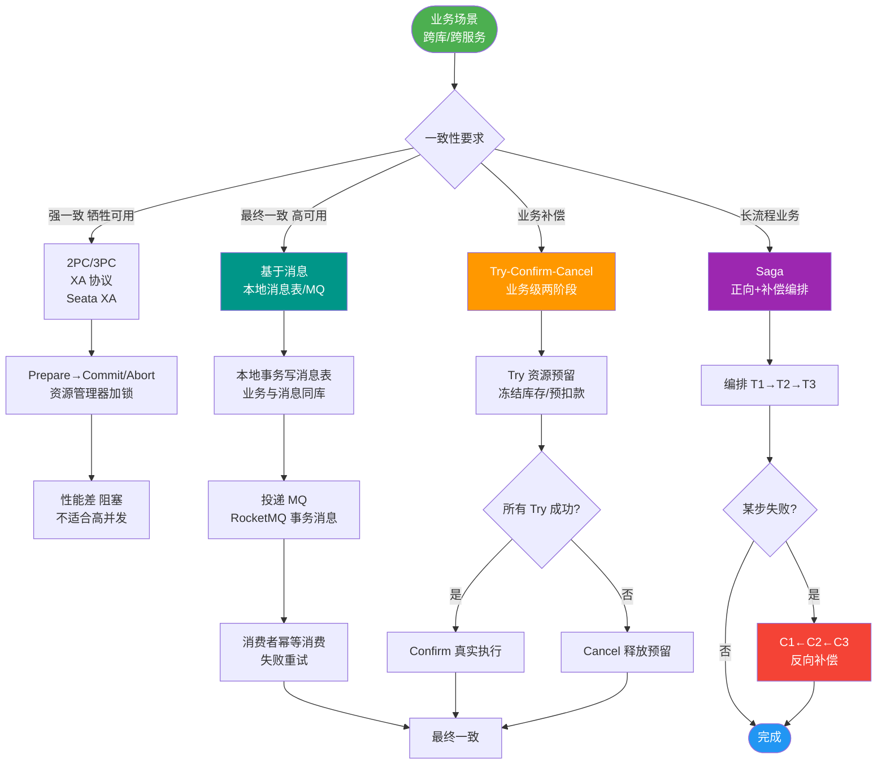

# 分布式事务的一致性场景有哪些？

### 分布式事务的一致性场景分类

在分布式系统中，根据业务对数据一致性的容忍度，主要分为以下几类场景：

#### 1. 强一致性场景
*   **定义**：系统中的任何数据更新操作，一旦成功，后续所有的读取操作都能立即读到最新的值。
*   **代价**：通常通过 2PC（两阶段提交）或 Paxos/Raft 等共识算法实现，性能较低，可用性可能受影响（CAP 理论中牺牲 A 或 P）。
*   **典型方案**：Seata XA 模式、数据库单机事务。

#### 2. 弱一致性场景
*   **定义**：系统不保证后续的访问能立即读到更新的值，也不保证多久能读到，但会尽可能保证数据最终一致。数据在中间过程中可能存在不一致的状态。
*   **典型方案**：DNS 缓存、主从异步复制中的读写分离。

#### 3. 最终一致性场景
*   **定义**：保证在没有新的更新操作的前提下，经过一段时间后，系统内的所有数据副本最终将达到一致的状态。这是互联网分布式系统中最常见的模型。
*   **代价**：接受短暂的数据不一致，换取系统的高性能和高可用性。
*   **典型方案**：Seata AT/TCC/Saga 模式、基于 MQ 的可靠消息最终一致性、TCC。

**一致性场景对比图：**
```text
强一致性 (CP)
┌───────────────────────────────────────────────┐
│  写入 A ────> [同步复制/共识算法] ────> 写入 B  │
│       │                                       │
│       └──────> 返回成功 (用户读到最新值)       │
└───────────────────────────────────────────────┘

最终一致性 (AP)
┌───────────────────────────────────────────────┐
│  写入 A ────> 返回成功                         │
│       │                                       │
│       └───> [异步/消息队列] ────> 写入 B       │
│              (期间可能读到旧值)               │
└───────────────────────────────────────────────┘
```

#### 4. 实战案例
**场景**：电商下单扣减库存后，Redis 库存显示为 0，但数据库因主从同步延迟（弱一致性/最终一致性）显示仍有余量，此时若风控系统直接读取数据库判断，可能导致超卖。解决方案是强制读主库或等待同步完成。

#### 5. 一致性模型对比表

| 模型 | CAP倾向 | 数据可见性 | 实现成本 | 典型业务 |
| :--- | :--- | :--- | :--- | :--- |
| **强一致性** | CP | 立即可见 | 高（性能损耗） | 银行转账、库存扣减 |
| **弱一致性** | AP | 不保证 | 低 | DNS 缓存、网页浏览量 |
| **最终一致性** | AP | 短暂延迟后可见 | 中 | 订单状态更新、积分发放 |

## 常见考点
1.  **CAP 理论中的权衡**：在分区容错性（P）必须存在的前提下，是选择强一致性（C，如 Seata XA）还是高可用性（A，如 Seata AT/Saga）。
2.  **BASE 理论**：Basically Available（基本可用）、Soft state（软状态）、Eventually consistent（最终一致性）。它是最终一致性场景的理论基础，是对 CAP 中 AP 方案的延伸。
3.  **业务场景举例**：银行转账（强一致 vs 最终一致？）通常要求强一致；电商下单后发积分（最终一致）。


## 核心流程图



## 记忆要点

- 强一致性(CP)：数据更新立即可见，依靠 2PC 或 Raft 算法，性能损耗大（如转账）。
- 最终一致性(AP)：接受短暂延迟，通过异步复制达到稳定，互联网最常见（如发积分）。
- 理论基础：CAP 中 P 必选，权衡 C 与 A；BASE 理论是最终一致性的核心延伸。
- 防坑指南：读写分离存在延迟，核心防超卖等业务需强制读主库。

## 结构化回答


**30 秒电梯演讲：** 打电话必须实时同步（强一致），发短信允许延迟送达（最终一致）。

**展开框架：**
1. **强一致性** — 读写立刻同步，性能低
2. **弱一致性** — 不保证何时同步
3. **最终一致性** — 经过一段时间后必然同步，互联网常用

**收尾：** 这是我实战中的理解，您想深入哪一段？


## 视频脚本

> 预计时长：1 分 30 秒 | 由浅入深

| 时间 | 画面/字幕 | 口播台词 | 讲解要点 |
|------|----------|----------|----------|
| 0:00 | 标题卡：分布式事务的一致性场景有哪些 | "分布式事务的一致性场景有哪些，一分钟讲透。" | 开场钩子 |
| 0:25 | 生活类比动画 | "打个比方——打电话必须实时同步(强一致)，发短信允许延迟送达(最终一致)。" | 核心类比 |
| 0:50 | 概念定义动画 | "一句话：分为强一致、弱一致和最终一致，核心是权衡一致性与性能。" | 核心定义 |
| 1:20 | 强一致性 图解 | "读写立刻同步，性能低。" | 强一致性 |
