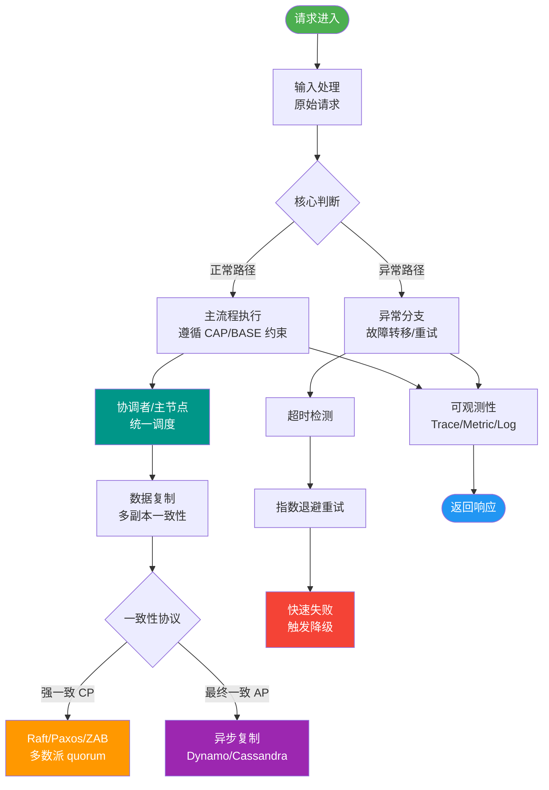

# 什么是分层JAR(Layered Jar)？它如何优化Docker镜像构建？

🎯 本质：分层JAR将Spring Boot应用拆分为多个层，每层可以被Docker缓存和复用，大幅提升Docker镜像构建速度。

📊 **传统Fat JAR问题**：
单个JAR包含所有内容（依赖+代码），每次代码修改都需要重建整个镜像层，Docker缓存完全失效。

📂 **分层JAR结构**：
Spring Boot Loader根据`layers.idx`文件将JAR内容逻辑分类。
```
layers/
  - dependencies/       (第三方库，很少变化)
  - spring-boot-loader/ (类加载机制，极少变化)
  - snapshot-dependencies/ (SNAPSHOT依赖，偶尔变化)
  - application/        (业务代码/资源，经常变化)
```

**分层策略（变化频率从低到高）**：
1. **dependencies** - 变化最少，缓存命中率最高。
2. **spring-boot-loader** - 版本升级才变。
3. **snapshot-dependencies** - 开发期变动，生产环境通常不用。
4. **application** - 经常变化，应放在Dockerfile最后。

**Docker 构建流程对比图**：

【传统 Fat Jar 构建】
┌──────────────────────────────────────────────────────┐
│ COPY app.jar .                                       │
│ (100MB Layer)                                        │
└──────────────────────────────────────────────────────┘
           ↓ 修改 1行代码
┌──────────────────────────────────────────────────────┐
│ COPY app.jar . (重新缓存整个100MB，构建慢)            │
└──────────────────────────────────────────────────────┘

【分层 Jar 构建】
┌───────────────┐ ┌───────────────┐ ┌─────────────────────┐
│ dependencies  │ │ snapshot-deps │ │    application      │
│   (80MB)      │ │    (5MB)      │ │      (15MB)         │
└───────────────┘ └───────────────┘ └─────────────────────┘
     (缓存)            (缓存)                (重建)
           ↓ 修改代码后
┌───────────────┐ ┌───────────────┐ ┌─────────────────────┐
│  HIT CACHE    │ │  HIT CACHE    │ │  REBUILD LAYER      │
│   (0s)        │ │    (0s)       │ │      (仅15MB)       │
└───────────────┘ └───────────────┘ └─────────────────────┘

**启用和构建**：
```xml
<!-- pom.xml -->
<plugin>
    <groupId>org.springframework.boot</groupId>
    <artifactId>spring-boot-maven-plugin</artifactId>
    <configuration>
        <layers><enabled>true</enabled></layers>
    </configuration>
</plugin>
```

# 查看分层结构
java -Djarmode=layertools -jar app.jar list

# Dockerfile 提取并分层
FROM eclipse-temurin:17-jre as builder
WORKDIR app
COPY jar/app.jar .
RUN java -Djarmode=layertools -jar app.jar extract

FROM eclipse-temurin:17-jre
WORKDIR app
# 按顺序拷贝，利用缓存
COPY --from=builder app/dependencies/ ./
COPY --from=builder app/spring-boot-loader/ ./
COPY --from=builder app/snapshot-dependencies/ ./
COPY --from=builder app/application/ ./
ENTRYPOINT ["java", "org.springframework.boot.loader.JarLauncher"]

**实战案例**：在CI/CD流水线中，每次提交代码只重新上传业务代码层，基础依赖层直接复用构建节点的Layer Cache，将构建时间从 5分钟降低至 30秒。注意 `layers.idx` 文件必须位于JAR包根目录，否则Spring Boot无法识别分层结构。


## 核心流程图



## 记忆要点

- 核心目的：因为Fat Jar每次改代码都全量重传，所以分层JAR按变化频率拆分内容以复用Docker缓存。
- 层级顺序：依赖层(不变) -> Loader层 -> SNAPSHOT依赖层 -> Application业务代码层(常变)。
- Dockerfile指令：按频率从低到高依次COPY各层目录，确保只重建业务代码层，构建秒级完成。

## 结构化回答


**30 秒电梯演讲：** 做三明治时，面包和酱料（依赖）做好放起来，每次只换中间的菜（代码）。

**展开框架：**
1. **JAR** — 将JAR拆分为依赖、快照、应用等层
2. **依赖层变化少** — 依赖层变化少，构建时命中缓存
3. **业务代码层频** — 业务代码层频繁重建

**收尾：** 这是我实战中的理解，您想深入哪一段？


## 视频脚本

> 预计时长：2 分钟 | 由浅入深

| 时间 | 画面/字幕 | 口播台词 | 讲解要点 |
|------|----------|----------|----------|
| 0:00 | 标题卡：分层JAR(Layered Jar) | "分层JAR(Layered Jar)，一分钟讲透。" | 开场钩子 |
| 0:35 | 生活类比动画 | "打个比方——做三明治时，面包和酱料(依赖)做好放起来，每次只换中间的菜(代码)。" | 核心类比 |
| 1:10 | 概念定义动画 | "一句话：按代码变化频率将JAR拆分为多层，使Docker构建只复用不变层。" | 核心定义 |
| 1:50 | JAR拆分为依赖、快 图解 | "将JAR拆分为依赖、快照、应用等层。" | JAR拆分为依赖、快 |
